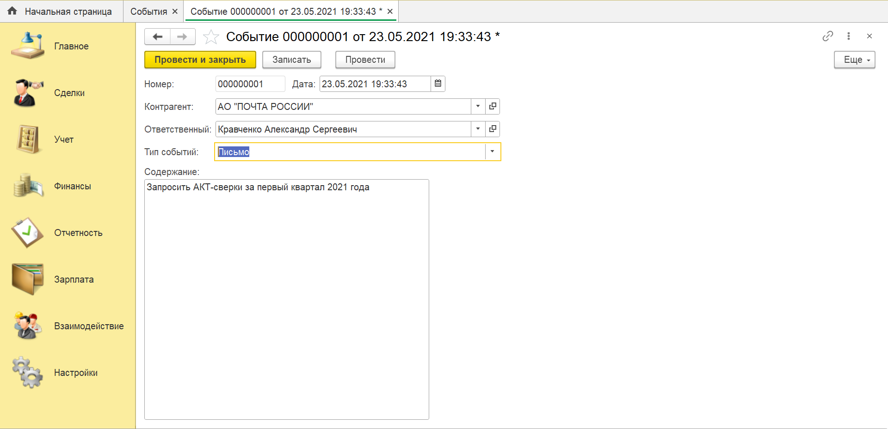
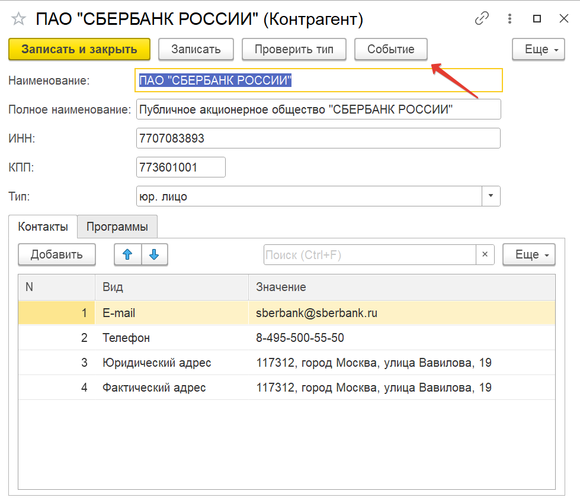

# Занятие "Документы"

## Задача 1 документ "Событие"
Создать документ "Событие" для хранения данных о планируемых действиях.
Документ оформляется при взаимодействии с контрагентом. Например, при звонке. Содержит информацию о сути взаимодействия.

## Результат:

     
  

 

## Задача 2 добавить форму выбора и списка в документ "Событие" 
* Создать форму списка.
* Создать форму выбора.

В справочники Контрагенты
добавить Команду "События" на форму документа

## Результат:
  

     
  

 
 

  
