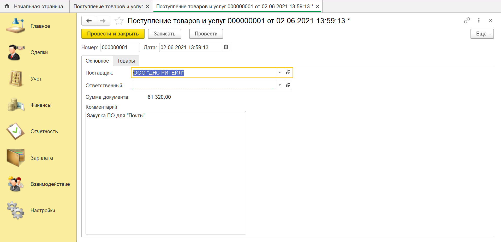
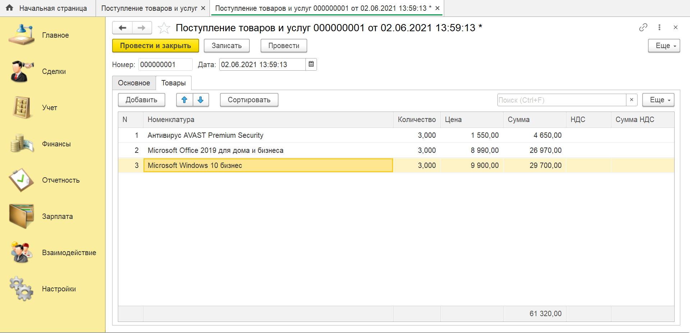

# Задание к занятию "Табличные части"

## Задача 1. Документы "Поступление товаров и услуг" и "Реализация товаров и услуг"

Необходимо было создать документы "Поступление товаров и услуг" и "Реализация товаров и услуг", отражающие закупку и продажу товаров и услуг, но пока не формирующие движения по остаткам и взаиморасчетам.

## Результат:
Поле "Сумма документа", сделать в виде поля надписи, чтобы пользователь в ручном режиме не смог изменить сумму.

     
  

## Задача 2 "Расчеты в таблице товаров" 

Добавить в документы из задачи 1 сортировку строк по сумме, а также расчет общего итога по колонке "Сумма".

## Результат:

Для отображения "подвала", в свойствах табличной части установить необходимую галочку.

     
  

