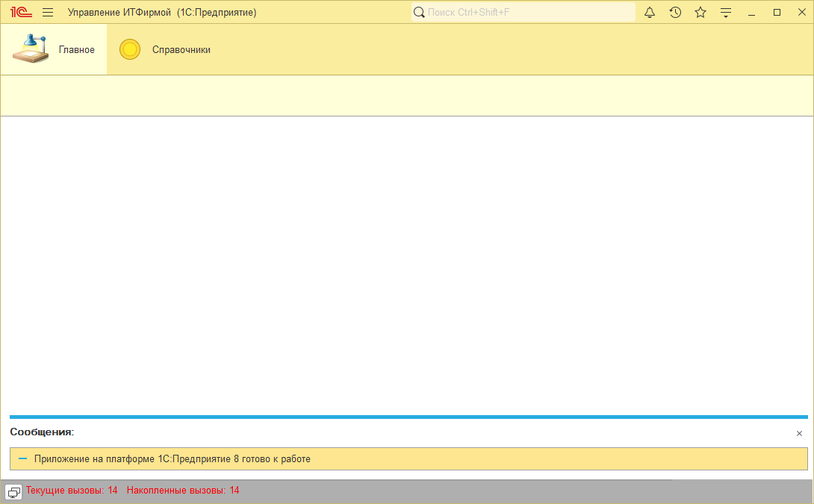
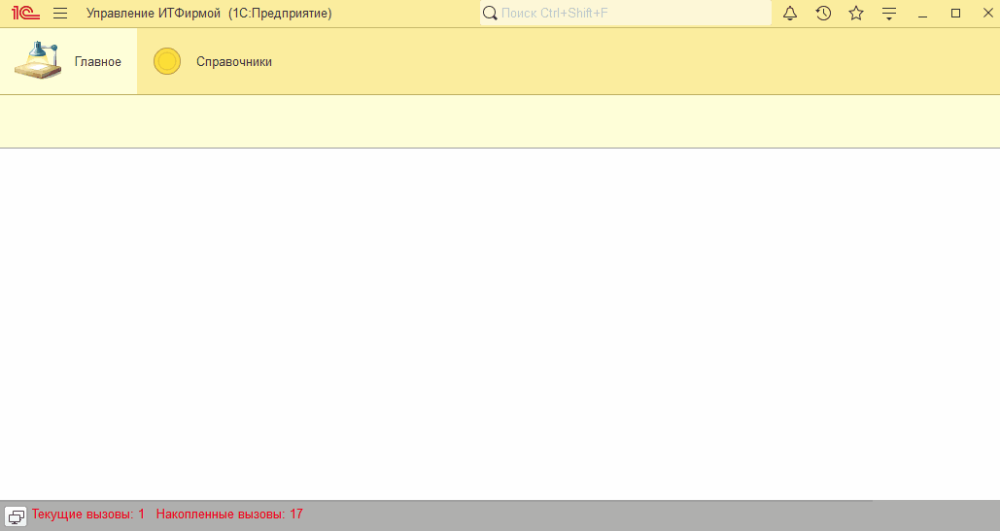
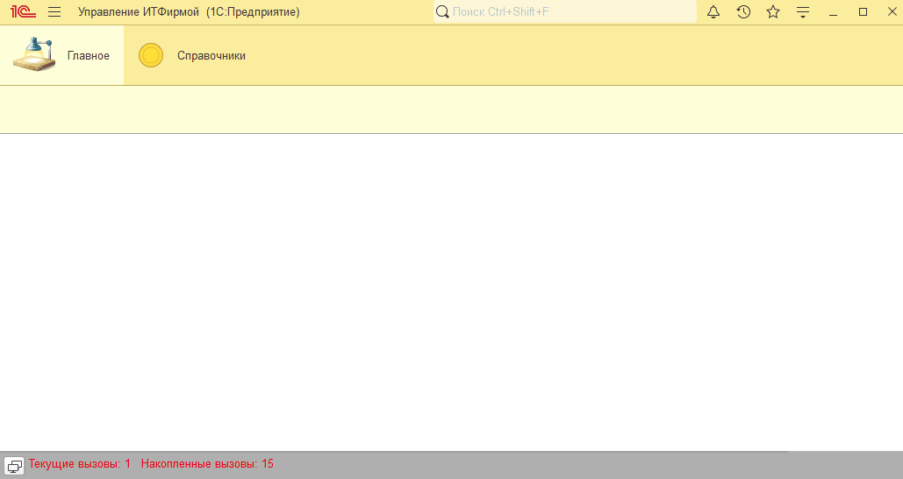

# Занятие "Модули"

## Задача 1 "Обработчики событий модуля приложения"
При запуске программы отображается сообщение

   

## Задача 2 "Обработчики событий модуля формы"
В справочнике Контрагенты при заполнении Наименования автоматически заполняется Полное наименование

   

## Задача 3 "Обработчики событий модуля объекта"
В справочнике Контрагенты при создании нового элемента реквизит Юридическое физическое лицо автоматически заполнен значением Юридическое лицо

   

