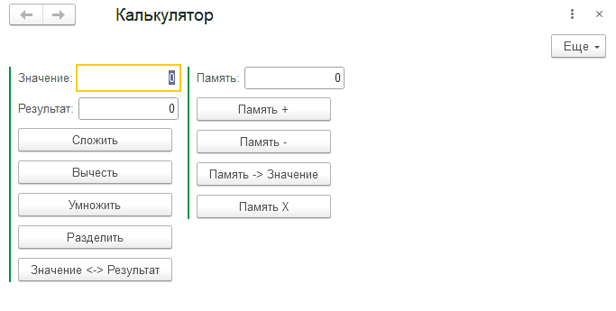

# Занятие "Переменные и параметры сеанса"

## Задача 1 "Развитие Калькулятора"
В калькулятор добавлены команды по работе с памятью

   

## Задача 2 "Параметры сеанса"
Добавлена обработка Проверка длительности сеанса, позволяющая получать число секунд со старта сеанса

   

