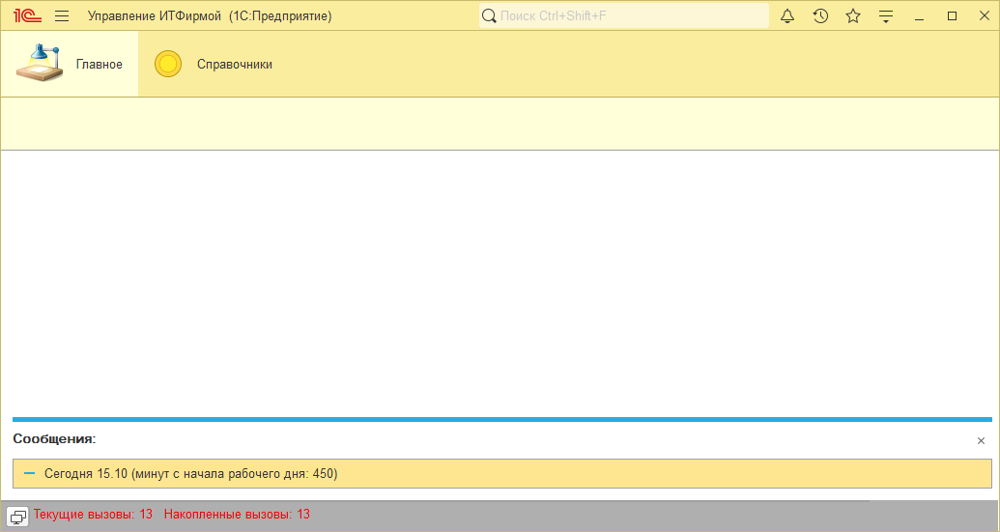
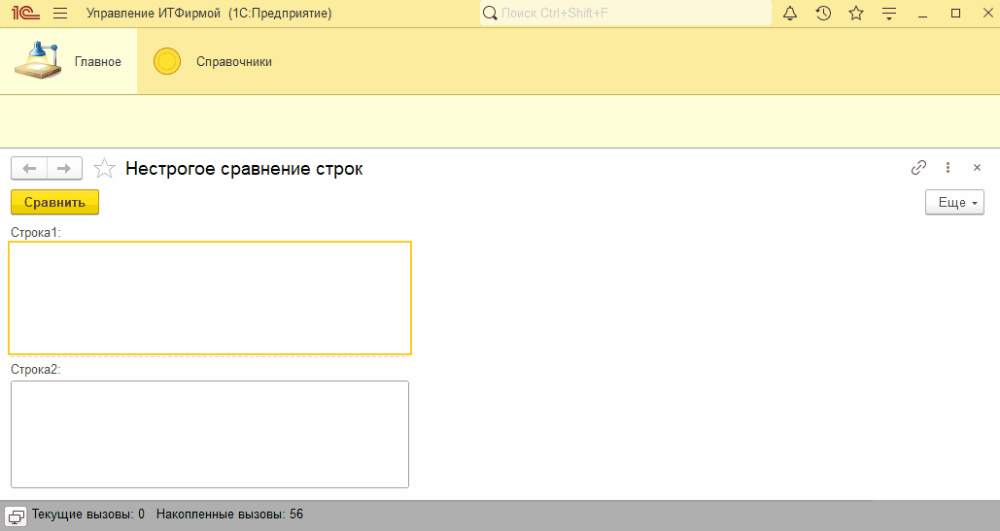

# Занятие "Даты и строки"

## Задача 1 "Приветствие"
При запуске программа сообщает текущую дату и время с начала рабочего дня

   

## Задача 2 "Нестрогое сравнение строк"
Обработка Нестрогое сравнение строк позволяет сравнить строки без учета регистра и пробелов

   

