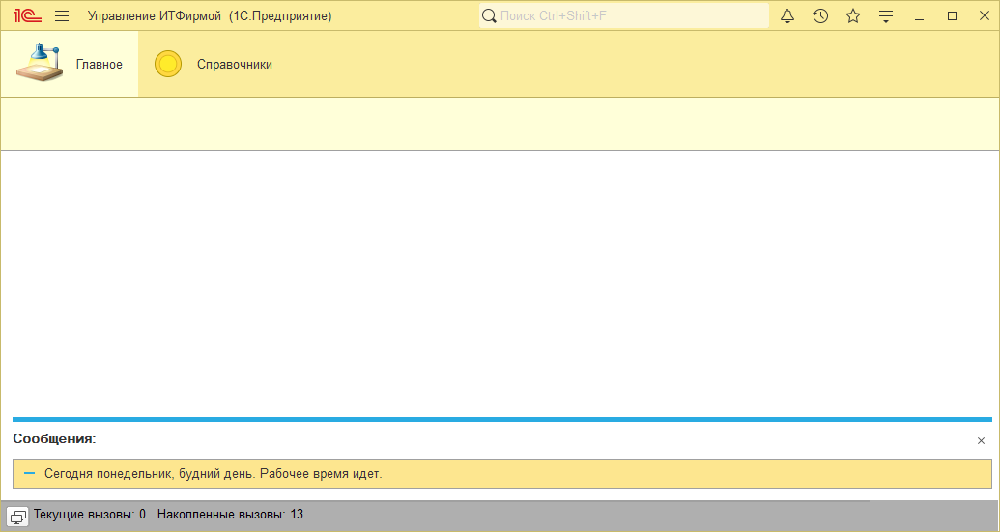
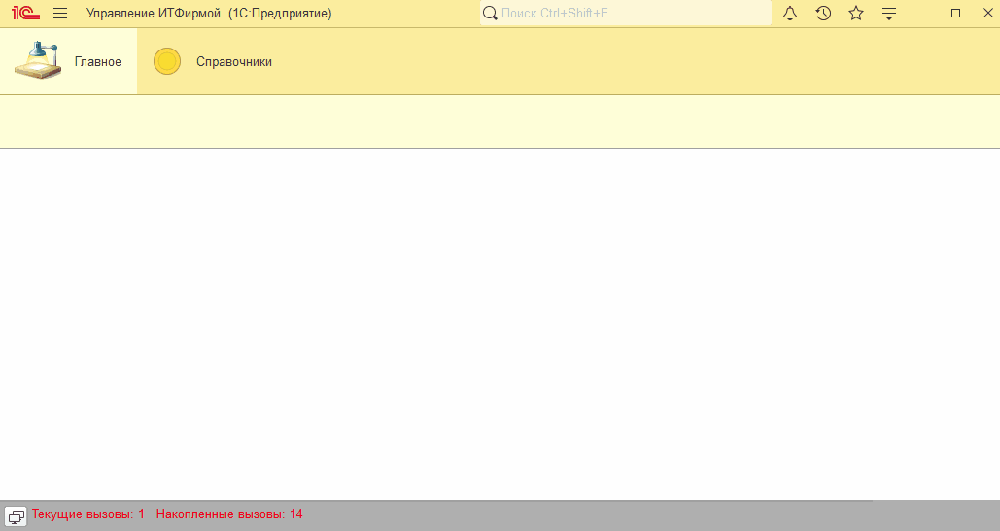

# Занятие "Условия"

## Задача 1 "Анализ времени запуска"
При запуске программа анализирует текущее время

   

## Задача 2 "Проверка введенных данных"
При записи элемента справочника Контрагенты выполняется проверка длины ИНН и КПП в зависимости от вида контрагента

   

