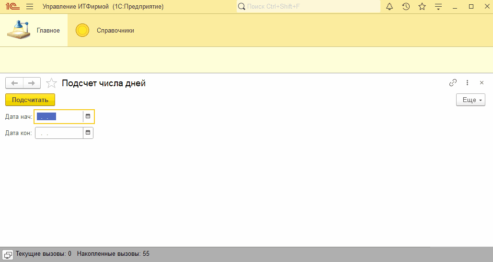
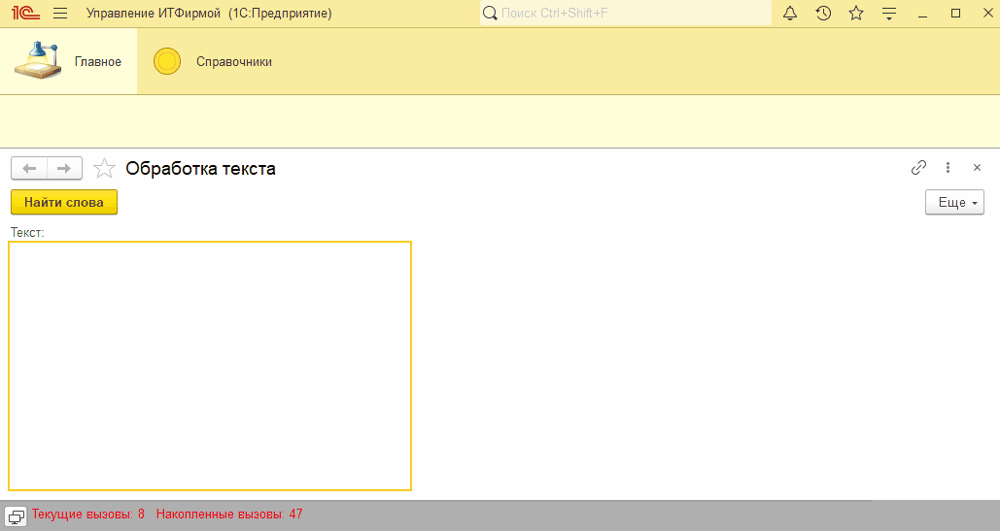
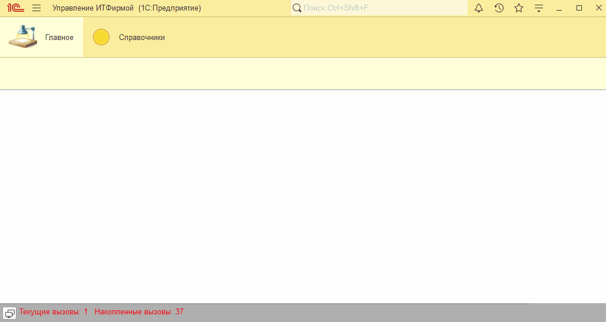

# Занятие "Циклы"

## Задача 1 "Подсчет числа дней"
Обработка позволяет ввести 2 даты и рассчитывает количество будних и выходных дней между этими датами

   

## Задача 2 "Обработка текста"
Обработка находит в тексте самое длинное и самое короткое слово

   

## Задача 3 "Развитие проверки введенных данных"
При записи контрагента проверяется состояти ли ИНН и КПП только из цифр

   

