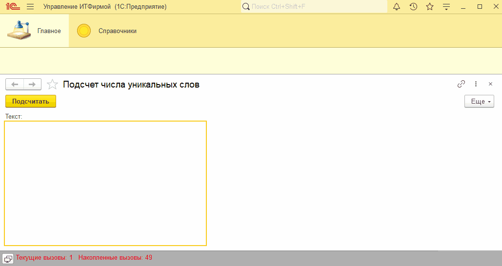
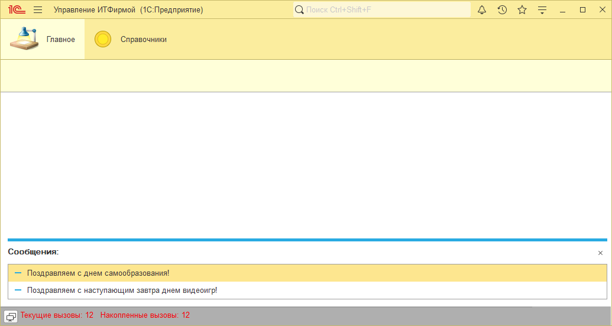

# Занятие "Универсальные коллекции"

## Задача 1 "Подсчет числа уникальных слов"
Обработка считает уникальные слова во введенном тексте без учета регистра

   

## Задача 2 "Поздравления"
При старте программа поздравляет пользователя с праздником, если он приходится на сегодня или на завтра

   

