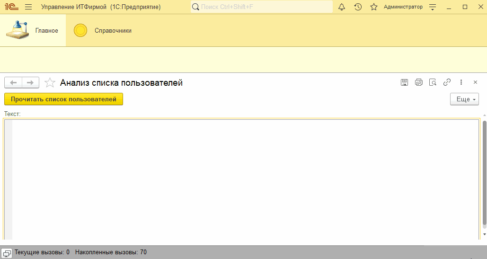
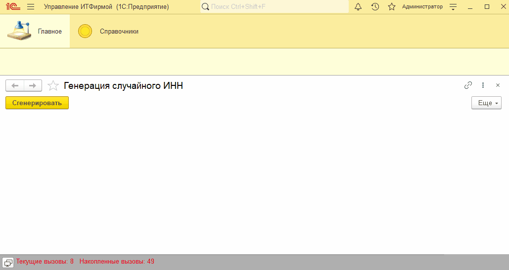

# Занятие "Объекты платформы"

## Задача 1 "Анализ списка пользователей"
Обработка выводит список пользователей с перечислением ролей

   

## Задача 2 "Случайный ИНН"
Обработка генерирует случайный ИНН с верным контрольным разрядом

   

