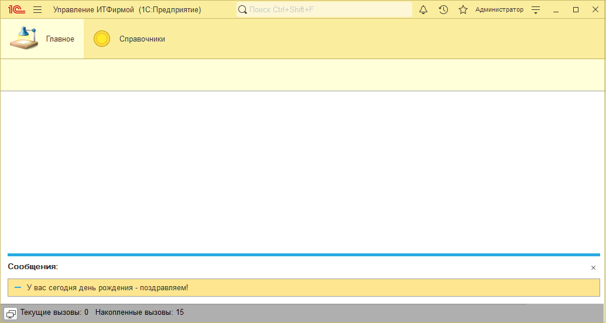
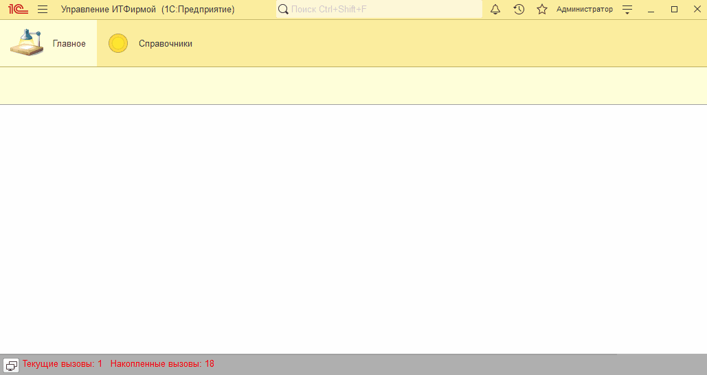

# Занятие "Процедуры и функции"

## Задача 1 "Поздравление с днем рождения"
Если день рождения текущего пользователя сегодня система выводит поздравление

   

## Задача 2 "Проверка ИНН контрагента"
При записи элемента справончика Контрагенты выполняется проверка контрольной суммы ИНН для юридических лиц

   

