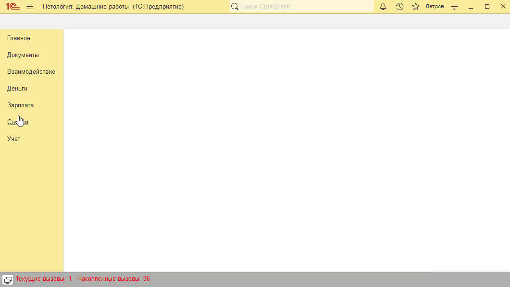
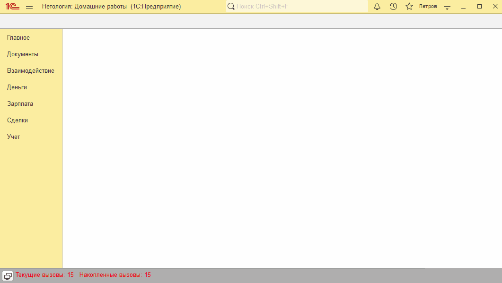

# Занятие "Документы"

## Задача 1 документ "Событие"
Создан документ "Событие" для хранения данных о планируемых действиях.
Документ оформляется при взаимодействии с контрагентом. Например, при звонке. Содержит информацию о сути взаимодействия.

   

 

## Задача 2 добавить форму выбора и списка в документ "Событие" 
Созданы формы списка и выбора.

В справочник Контрагенты на форму элемента добавлена Команда "События". При нажатии на кнопку "События", будет открыт список документов с отбором по контрагенту.

   

  
