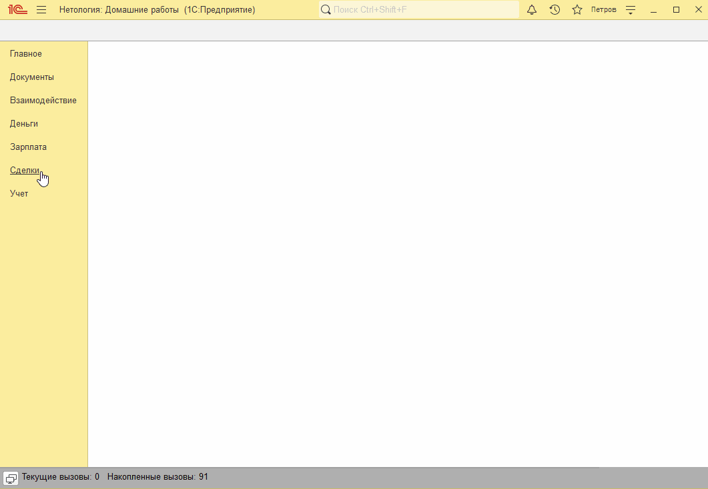
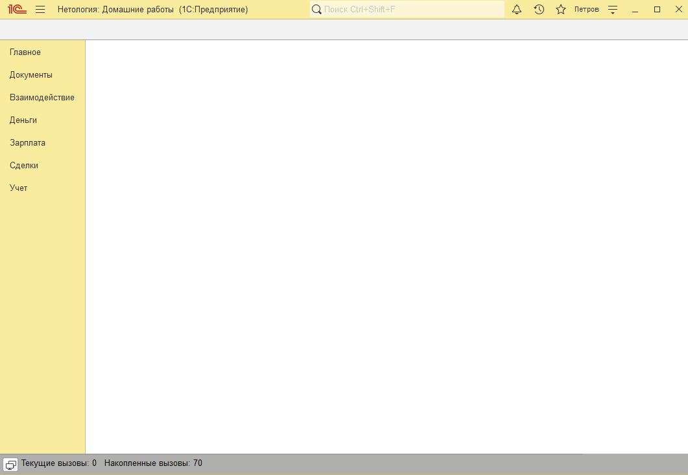
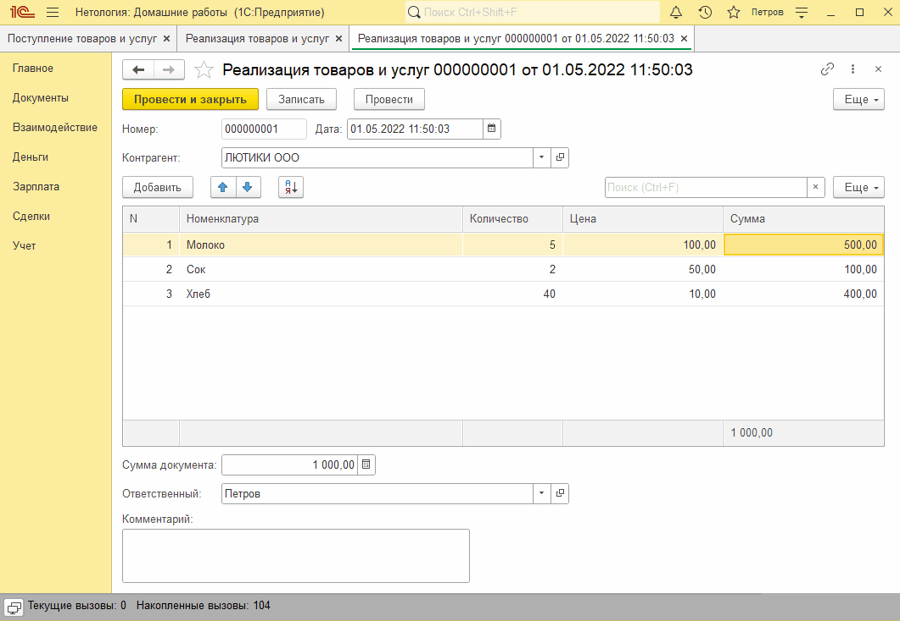

# Задание к занятию "Табличные части"

## Задача 1. Документы "Поступление товаров и услуг" и "Реализация товаров и услуг"

В раздел Сделки выведены документы "Поступление товаров и услуг" и "Реализация товаров и услуг"

На формах документов "Поступление товаров и услуг" и "Реализация товаров и услуг" отображаются необходимые реквизиты и табличные части. При изменении количества или цены пересчитывается сумма строки. При записи или проведении документа пересчитываеться сумма документа.

   

В раздел Сделки выведен журнал документов "Движения товаров" с дополнительными графами "Контрагент" и "Сумма документа". В журнал документов выводятся документы "Поступление товаров и услуг" и "Реализация товаров и услуг".

   

## Задача 2. "Расчеты в таблице товаров" 

В командной панели табличной части "Товары" документов "Поступление товаров и услуг" и "Реализация товаров и услуг" добавлена команда для сортировки строк. В подвал табличной части выведен итог по колонке "Сумма"

   

