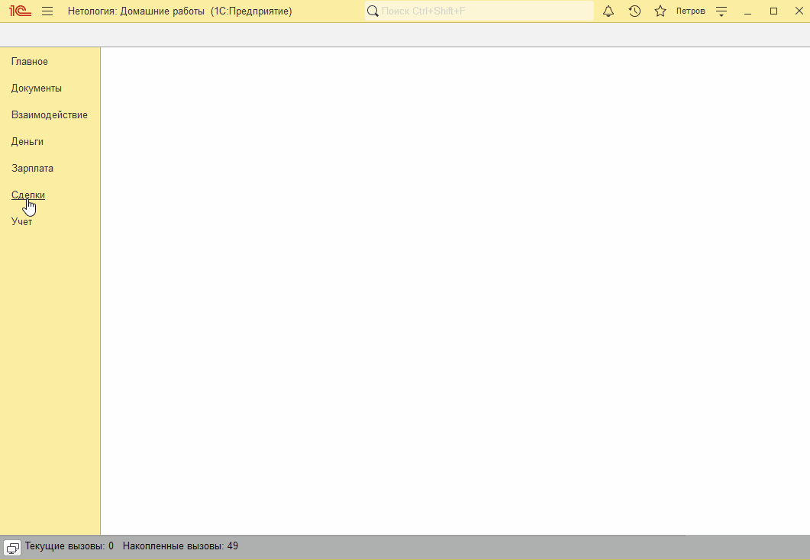
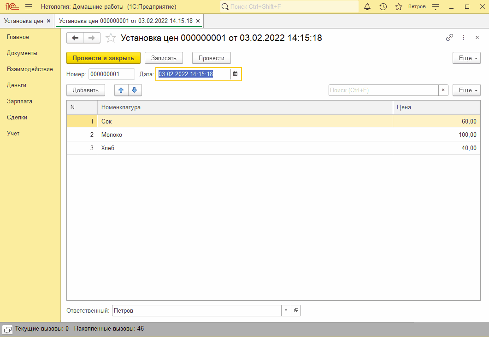

# Занятие "Проведение и движения"

## Задача 1 движения Документов "Поступление товаров и услуг" и "Реализация товаров и услуг"
При проведении документа "Поступление товаров и услуг" формируются движения по регистру накопления "Товары" с типом "Приход". При проведении документа "Реализация товаров и услуг" формируются движения по регистру накопления "Товары" с типом "Расход".

   

 

## Задача 2 движение документа "Установка цен" 
При проведении документа "Установка цен" формируются движения по регистру сведений "Цены".

   

  
