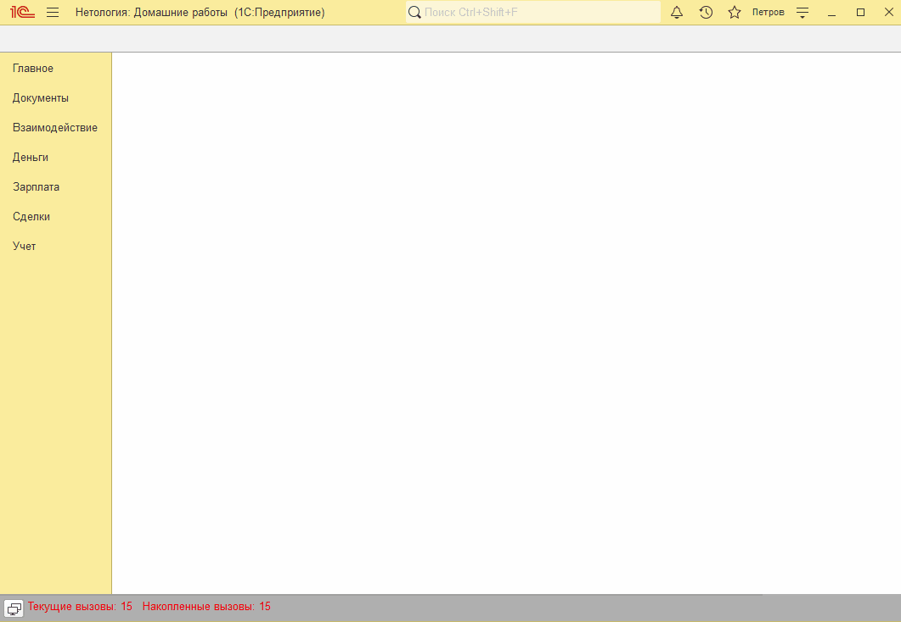
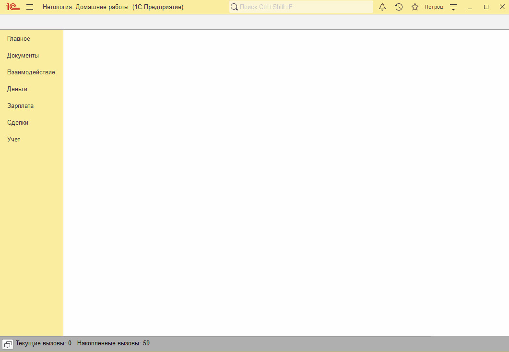

# Занятие "Формы документов"

## Задача 1 Добавить вкладки на форме документа в документы "Установка цен", "Поступление товаров и услуг" и "Реализация товаров и услуг"
На формах документов добавлены вкладки, реквизиты распределены между вкладками

   

 

## Задача 2 добавить в форму списка подсветку зеленым строк "Поступление товаров и услуг" и "Реализация товаров и услуг" 
При вводе документов с суммой более 100 000 в форме списка строки таких документов выделяются цветом. Для документов "Поступление товаров и услуг" - красным, для документов "Реализация товаров и услуг" - зеленым.

   

## Задача 3 добавить в форму документа "Установка цен" признак согласования
Пользователи без полных прав могут только редактировать документ до проведения. При этом флажок "Согласовано" без полных прав недоступен для редактирования.

Документ проводится только при установленном флажке "Согласовано" и только под пользователем с полными правами.

   

