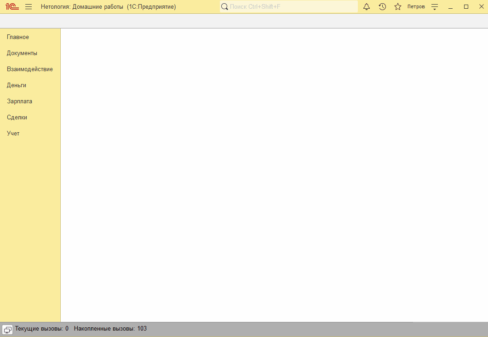
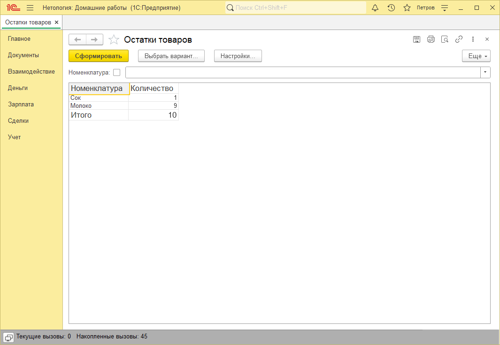

# Занятие "Виртуальные таблицы регистров накопления"

## Задача 1 Добавить контроль остатков в проведение документа "Реализация товаров и услуг"
При проведении документа в случае нехватки товара выводится сообщение об ошибке. В сообщении указывается какого товара нехватает в каком количестве.

   

## Задача 2 Создать отчет СКД "Остатки товаров" 
Доступен отчет, в котором отображаются остатки товаров

   

