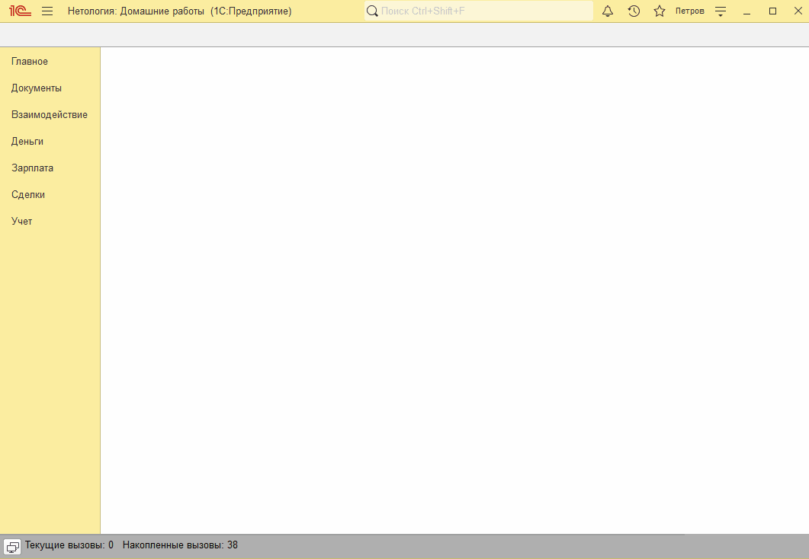

# Занятие "Расчет себестоимости и последовательности документов"

## Задача 1 Реализовать расчет себестоимости товаров в документе Реализация
Документ "Поступление товаров и услуг" записывает в движения по регистру накопления "Товары" себестоимость товара.

Документ "Реализации товаров и услуг" в движениях по регистру накопления "Товары" списывает себестоимость товара по средней.

   

