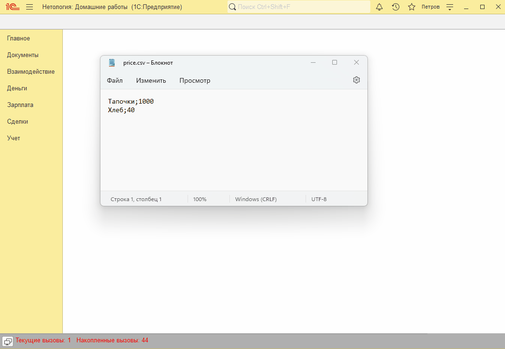
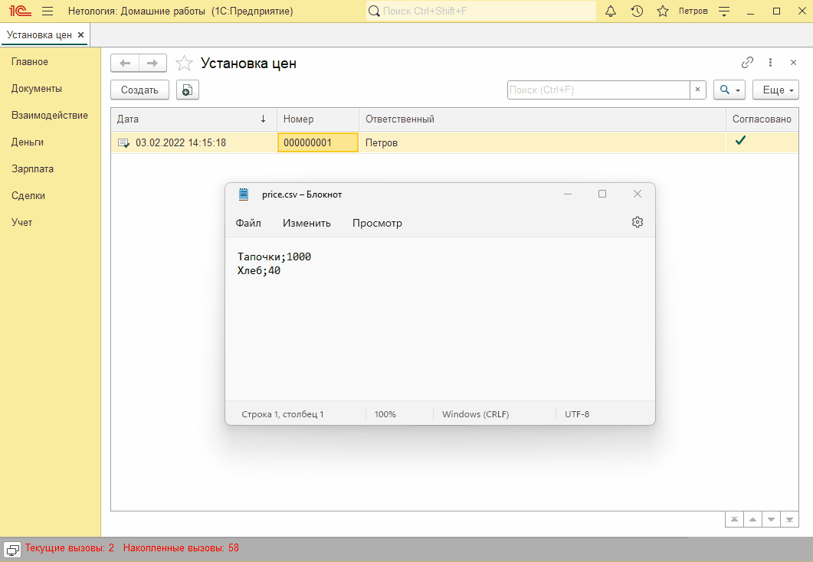

# Занятие "Файлы"

## Задача 1 Создать обработку для загрузки цен из файла
При выборе файла прайса создается документ "Установка цен". Если какой-то номенклатуры из файла нет в базе, то выдается ошибка.

   

## Задача 2 Развитие обработки для загрузки цен из файла
Если какой-то из номенклатуры в файле нет в базе, то перед сохранением документа пользователю задается вопрос.

   

