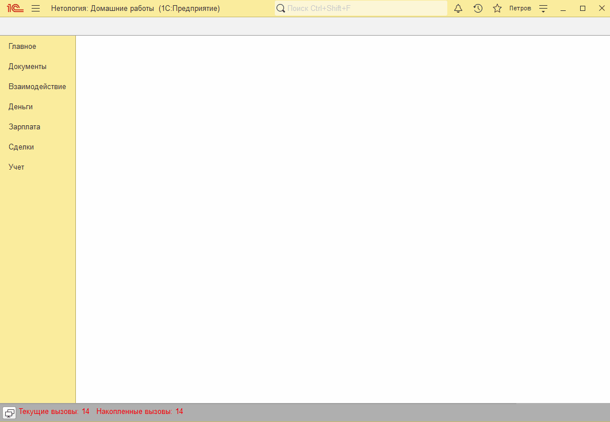

# Занятие "Табличные и текстовые документы"

## Задача 1 Создать обработку для загрузки цен из файла
На форму списка справочника "Номенклатура" добавлена кнопка "Печать прайса". По нажатию на кнопку отображается печатная форма с ценами выбранной номенклатуры.

   

## Задача 2 Развитие обработки для загрузки цен из файла
Добавлена обработка для загрузки прайса из файла xlsx. Если какой-то номенклатуры из файла нет в базе, то выдается соответствующее сообщение.

   

