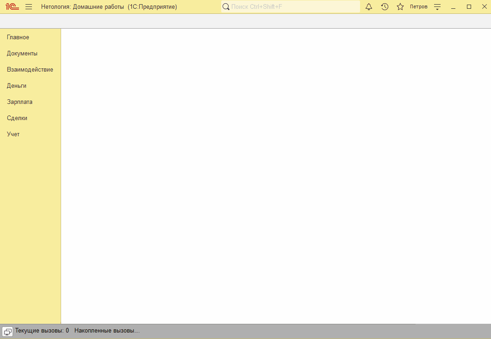
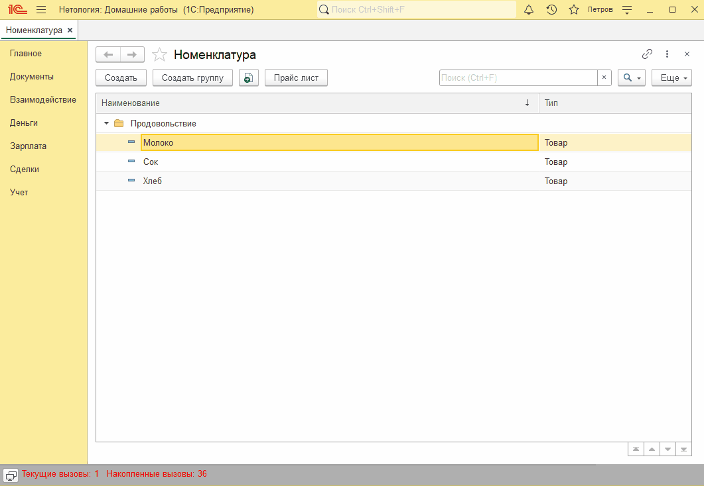

# Занятие "Двоичные данные"

## Задача 1 Создать в справочнике Номенклатура возможность загрузки и хранения картинки.
На форме элемента справочника "Номенклатура" добавлена возможность прикреплять картинку.

   

## Задача 2 Сохранение картинки номенклатуры с установленной шириной
Можно сохранять прикрепленную к "Номенклатуре" картинку в новый файл с шириной 100 пикселей.

   

