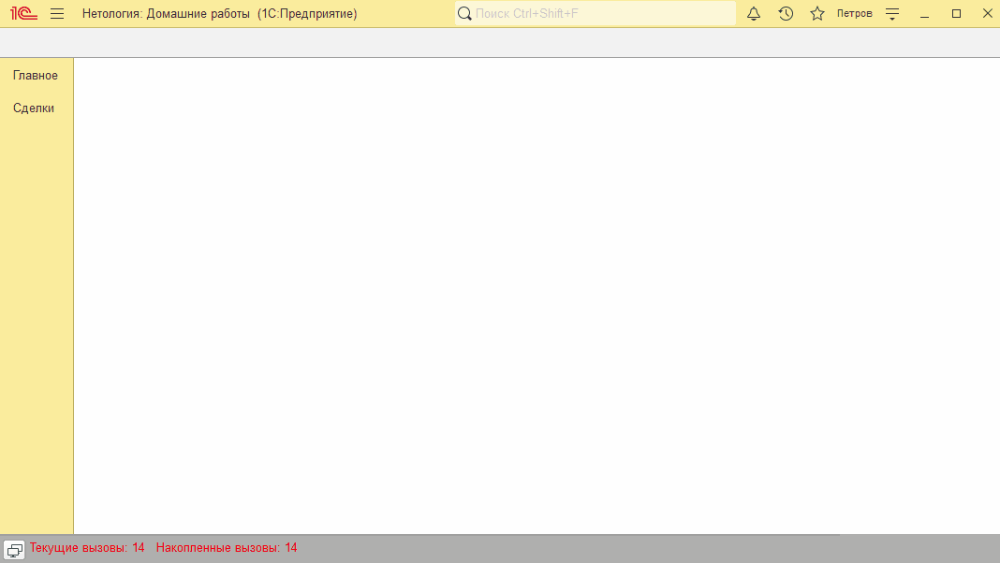

# Занятие "Условия и подзапросы"

## Задача 1 "Отбор номенклатуры при обновлении цен в документе Реализация"
В документе Реализация товаров и услуг реализована функция обновления цен

   

## Задача 2 "Заполнение строк табличной части по отбору в документе Реализация"
В документе Реализация товаров и услуг реализована функция заполнения строк по заранее установленному отбору

   

  
