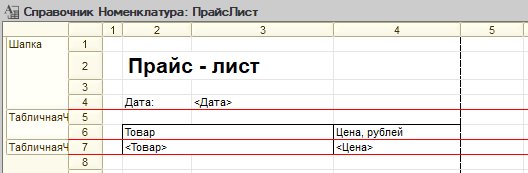
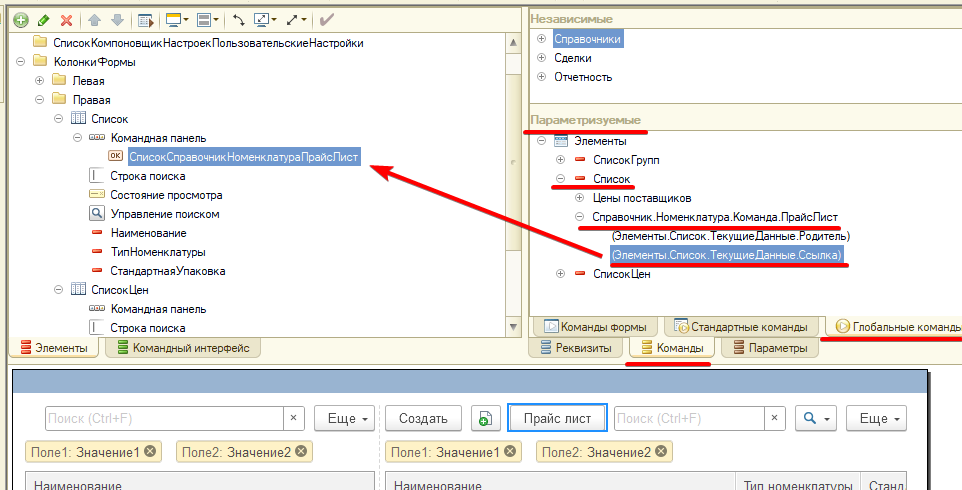
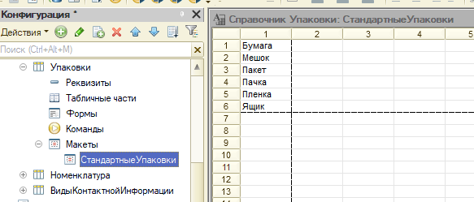

# Задание к занятию «Табличные документы, работа с макетами»

Задачи 1-3 обязательны к выполнению (кроме текста под спойлером "Дополнительно" - эти задачи делать необязательно. Возможно, Вы вернетесь к ним позднее, после того, как изучите дополнительный материал). Задача 4 - необязательна.

Пожалуйста, присылайте на проверку все задачи сразу, одним файлом выгрузки информационной базы (dt)
Любые вопросы по решению задач задавайте в чате учебной группы.

## Цель задания

1. Изучить работу с макетами табличных документов.
2. Узнать, как загрузить информацию из Excel-файла.
3. Подготовить конфигурацию к последующей работе.

## Чеклист готовности к домашнему заданию

- [ ] Установить учебную платформу версии 8.3.22 или больше.
- [ ] Подготовить разработанную ранее конфигурацию "УправлениеИТФирмой"
- [ ] Просмотреть материал занятия «Табличные документы, работа с макетами».

## Инструкция к заданию

1. Решите описанные задачи в конфигураторе.

В тексте задания приведен программный код для решения задач. Конечно, Вы можете использовать его. Но для более продуктивного обучения, старайтесь, сначала, самостоятельно написать код. Если все же, самостоятельно решить задачу не удалось, используйте код из текста задачи но обязательно пройдите его в отладке, посмотрите, что попадает в переменные, как преобразуются значения. Старайтесь максимально детально разобраться в механизме.

2. Протестируйте решение в пользовательском режиме, обязательно введите данные в базу, убедитесь, что все работает.
3. Отправьте на проверку в личном кабинете Нетологии один общий файл базы данных (.dt), содержащей решение всех задач и файл Excel, на котором Вы тестировали загрузку.

## Задача 1. Формирование печатной формы, при помощи конструктора печати

### Описание задачи

Создайте печатную форму "Чек" для документа "Реализация товаров и услуг".

Печатная форма должна содердать информацию о дате и номере документа, менеджере, который оформил документ, список товаров с наименованием товара, количеством и суммой, общей суммой по документу.

### Процесс выполнения

1. В документе "Реализация товаров и услуг" перейдите в раздел "Макеты" - "Конструкторы" - "Конструктор печати"
2. Имя команды укажите "Чек"
3. В шапке документа выведите Номер, Дата и Ответственный
4. В табличной части - Номенклатура, Количество, Сумма
5. В подвале - СуммаДокумента
6. Команду расположите в Командной панели формы "Важное"
7. Исправьте ячейку в области заголовок на "Чек"
8. Убедитесь, что печатная форма формируется корректно

<details>
  <summary>Дополнительно</summary>
Выведите номер и дату в заголовке формы, чтобы было, например "Чек №000000001 от 14.05.2023" (из области Шапка их в этом случае следует убрать)
Сумму по документу выведите в виде ячейки Итого под таблицей (см пример выполнения ДЗ)
Полк "Ответственный" измените на "Менеджер"
</details>

## Задача 2. Создать команду печати прайс-листа в справочнике «Номенклатура» в табличный документ

### Описание задачи

Добавить возможность формирования прайс-листа в справочнике «Номенклатура».

### Процесс выполнения

1. Для справочника Номенклатура добавьте макет "ПрайсЛист"с типом Табличный документ. Создайте в нём области:

- «Шапка» с полем «Дата»;
- «ТабличнаяЧастьЗаголовок» с именами колонок, которые будут выводится на печать;
- «ТабличнаяЧастьСтрока» с полями «Товар» и «Цена».

<details>
  <summary>Пример макета</summary>

<p align="center" width="100%">
   
</p>

</details>

2. Для справочника Номенклатура добавьте команду, параметризуйте ее типом СправочникСсылка.Номенклатура, Режим использования параметра укажите "Множественный", Группа - Командная панель формы.Важное
3. В обработчике команды пропишите создание нового табличного документа, затем передайте его и параметр команды в серверную процедуру, для заполнения. После заполнения, выведите документ пользователю

<details>
  <summary>Код</summary>

```bsl
&НаКлиенте
Процедура ОбработкаКоманды(ПараметрКоманды, ПараметрыВыполненияКоманды)

	ТабличныйДокумент = Новый ТабличныйДокумент;
	СформироватьПрайслистНаСервере(ТабличныйДокумент, ПараметрКоманды);
	
	// Отключим отображение сетки для более естественного отображения
	ТабличныйДокумент.ОтображатьСетку = Ложь;

	ТабличныйДокумент.Показать("Прайс-лист");	
КонецПроцедуры

&НаСервере
Процедура СформироватьПрайслистНаСервере(ТабличныйДокумент, Ссылки)

	// В принципе, обработку заполнения табличного документа можно описать тут,
	// но все таки, это действие уместнее разместить в модуле менеджера справочника, 
	// вызовем процедуру в нем
	Справочники.Номенклатура.СформироватьПрайслист(ТабличныйДокумент, Ссылки);
КонецПроцедуры
```

</details>

4. В модуле менеджера пропишем процедуру заполнения табличного документа по макету. Цену номенклатуры следует получать при помощи среза последних из регистра сведений на текущую дату.

<details>
  <summary>Код</summary>

```bsl
Процедура СформироватьПрайслист(ТабличныйДокумент, Ссылки)
	
	Макет = ПолучитьМакет("ПрайсЛист");
	
	// Получаем область шапки и макета по имени
	Шапка = Макет.ПолучитьОбласть("Шапка");
	// Заполняем параметр Дата
	Шапка.Параметры.Дата = ТекущаяДата();
	// Выводим область в документ
	ТабличныйДокумент.Вывести(Шапка);
	
	// Получаем область заголовка
	ТабличнаяЧастьЗаголовок = Макет.ПолучитьОбласть("ТабличнаяЧастьЗаголовок");
	ТабличныйДокумент.Вывести(ТабличнаяЧастьЗаголовок);
	
	// Получаем область строк для формирования табличной части в цикле
	ТабличнаяЧастьСтрока = Макет.ПолучитьОбласть("ТабличнаяЧастьСтрока");
	
	Для каждого СсылкаНоменклатура из Ссылки Цикл
		ТабличнаяЧастьСтрока.Параметры.Товар = СсылкаНоменклатура; 
		ТабличнаяЧастьСтрока.Параметры.Цена = ПолучитьЦенуНоменклатуры(СсылкаНоменклатура); 
		ТабличныйДокумент.Вывести(ТабличнаяЧастьСтрока);
	КонецЦикла;
	        
КонецПроцедуры

Функция ПолучитьЦенуНоменклатуры(СсылкаНоменклатура)
	
	Отбор = Новый Структура("Номенклатура", СсылкаНоменклатура);
	ПоследняяЗапись = РегистрыСведений.ЦеныПродажиНоменклатуры.ПолучитьПоследнее(ТекущаяДата(), Отбор);
	Возврат ПоследняяЗапись.Цена;
	
КонецФункции
```

</details>

<details>
  <summary>Дополнительно</summary>

Отформатируйте дату, перед выводом в табличный документ

</details>

5. Важно! Если Вы отключили на форме списка автозаполнение командной панели формы, команда сама не будет выведена в список. Это необходимо настроить. Для этого, отройте редактор формы, перейдите в раздел Команды - Глобальные команды - Параметризуемые - Найдите Список номенклатуры, разверните его, в нем команда ПрайсЛист, а в ней выбираем вариант для ТекущиеДанные.Ссылка и переносим на командную панель списка.

<p align="center" width="100%">
   
</p>

6. Убедитесь, что прайслист печатается для выделенных строк справочника Номенклатура

## Задача 3. Создать обработку для загрузки прайса из файла Excel (*.xlsx)

### Описание задачи

Создадим обработку для загрузки цен из файла xlsx.

Обработка создаёт новый документ «Цены номенклатуры» и заполняет данными из файла.

Логика обработки аналогична загрузке из csv, но источником будет файл Excel

### Процесс выполнения

1. Создайте файл для тестирования загрузки - файл Excel, в первой строке заголовки полей, начиная со второй строки - данные. [Пример файла](src/Pricelist.xlsx)
2. Создайте обработку "Загрузка прайса из файла xlsx" аналогично загрузке из csv, разместите ее в той же подсистеме. Отличаться будет выбор файла - должны выбираться файлы xlsx. Процедура загрузки - читать табличный документ следует через табличный документ. Если номенклатура не найдена, выведите сообщение вида «Номенклатура: « + НаименованиеНоменклатуры + » не найдена».


<details>
  <summary>Код</summary>

```bsl

&НаКлиенте
Процедура ПутьКФайлуНачалоВыбора(Элемент, ДанныеВыбора, СтандартнаяОбработка)
	ВыбратьФайлАсинхронно();
КонецПроцедуры

&НаКлиенте
Асинх Процедура ВыбратьФайлАсинхронно()

	Диалог = Новый ДиалогВыбораФайла(РежимДиалогаВыбораФайла.Открытие);
	Диалог.Заголовок = "Выберите файл для загрузки данных";
	Диалог.Фильтр = "Excel-файлы|*.xlsx";

	РезультатВыбора = Ждать Диалог.ВыбратьАсинх();

	Если РезультатВыбора = Неопределено Тогда
		// Пользователь ничего не выбрал
		Возврат;
	КонецЕсли;

	Объект.ПутьКФайлу = РезультатВыбора[0];

КонецПроцедуры

&НаКлиенте
Процедура Загрузить(Команда)
	
	Если Не ПроверитьЗаполнение() Тогда
		Возврат;
	КонецЕсли;
	
	ЗагрузитьФайл();

КонецПроцедуры

&НаКлиенте
Асинх Процедура ЗагрузитьФайл()

	ОписаниеФайла = Ждать ПоместитьФайлНаСерверАсинх(, , , Объект.ПутьКФайлу, УникальныйИдентификатор);
	СоздатьДокумент(Объект.Контрагент, ОписаниеФайла.Адрес);	

КонецПроцедуры

&НаСервереБезКонтекста
Процедура СоздатьДокумент(Контрагент, АдресФайла)

	Данные = ПолучитьИзВременногоХранилища(АдресФайла);
	ИмяПромежуточногоФайла = ПолучитьИмяВременногоФайла("xlsx");
	Данные.Записать(ИмяПромежуточногоФайла);

	ТабличныйДокумент = Новый ТабличныйДокумент;
	ТабличныйДокумент.Прочитать(ИмяПромежуточногоФайла);

	// Создаём новый документ
	ДокументЦены = Документы.УстановкаЦен.СоздатьДокумент();
	ДокументЦены.Дата = ТекущаяДата();
	ДокументЦены.Контрагент = Контрагент;
	ДокументЦены.Комментарий = "Загружен из файла";

	ШаблонСообщения = НСтр("ru = 'Номенклатура: %1 не найдена'");

	ОписаниеТипаЧисло = Новый ОписаниеТипов("Число");
	// Начинаем со 2 строки т.к. в 1-й заголовки колонок
	Для Сч = 2 По ТабличныйДокумент.ВысотаТаблицы Цикл 

		ИмяНоменклатуры = ТабличныйДокумент.Область(Сч, 1).Текст;
		Цена = ТабличныйДокумент.Область(Сч, 2).Текст;		

		Номенклатура = Справочники.Номенклатура.НайтиПоНаименованию(ИмяНоменклатуры);
		Если Не ЗначениеЗаполнено(Номенклатура) Тогда

			Сообщение = Новый СообщениеПользователю;
			Сообщение.Текст = СтрШаблон(ШаблонСообщения, ИмяНоменклатуры);
			Сообщение.Сообщить();

			Продолжить;

		КонецЕсли;

		НоваяСтрокаТЧ = ДокументЦены.Цены.Добавить();
		НоваяСтрокаТЧ.Номенклатура = Номенклатура;
		НоваяСтрокаТЧ.Цена = ОписаниеТипаЧисло.ПривестиЗначение(Цена);

	КонецЦикла;

	ДокументЦены.Записать(РежимЗаписиДокумента.Запись);

	УдалитьФайлы(ИмяПромежуточногоФайла);
КонецПроцедуры
```

</details>

<details>
  <summary>Дополнительно</summary>

Реализуйте в обработке все те же возможности, которые делали для загрузки из csv:

- возможность указать отказаться от создания документа, если номенклатура не найдена
- возможность создавать номенклатуру
- возможность устанавливать в документе свойство Согласована и проводить его

</details>

## Задача 4*. Хранение данных в макете

*Это дополнительная задача, реализовывать ее не обязательно.*
*Задача предназначена для тех студентов, которым первые покажутся слишкм простыми.*
*В процессе выполнения не будут даны примеры программного кода.*

### Описание задачи

Часто можно встретить такой вариант работы с макетами, когда, в нем храняться справочные данные, и они заполняются в справочник при обновлении конфигурации, или при вызове пользователем определенной команды.

В качестве примера, создадим возможность заполнить справочник упаковок стандартными значениями. При этом, данные будут храниться прямо в конфигурации, в макете

### Процесс выполнения

1. В справочнике Упаковки создайте макет "СтандартныеУпаковки" с типом Табличный документ. В макет запишите несколько стандартных упаковок

<p align="center" width="100%">
   
</p>

2. Отобразите в форме списка справочника команду создания стандартных упаковок.
3. Если упаковка с таким наименованием уже существует, не создавайте ее
4. Чтение макета ничем не отличается от чтения Excel-файла, только табличный документ получаем не из файла, а из макета справочника
5. После завершения создания номенклатуры, можно вызвать у элемента Список метод Обновить(), чтобы сразу увидеть новые данные

## Пример

[Пример выполнения домашнего задания](examples/HW_6_3_example.md)

## Критерии оценки

Зачёт ставится, если:

1. Программа запускается, не возникает явных ошибок, исключений при выполнении программы (в том числе, если Вы начали делать дополнительную задачу, ее функционал не должен приводить к ошибкам и исключениям)
2. Для документа Реализация товаров и услуг реализована печатная форма "Чек", содержащая все описанные поля
3. Прайс-лист формируется на основе выделенных строк в форме списка «Номенклатура».
4. Цена номенклатуры определяется на текущую дату.
5. Можно выделить одну или несколько строк для формирования печатной формы.
6. Данные из файла Excel загружаются в базу данных.
7. Выслан файл, на котором тестировалась загрузка.
8. Введены тестовые данные

