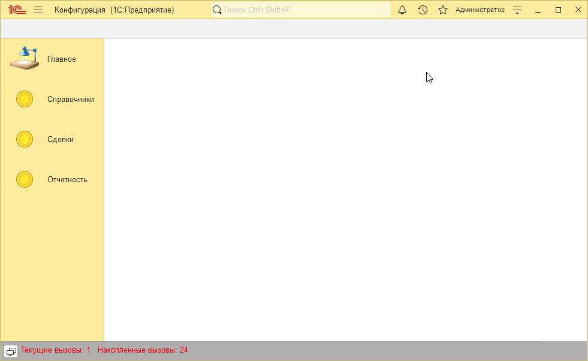
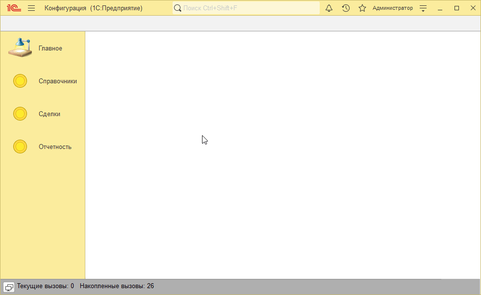
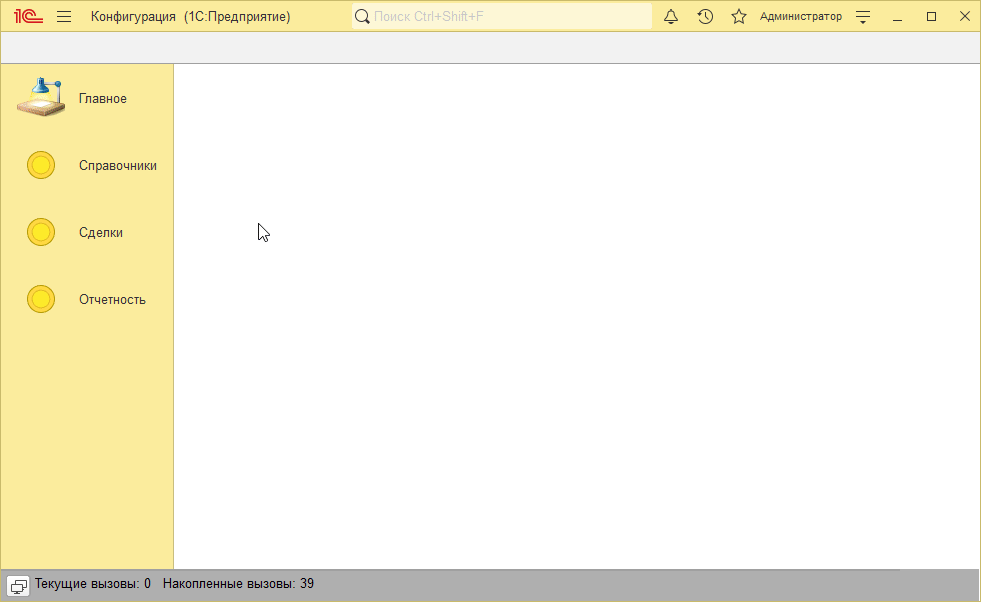

# Пример решения домашнего задания к занятию "Файлы"

## Задача 1. Создать обработку для загрузки цен из файла

   

## Задача 2. Развитие обработки для загрузки цен из файла

   

## Задача 3*. Согласование цен и проведение документа

   

## Задача 4*. Создание не найденной номенклатуры

   

