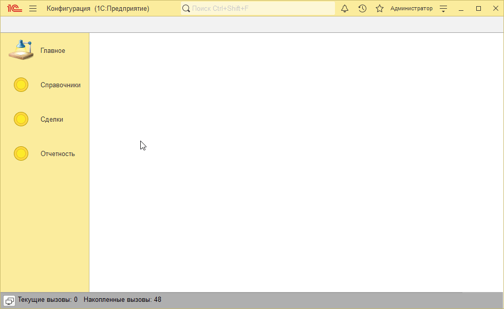
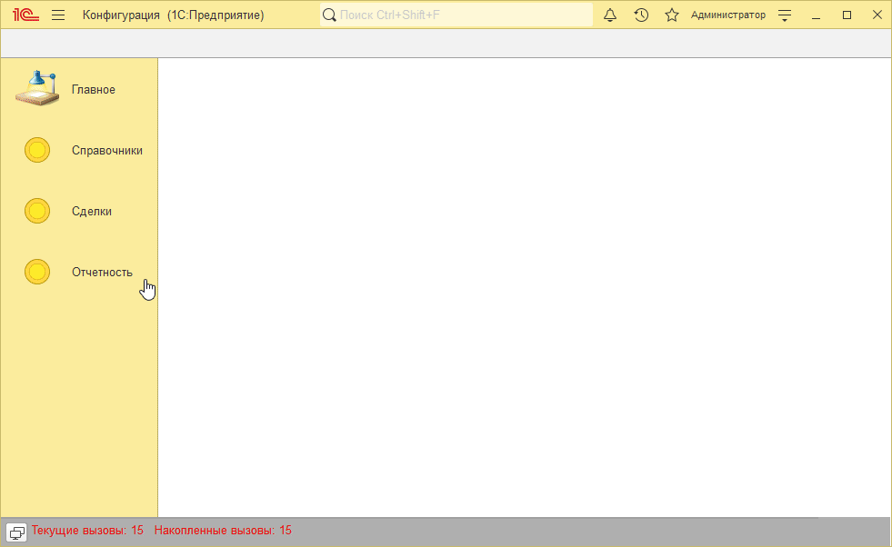

# Пример решения домашнего задания к занятию "Работа с файлами на сервере, Двоичные данные"

## Задача 1. Обработка файла на сервере

Поведение в пользовательском режиме аналогично поведению в результате прошлого домашнего задания

   

## Задача 2. Преобразование файла в Base64 и обратно

   

