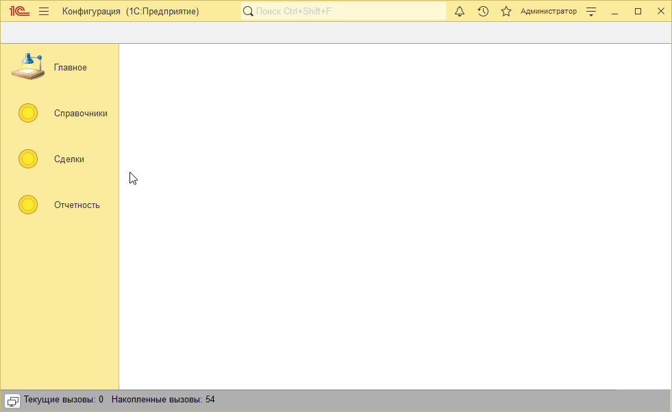
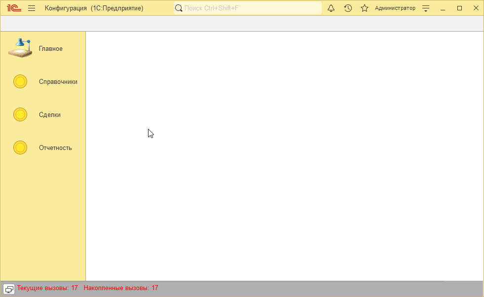
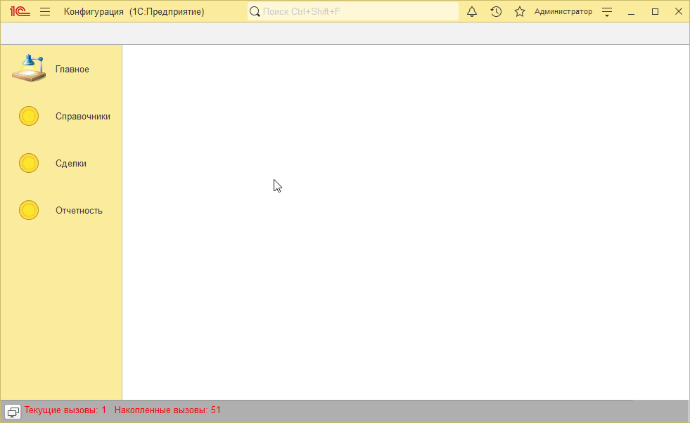
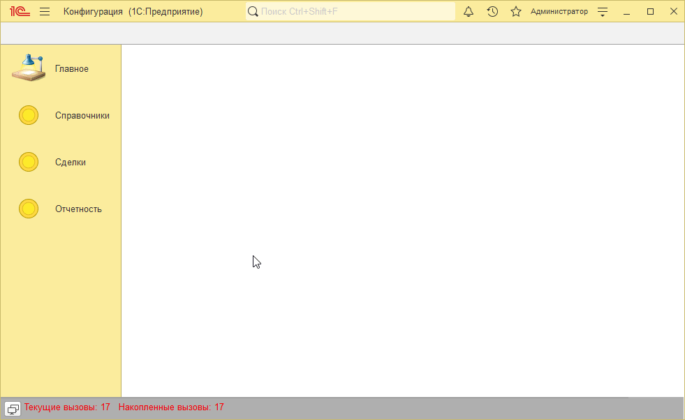

# Пример решения домашнего задания к занятию "Хранилище значения, потоки"

## Задача 1. Формирование печатной формы, при помощи конструктора печати

   

## Задача 2. Создать команду печати прайс-листа в справочнике «Номенклатура» в табличный документ

   

## Задача 3. Создать обработку для загрузки прайса из файла Excel (*.xlsx)

   

## Задача 4*. Хранение данных в макете

   

