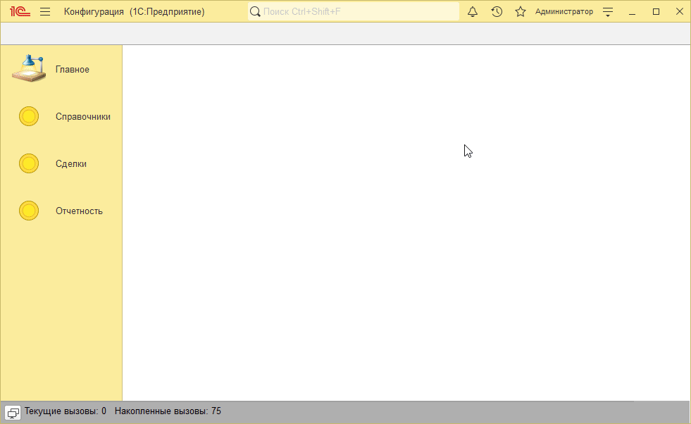
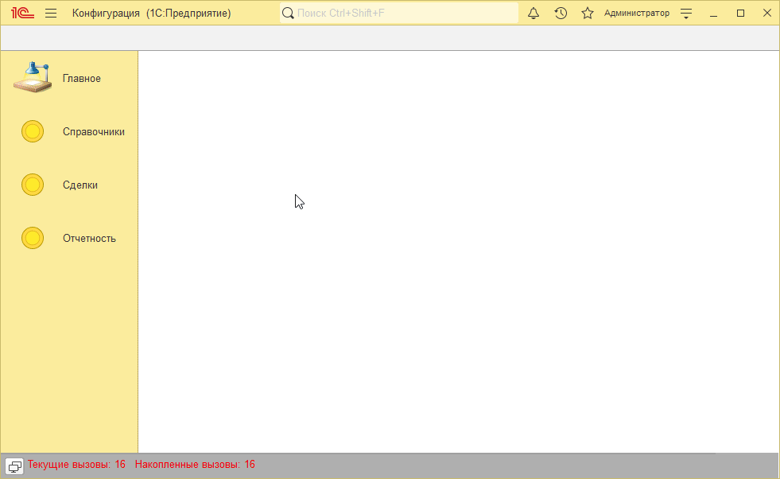
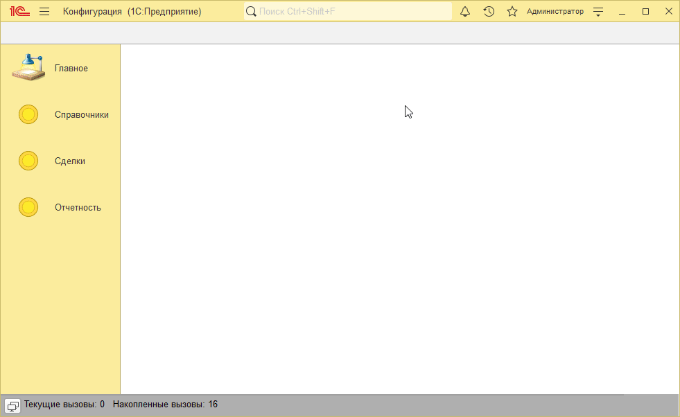

# Пример решения домашнего задания к занятию "Виртуальные таблицы регистров накопления"

## Задача 1. Фотография сотрудника

   

## Задача 2. Обработка двоичных данных

   

## Задача 3*. Удаление фотографии

   

## Задача 4*. Потоки

   

