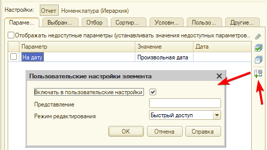

# Задание к занятию «Виртуальные таблицы регистров накопления»

*Примерное время выполнения: 40–120 минут*

## Цель задания

1. Изучить работу с виртульными таблицами регистров накопления
2. Освоить методику контроля остатков при проведении документа
3. Подготовить конфигурацию к последующей работе.

## Чеклист готовности к домашнему заданию

- [ ] Установить учебную платформу версии 8.3.22 или больше.
- [ ] Подготовить разработанную ранее конфигурацию "УправлениеИТФирмой"
- [ ] Просмотреть материал занятия «Виртуальные таблицы регистров накопления».

## Инструкция к заданию

1. Решите описанные задачи в конфигураторе.

В тексте задания приведен программный код для решения задач. Конечно, Вы можете использовать его. Но для более продуктивного обучения, старайтесь, сначала, самостоятельно написать код. Если все же, самостоятельно решить задачу не удалось, используйте код из текста задачи но обязательно пройдите его в отладке, посмотрите, что попадает в переменные, как преобразуются значения. Старайтесь максимально детально разобраться в механизме.

2. Протестируйте решение в пользовательском режиме, обязательно введите данные в базу, убедитесь, что все работает.
3. Отправьте на проверку в личном кабинете Нетологии один общий файл базы данных (.dt), содержащей решение всех задач.

## Задача 1. Установка цен

### Описание задачи

Переделать обработку «Установка цен» с использованием среза последних по регистру сведений, вместо поиска по регистру накопления.

### Процесс выполнения

В одном из прошлых [заданий](2_InfoRgReadWright.md), в задаче Пакетное изменение цен, мы создавали процедуру получающую последнюю цену номенклатуры. Для этого мы вызывали собственную функцию *ПолучитьПоследнююЦенуНоменклатуры*, в которой создавали набор записей и перебирали его в цикле. Сейчас нам необходимо ее перееписать:

1. Создать структуру с отбором по номенклатуре.
2. Считать запись с последней ценой.
3. Вернуть значение цены из этой записи.

<details>
  <summary>Код</summary>
  
```bsl
&НаСервере
Функция ПолучитьПоследнююЦенуНоменклатуры(Номенклатура)

	// Готовим отбор для регистра
	Отбор = Новый Структура;
	Отбор.Вставить("Номенклатура", Номенклатура);
	
	// Читаем запись
	// Не устанавливаем отбор по дате, чтобы получить самую последнюю запись
	ПоследняяЦена = РегистрыСведений.ЦеныПродажиНоменклатуры.ПолучитьПоследнее( , Отбор);
	
	// Возвращаем цену для дальнейшего использования в алгоритме	
	Возврат ПоследняяЦена.Цена;

КонецФункции
```

</details>

<details>
  <summary>Дополнительно</summary>

Добавьте в форме обработки поле для указания даты "Дата актуальности", оно должно быть доступно только когда выбран вариант установки "Процентом от текущей".
Если дата заполнена - получайте текущую цену, актуальную на эту дату.
При открытии формы, заполняйте поле текущей датой.

</details>

4. Убедитесь, что установка цены процентом работает корректно

## Задача 2. Контроль остатков в документе Реализация

### Описание задачи

При проведении документа РеализацияТоваровИУслуг необходимо проконтролировать, что товара, который мы хотим списать достаточно на складе (на остатке в регистре)

### Процесс выполнения

Существует 2 методики контроля остатков при списании товаров:

1. Перед формированием движений считываются остатки, сравнивается остаток из регистра с количеством в документе, если товара достаточно, формируются движения. ("Старая методика")
2. Движения формируются без контроля остатков. Движения по регистру записываются в базу данных. Считываются все остатки из регистра. Если среди остатков есть такие, где количество меньше 0, проведение документа отменяется.

<details>
  <summary>Дополнительно</summary>

Более подробно почитать про методики контроля остатков можно в [статье](https://xn----1-bedvffifm4g.xn--p1ai/articles/2017-02-12-two-methods-for-inventory-check)
Тут описано с использованием запросов, но примерно то же самое можно реализовать без них.

</details>

В рамках домашнего задания, можно использовать любую методику. Но т.к. в последующих домашних заданиях мы будем рассматривать расчет себестоимости и нам в любом случае понадобится читать остатки до записи движений, здесь рассмотрим "старую" методику.

1. В цикле, перед формированием движений создайте отбор по текущей обрабатываемой номенклатуре.
2. Получите остатки по регистру накопления
3. Если таблица остатков пустая (в ней нет ниодной строки), значит товара нет на остатках совсем - сообщите об этом, установите Отказ в значение Истина.
4. Если в таблице есть строки, мы можем быть уверены, что там только одна строка (т.к. в регистре только одно измерение и мы установили по нему отбор). Получим эту строку и сравним поле Количество в ней, с количеством в текущей строке таблицы
5. Если количество в документе больше - сообщите об ошибке и откажитесь от записи документа.
6. Если остаток товаров достаточен, сформируйте движения

<details>
  <summary>Код</summary>
  
```bsl
Процедура ОбработкаПроведения(Отказ, Режим)

	// Запишем пустой набор записей по регистру товаров, чтобы удалить существующие движения
	// Это необходимо для того, чтобы движения этого документа не влияли на остатки при его перепроведении
	Движения.Продажи.Очистить();
	Движения.Продажи.Записать();

	Движения.Товары.Записывать = Истина;
	Движения.Продажи.Записывать = Истина;

	ТаблицаДляПроведения = Товары.Выгрузить();
	ТаблицаДляПроведения.Свернуть("Номенклатура", "Количество, Сумма");

	ТипТовар = Перечисления.ТипНоменклатуры.Товар;

	Для Каждого ТекСтрокаТовары Из ТаблицаДляПроведения Цикл

		Если ТекСтрокаТовары.Номенклатура.ТипНоменклатуры = ТипТовар Тогда 

			// Контролировать остаток, очевидно, надо только для товаров
			ОтборПоТовару = Новый Структура("Номенклатура", ТекСтрокаТовары.Номенклатура);
			// Получаем остатки по товару на дату документа
			Остатки = РегистрыНакопления.Товары.Остатки(Дата, ОтборПоТовару);

			Если Остатки.Количество() = 0 Тогда
				ТекстСообщения = СтрШаблон("Товара %1 нет на складе", ТекСтрокаТовары.Номенклатура);
				Сообщить(ТекстСообщения);
				Отказ = Истина;
				Продолжить;
			КонецЕсли;

			СтрокаОстатка = Остатки[0];
			Если СтрокаОстатка.Количество < ТекСтрокаТовары.Количество Тогда
				НедостатокТовара = ТекСтрокаТовары.Количество - СтрокаОстатка.Количество;
				ТекстСообщения = СтрШаблон("Товара %1 недостаточно на складе, не хватает %2", ТекСтрокаТовары.Номенклатура, НедостатокТовара);
				Сообщить(ТекстСообщения);
				Отказ = Истина;
				Продолжить;
			КонецЕсли;

			Движение = Движения.Товары.Добавить();
			Движение.ВидДвижения = ВидДвиженияНакопления.Расход;
			Движение.Период = Дата;
			Движение.Номенклатура = ТекСтрокаТовары.Номенклатура;
			Движение.Количество = ТекСтрокаТовары.Количество;
		КонецЕсли;

		Движение = Движения.Продажи.Добавить();
		Движение.Период = Дата;
		Движение.Сотрудник = Ответственный;
		Движение.Номенклатура = ТекСтрокаТовары.Номенклатура;
		Движение.Сумма = ТекСтрокаТовары.Сумма;

	КонецЦикла;

КонецПроцедуры
```

</details>

<details>
  <summary>Дополнительно</summary>

Можете попробовать реализовать "новую" методику контроля остатков, но помните о том, что далее она нам будет скорее мешать (дважды контролировать остатки и в цикле и после записи - избыточно)

</details>

7. Убедитесь, что контроль остатков работает верно, введите тестовые данные

## Задача 3. Отчеты

### Описание задачи

Необходимо создать отчеты для вывода текущих цен поставщиков и актуальных остатков номенклатуры

### Процесс выполнения

1. Создайте отчет АктуальныеЦеныПоставщиков. Разместите его в подсистеме Отчетность
2. В схеме компановки данных добавьте новый набор данных запрос
3. Пропишите запрос, получающий срез последних из регистра ЦеныПоставщиков. Получайте поля Номенклатура, Контрагент, Цена

<details>
  <summary>Код</summary>
  
```bsl
ВЫБРАТЬ
	ЦеныПоставщиковСрезПоследних.Номенклатура КАК Номенклатура,
	ЦеныПоставщиковСрезПоследних.Контрагент КАК Контрагент,
	ЦеныПоставщиковСрезПоследних.Цена КАК Цена
ИЗ
	РегистрСведений.ЦеныПоставщиков.СрезПоследних КАК ЦеныПоставщиковСрезПоследних
```

</details>

4. На закладке Ресурсы укажите Цену как ресурс отчета (перенесите поле в правую область). В колонке Выражение выберите из выпадающего списка "Среднее(Цена)"
5. На закладке Параметры у Вас был добавлен параметр Период. 

- Поменяйте текст в колонке Заголовок на "На конец дня".
- В колонку Выражение запишите строку: *КОНЕЦПЕРИОДА(&Период, "День")* это позволит всегда приводить указанное пользователем значение к концу дня
- В колонке Тип нажмите на кнопку выбора и укажите состав даты Дата

1. На закладке Настройки:

- Добавьте группировку; в Поле укажите "Номенклатура", в Тип - "Иерархия"
- На закладке Параметры настройте в пользовательских настройках периода Включение в пользовательские настройки

<p align="center" width="100%">
   
</p>

- На закладке Выбранные поля укажите Цену (перетащите в правую область)
- На закладке Отбор, добавьте отборы по Номенклатуре и Контрагенту. После добавления отбора, снимите флаг использования отбора (в первой колонке) и аналогично параметру Период, добавьте отборы в пользовательские настройки.

7. По аналогии, создайте Отчет "ОстаткиТоваров". (Далее будут описаны основные отличия, постарайтесь настроить отчет самостоятельно)
8. В качестве источника данных используйте запрос к таблице Остатки регистра накопления Товары. Получайте из него Номенклатуру и КоличествоОстаток

<details>
  <summary>Код</summary>
  
```bsl
ВЫБРАТЬ
	ТоварыОстатки.Номенклатура КАК Номенклатура,
	ТоварыОстатки.КоличествоОстаток КАК КоличествоОстаток
ИЗ
	РегистрНакопления.Товары.Остатки КАК ТоварыОстатки
```

</details>

9. Ресурс - Количество остаток. Выражение - Сумма (Не очень корректно складывать например штуки и килограммы, в которых может быть указано количество для номенклатуры. Но более тонкая настройка ресурсов будет рассмотрена в отдельном занятии далее)
10. Параметры - аналогично прошлому отчету
11. Настройки - по аналогии с предыдущим отчетом
12. Убедитесь, что оба отчета формируются.

## Задача 4*. Обороты по регистру накопления

*Это дополнительная задача, реализовывать ее не обязательно.*
*Задача предназначена для тех студентов, которым первые покажутся слишкм простыми.*
*В процессе выполнения не будут даны примеры программного кода.*


### Описание задачи

Для оценки деятельности менеджеров, заказчику необходимо получать информацию о их продажах за разные периоды и рассчитывать сумму премии. Реализуйте обработку для получения этих сумм.
В форме обработки пользователь должен указать период (дату с - дату по), процент премии для товаров и процент премии для услуг (они могут отличаться) Нажать на кнопку рассчитать и на выходе получить суммы премий

### Процесс выполнения

1. Создайте обработку "РасчетПремий". Разместите ее в подсистеме Отчетность
2. Создайте форму с необходимыми реквизитами.
3. При нажатии на кнопку выведите суммы по сотрудникам.
Внешний вид формы может быть любым. Главное, дать возможность ввести необходимые данные, а в итоге получить общую сумму премии для всех сотрудников
4. Протестируйте работу обработки.

## Пример

[Пример выполнения домашнего задания](examples/HW_5_4_example.md)

## Критерии оценки

Зачёт ставится, если:

1. Программа запускается, не возникает явных ошибок, исключений при выполнении программы (в том числе, если Вы начали делать дополнительную задачу, ее функционал не должен приводить к ошибкам и исключениям)
2. Установка цен продажи работает с использованием среза последних
3. В документе реализации товаров прописан контроль остатков. Документ не должен проводиться, если товара на складе не хватает
4. При отказе от проведения документа, пользователь должен получать сообщение об ошибке, в котором понятно описано, почему конкретно документ не был проведен.
5. Созданы, выведены в интерфейс и корректно формируются 2 отчета - "Актуальные цены поставщиков" и "Остатки товаров".
6. Введены тестовые данные

Задачи 1-3 обязательны к выполнению (кроме текста под спойлером "Дополнительно" - эти задачи делать не обязательно. Возможно, Вы вернетесь к ним позднее, после того, как изучите дополнительный материал). Задача 4 не обязательна к выполнению.

Пожалуйста, присылайте на проверку все задачи сразу, одним файлом выгрузки информационной базы (dt)

Любые вопросы по решению задач задавайте в чате учебной группы.
