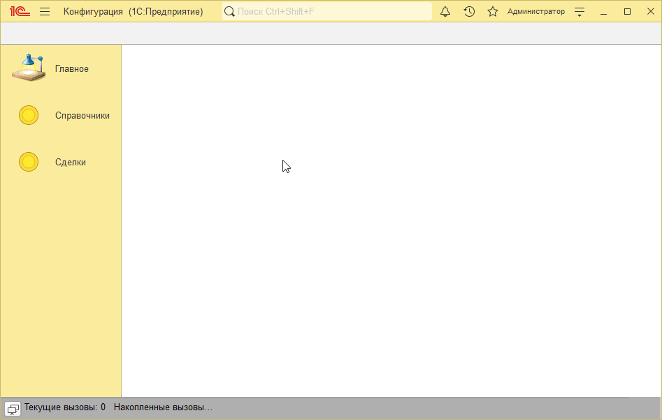
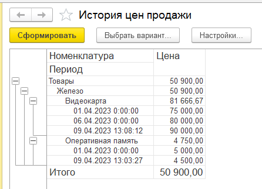
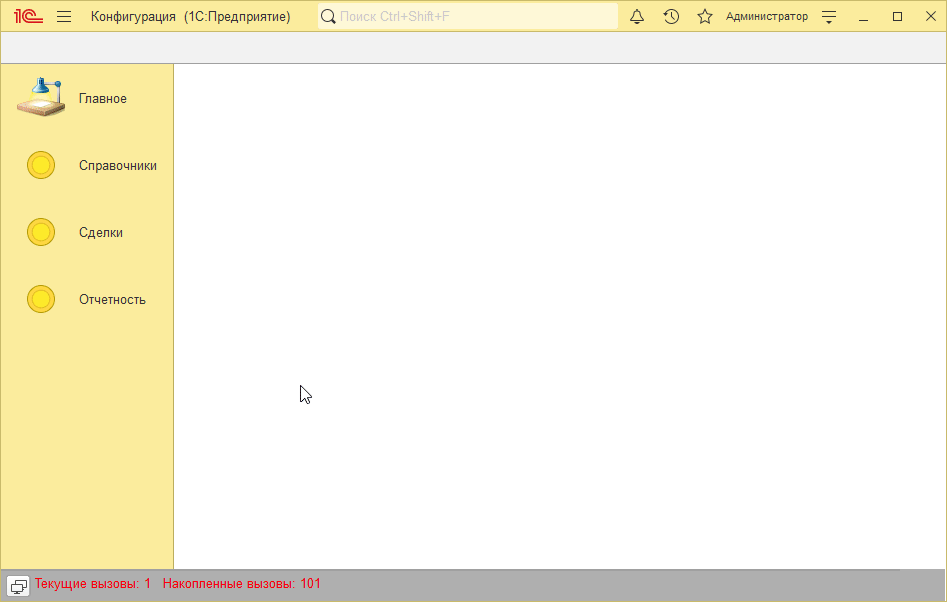
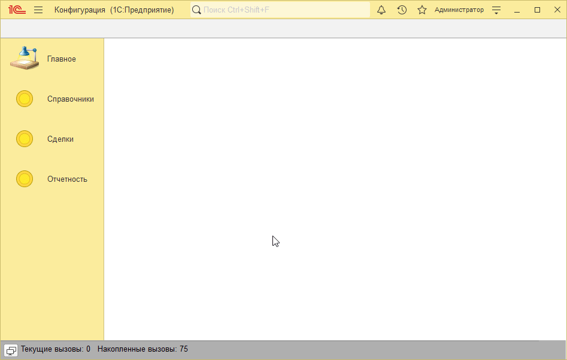

# Пример решения домашнего задания к занятию "Регистры сведений"

## Задача 1. Регистр "Цены продажи номенклатуры"

   

## Задача 2. История цен продажи

   

## Задача 3. Регистр "Цены поставщиков"

   

## Задача 4*. Отображение цен поставщика в форме контактного лица

   

