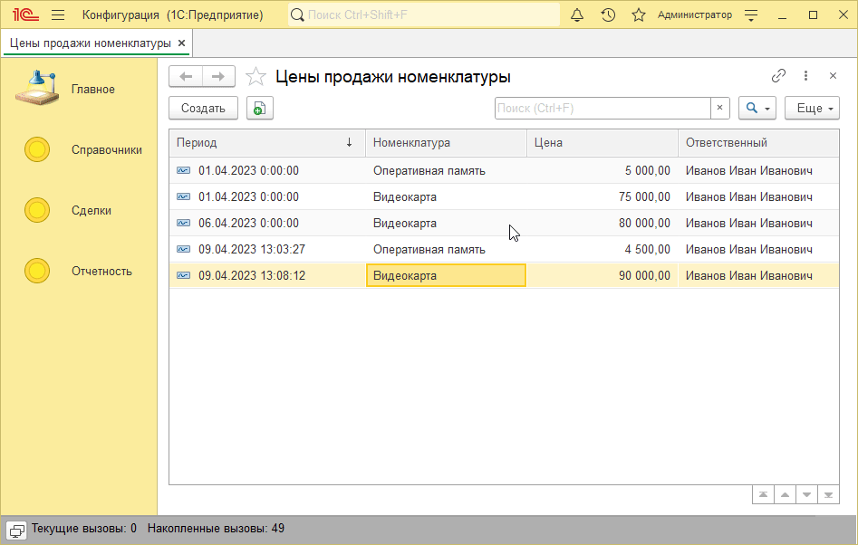
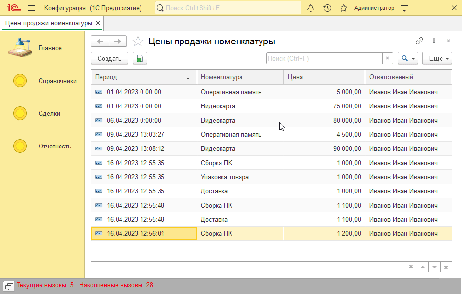
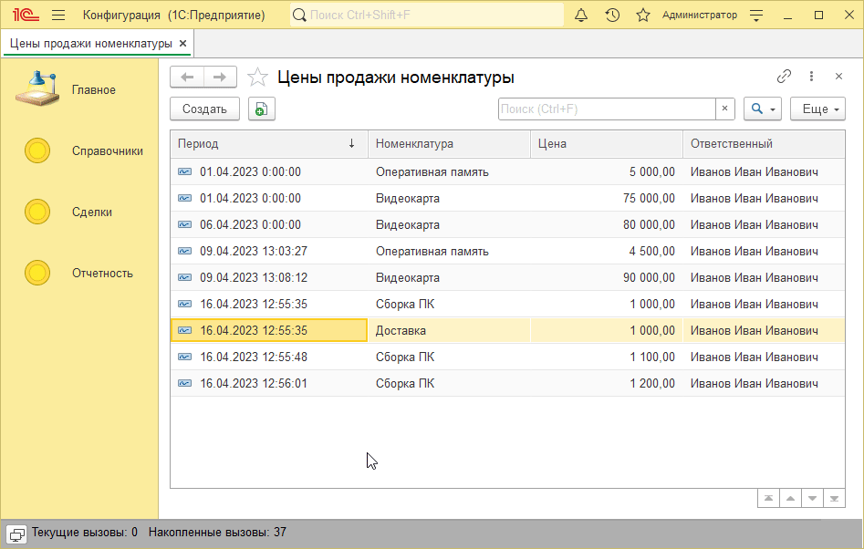
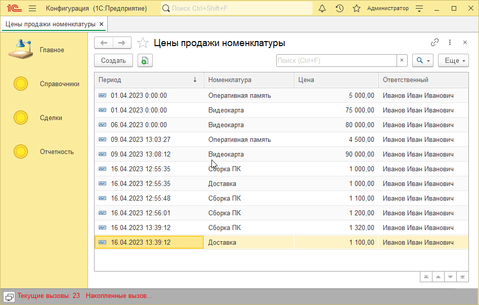

# Пример решения домашнего задания к занятию "Запись и чтение регистров cведений"

## Задача 1. Пакетное создание цен

   

## Задача 2. Пакетное удаление цен

   

## Задача 3. Пакетное изменение цен

   

## Задача 4. Улучшение обработки

   

