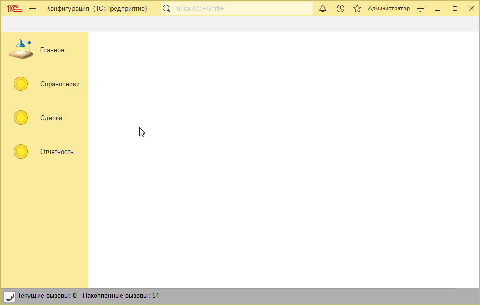
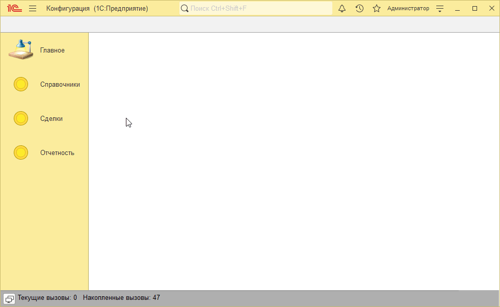
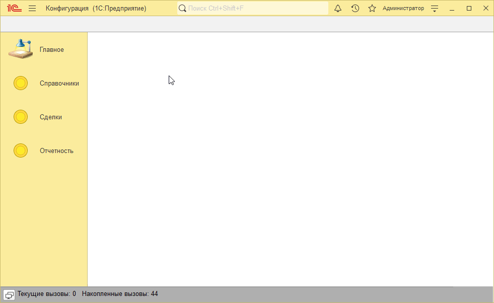

# Пример решения домашнего задания к занятию "Регистры накопления, проведение документов"

## Задача 1. Учет количества товара в регистре накопления

   

## Задача 2. Учет продаж товаров в разрезе сотрудников

   

## Задача 3. Установка цен поставщиков документом

   

