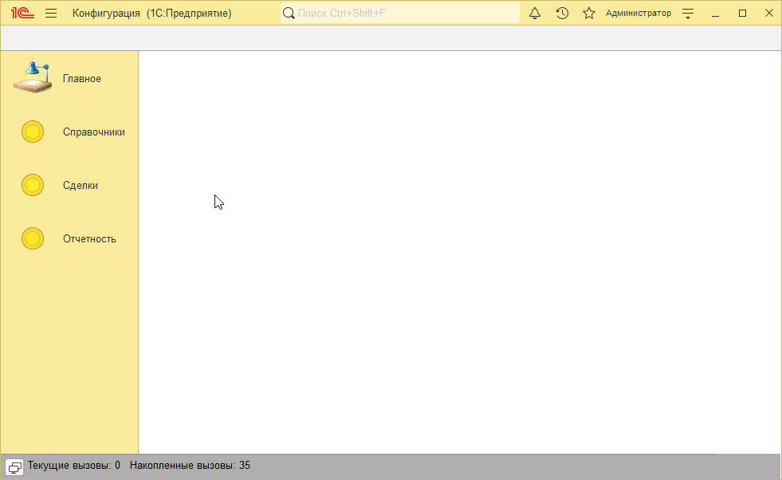
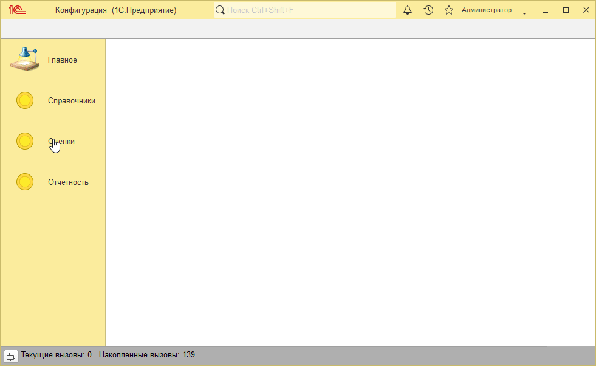
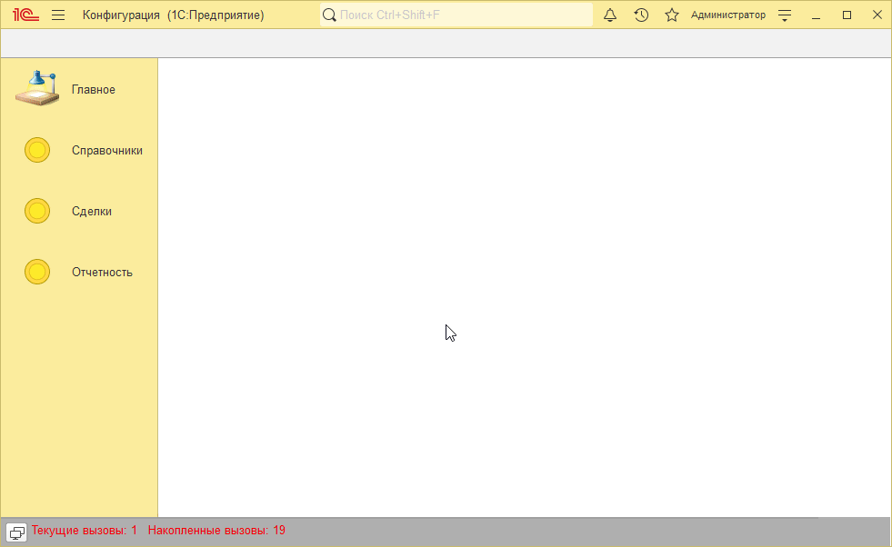
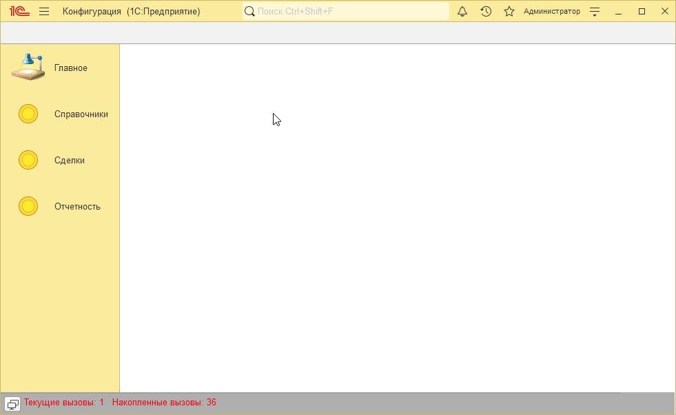

# Пример решения домашнего задания к занятию "Виртуальные таблицы регистров накопления"

## Задача 1. Установка цен

   

## Задача 2. Контроль остатков в документе Реализация

   

## Задача 3. Отчеты

   

## Задача 4*. Обороты по регистру накопления

Важно. Здесь таблица с колонками сделана для наглядности Вам такой сложный интерфейс реализовывать не обязательно (хотя и не запрещено, конечно). Важно, чтобы итоговые суммы премий рассчитывались корректно.

   

