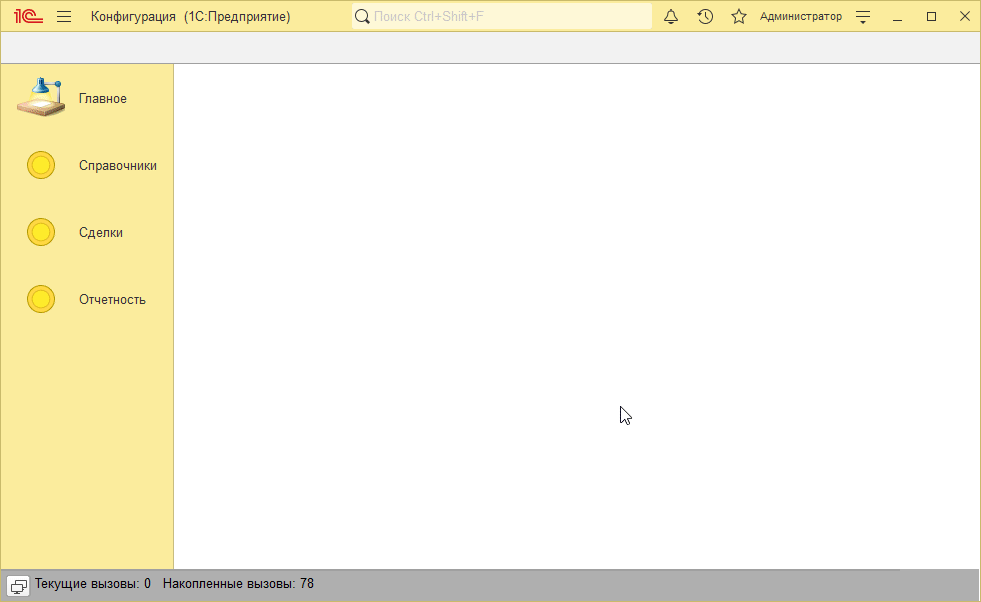
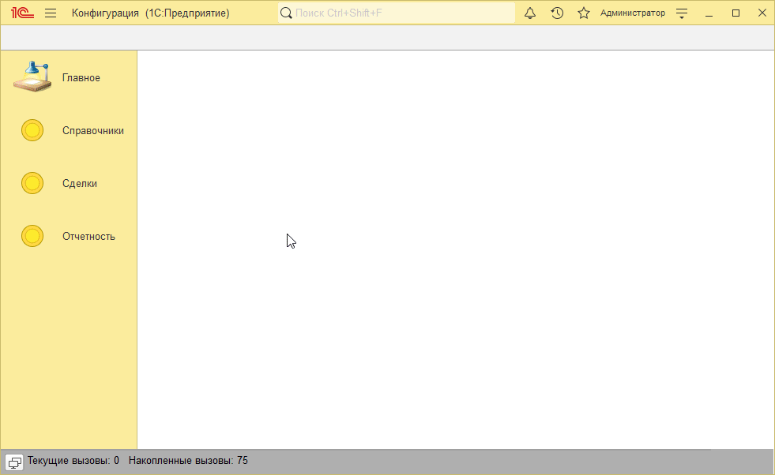

# Пример решения домашнего задания к занятию "Расчет себестоимости и последовательности документов"

## Задача 1. Реализовать расчёт себестоимости товаров в документе «Реализация»

<p align="center" width="100%">
   
</p>

## Задача 2. Реализовать последовательность документов для пересчёта документов «Поступление» и «Реализация товаров»

Здесь для наглядности в обработку проведения документов добавлена строчка

```bsl
Сообщить("Проведен " + Ссылка);
```

Вам это делать не нужно, можно просто поставить точки останова в ОбработкуПроведения и убедиться, что документы перепроводятся.

<p align="center" width="100%">
   
</p>
