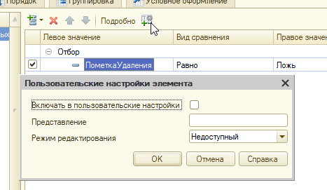

# Задание к занятию «Формы списка и выбора»

*Примерное время выполнения: 20–60 минут*

## Цель задания

1. Научиться работать с формами списков и выбора.
2. Разобраться с настройками динамического списка.
3. Подготовить конфигурацию к последующей работе.

## Чеклист готовности к домашнему заданию

- [ ] Установить учебную платформу версии 8.3.22 или больше.
- [ ] Подготовить разработанную ранее конфигурацию "УправлениеИТФирмой"
- [ ] Просмотреть материал занятия «Ссылочные типы».

## Инструкция к заданию

1. Решите описанные задачи в конфигураторе.

В тексте задания приведен программный код для решения задач. Конечно, Вы можете использовать его. Но для более продуктивного обучения, старайтесь, сначала, самостоятельно написать код. Если все же, самостоятельно решить задачу не удалось, используйте код из текста задачи но обязательно пройдите его в отладке, посмотрите, что попадает в переменные, как преобразуются значения. Старайтесь максимально детально разобраться в механизме.

2. Протестируйте решение в пользовательском режиме, обязательно введите данные в базу, убедитесь, что все работает.
3. Отправьте на проверку в личном кабинете Нетологии один общий файл базы данных (.dt), содержащей решение всех задач.

## Задача 1. Видимость помеченных на удаление элементов списка

### Описание задачи

Скрыть помеченных на удаление контрагентов, дав возможность показать их по команде в подменю «Ещё».

### Процесс выполнения

1. Создайте элемент стиля ШрифтПомеченныхНаУдаление (зачёркнутый) и/или ЦветПомеченныхНаУдаление (серый).
2. В настройках условного оформления динамического списка контрагентов добавьте условие на пометку удаления, применив стиль ко всей строке.

- В конфигураторе откройте форму списка справочника Контрагенты
- Перейдите в настройки Динамического списка, в раздел "Условное оформление"
- Добавьте строку в настройку условного оформления. В ней:

	- В колонке "Оформление" установите шрифт - ШрифтПомеченныхНаУдаление, цвет шрифта - ЦветПомеченныхНаУдаление
    - В колонке Условие - задайте Отбор ПометкаУдаления = Истина
    - Оформляемые поля оставьте незаполненной

3. Зайдите в режим предприятия, пометьте одного контрагента на удаление, убедитесь, что для него установилось оформление, согласно правилам.
4. В отборе динамического списка установите отбор по умолчанию ПометкаУдаления — Равно — Ложь. 

<details>
  <summary>Важно</summary>
  Флажок «Включать в пользовательские настройки» для этого элемента нужно снять. Затем, открыть «Свойства элемента пользовательских настроек» и установить режим редактирования «Недоступный»
  <p align="center" width="100%">
   
</p>
</details>

5. Создайте в форме реквизит ПоказыватьПомеченныхНаУдаление с типом Булево. На форму реквизит выносить не нужно.
6. Создайте команду ПоказыватьПомеченныхНаУдаление. 
7. Вынесете команду на форму в командную панель формы. В свойствах кнопки установите ПоложениеВКоманднойПанели = В дополнительном подменю. Так, команда пропадет с формы, но будет доступна в подменю "Еще".
8. В обработчике команды:

- инвертировать реквизит ПоказыватьПомеченныхНаУдаление (т.е. поменять значение на противоположное)
- установить пометку кнопки согласно новому значению реквизита
- элемент отбора нужно найти в составе коллекции Список.КомпоновщикНастроек.Настройки.Отбор.Элементы по равенству свойства ЛевоеЗначение полю компоновки данных «ПометкаУдаления»
- в случае отсутствия такого элемента его нужно создать
- правым значением элемента отбора будет Ложь, видом сравнения — равно, а Использование будет зависеть от значения реквизита формы ПоказыватьПомеченныхНаУдаление

<details>
  <summary>Код</summary>
    
  ```bsl
	&НаКлиенте
	Процедура ПоказыватьПомеченныхНаУдаление(Команда)   
	
		ПоказыватьПомеченныхНаУдаление = Не ПоказыватьПомеченныхНаУдаление;
		Элементы.ФормаПоказыватьПомеченныхНаУдаление.Пометка = ПоказыватьПомеченныхНаУдаление;
	
		ПолеПометкаУдаления = Новый ПолеКомпоновкиДанных("ПометкаУдаления");
		НайденныйЭлементОтбора = Неопределено;
		ЭлементыОтбора = Список.КомпоновщикНастроек.Настройки.Отбор.Элементы;
		Для Каждого ЭлементОтбора Из ЭлементыОтбора Цикл
			Если ЭлементОтбора.ЛевоеЗначение = ПолеПометкаУдаления Тогда
				НайденныйЭлементОтбора = ЭлементОтбора;
				Прервать;
			КонецЕсли;
		КонецЦикла;
	
		Если НайденныйЭлементОтбора = Неопределено Тогда
			НайденныйЭлементОтбора = ЭлементыОтбора.Добавить(Тип("ЭлементОтбораКомпоновкиДанных"));
			НайденныйЭлементОтбора.ЛевоеЗначение = ПолеПометкаУдаления;
		КонецЕсли;
	
		НайденныйЭлементОтбора.ВидСравнения = ВидСравненияКомпоновкиДанных.Равно;
	  НайденныйЭлементОтбора.ПравоеЗначение = Ложь;
  	НайденныйЭлементОтбора.Использование = Не ПоказыватьПомеченныхНаУдаление;
	
  КонецПроцедура
  ```

</details>

## Задача 2. Подбор номенклатуры в формы документов

### Описание задачи

Дать пользователю возможность подбирать номенклатуру в документ не по одному значению, а сразу списком. Реализовать кнопку Подбор в форме документов.

### Процесс выполнения

1. В списке форм справочника Номенклатура добавьте новую Форму Выбора, **но не назначайте ее основной** задайте ей имя "ФормаВыбораСписком", определите состав реквизитов, необходимый для выбора номенклатуры.
2. В этой форме создайте новый реквизит СписокВыбранныхЭлементов. Тип реквизита - Таблица значений. Создайте 2 колонки - Номенклатура (СправочникСсылка.Номенклатура) и Количество (Число)
3. Разместите реквизит на форме, отобразите обе колонки.
4. Отключите автозаполнение командной панели.
5. Для списка элементов (основного списка формы) обработайте событие ВыборЗначения. В нем:

- Выполните поиск в таблице строки с этой номенклатурой;
- Если строка не найдена - создайте новую строку, в колонку Номенклатура укажите выбранное значение, в колонку Количество 1;
- Если строка найдена, увеличьте в ней количество на единицу.

<details>
  <summary>Код</summary>

```bsl
&НаКлиенте
Процедура СписокВыборЗначения(Элемент, Значение, СтандартнаяОбработка)

	СтандартнаяОбработка = Ложь;

	ОтборСтрок = Новый Структура("Номенклатура", Значение);
	НайденныеСтрокиВСпискеВыбранных = СписокВыбранныхЭлементов.НайтиСтроки(ОтборСтрок);

	Если НайденныеСтрокиВСпискеВыбранных.Количество() = 0 Тогда

		НоваяСтрокаТаблицы = СписокВыбранныхЭлементов.Добавить();
		НоваяСтрокаТаблицы.Номенклатура = Значение;
		НоваяСтрокаТаблицы.Количество = 1;

	Иначе

		НайденнаяСтрока = НайденныеСтрокиВСпискеВыбранных[0];
		НайденнаяСтрока.Количество = НайденнаяСтрока.Количество + 1;
		
	КонецЕсли;

КонецПроцедуры
```
</details>

6. Создайте команду "ОК" разместите ее в командной панели таблицы с выбранными значениями, установите для кнопки свойство КнопкаПоУмолчанию в значение Истина
7. При нажатии на кнопку, создайте массив структур аналогичный таблице. То есть, создайте массив, в цикле переберите таблицу выбранных элементов, для каждой строки создавайте структуру с полями Номенклатура и Количество, заполняйте структуру по данным строки, структуру добавляйте в массив.

Таким образом, Вы получите данные, которые можно передать в другую форму. Верните их при помощи метода ОповеститьОВыборе

<details>
  <summary>Код</summary>

```bsl
&НаКлиенте
Процедура ОК(Команда)

	ВыбранныеДанные = Новый Массив;

	Для Каждого Строка Из СписокВыбранныхЭлементов Цикл                          
		// Создаем структуру с пустыми полями "Номенклатура" и "Количество"
		ОписаниеВыбранногоЗначения = Новый Структура("Номенклатура, Количество");

		//Заполняем поля структуры. Т.к. они одноименны полям таблицы, можно сделать это в одну строку
		ЗаполнитьЗначенияСвойств(ОписаниеВыбранногоЗначения, Строка);

		ВыбранныеДанные.Добавить(ОписаниеВыбранногоЗначения);
	КонецЦикла;

	ОповеститьОВыборе(ВыбранныеДанные);

КонецПроцедуры
```
</details>

8. В форме документа - создайте кнопку Подбор, разместите ее в командной панели формы. В обработке нажатия кнопки - откройте форму выбора номенклатуры, владельцем формы укажите поле таблицы формы.

<details>
  <summary>Код</summary>

```bsl
&НаКлиенте
Процедура Подбор(Команда)
	
	ОткрытьФорму("Справочник.Номенклатура.Форма.ФормаВыбораСписком", , Элементы.Товары);
	
КонецПроцедуры
```
</details>

9. Добавьте для таблицы Товары обработку события ОбработкаВыбора. В нем перебите полученный массив и создайте по его данным строки таблицы формы.

<details>
  <summary>Код</summary>

```bsl
&НаКлиенте
Процедура ТоварыОбработкаВыбора(Элемент, ВыбранноеЗначение, СтандартнаяОбработка)
	
	Если ТипЗнч(ВыбранноеЗначение) <> Тип("Массив") Тогда
		Возврат;
	КонецЕсли;
	
	Для Каждого ВыбранныеДанные Из ВыбранноеЗначение Цикл
		
		СтрокаТаблицы = Объект.Товары.Добавить();
		ЗаполнитьЗначенияСвойств(СтрокаТаблицы, ВыбранныеДанные);
		
	КонецЦикла;
	
КонецПроцедуры
```
</details>

10. Протестируйте работу механизма.

<details>
  <summary>Дополнительно</summary>

Реализуйте следующее поведение, если при подборе Номенклатуры, в документе уже есть такая номенклатура, увеличьте количество в строке на то, которое было выбрано в форме. Конечно, при этом необходимо пересчитать сумму.
Если строк с выбранной номенклатурой в документе несколько - увеличивайте количество только в одной из них.

</details>

11. Повторите настройку формы для второго документа.

## Задача 3. Добавить в форму списка документов подсветку строк

### Описание задачи

Создадим простую форму контроля и фокусировки на затратах и продажах. Для этого добавим условия в форму списка, чтобы не заходя в документ визуально видеть важные для учёта и контроля движения.

Добавим в форму списка документов «Поступление товаров и услуг» и «Реализация товаров и услуг» выделение строк цветом фона.

### Процесс выполнения

1. Откройте форму списка документа
2. Перейдите в свойства динамического списка - Настройка списка - Открыть
3. В открывшейся форме переключитесь на вкладку Настройки, а в ней на Условное оформление
4. Добавьте новую строку оформления.
5. В поле "Оформление" укажите цвет фона - для поступлений товаров - Зеленый, для Реализаций - Красный.
6. В поле Условие - добавьте условие по сумме - СуммаДокумента больше 100000.
7. Оформляемые поля - не заполняйте (необходимо, оформлять всю строку)
8. Введите тестовые данные.

## Задача 4*. Добавить в форму журнала документов подсветку поля Сумма по документу

*Это дополнительная задача, реализовывать ее не обязательно.*
*Задача предназначена для тех студентов, которым первые покажутся слишкм простыми.*
*Процесс выполнения аналогичен предыдущей задаче, за некоторыми исключениями. Приведен в задании не будет*

### Описание задачи

Добавим в журнал документов подсветку по тому же принципу, как в задаче 3.
Какие должны быть отличия:

1. Отбор - кроме отбора по сумме, надо учитывать тип документа.
2. Оформляться должно только поле Сумма по документу, а не вся строка.

## Пример

[Пример выполнения домашнего задания](examples/HW_4_5_example.md)

## Критерии оценки

Зачёт ставится, если:

1. Программа запускается, не возникает явных ошибок, исключений при выполнении программы (в том числе, если Вы начали делать дополнительную задачу, ее функционал не должен приводить к ошибкам и исключениям)
2. Помеченные на удаление контрагенты выделяются серым цветом и/или зачеркнутым шрифтом и скрыты по умолчанию.
3. В «Ещё» есть команда «Показывать помеченных на удаление», выбор которой переключает пометку и управляет видимостью помеченных на удаление.
4. К справочнику «Контрагенты» добавлена табличная часть «Программы» с реквизитом «Программа» типа СправочникСсылка.Номенклатура.
5. В форме контрагента есть таблица «Программы» с кнопкой «Подбор» в командной панели, открывающая форму выбора справочника «Номенклатура» в режиме подбора. Результат подбора не должен содержать дублей программ.
6. Зелёным подсвечиваются документы «Реализация» с суммой выше 100 000 рублей.
7. Красным подсвечиваются документы «Поступления» с суммой выше 100 000 рублей.
8. Введены тестовые данные

Все задачи обязательны к выполнению (кроме текста под спойлером "Дополнительно" - эти задачи делать не обязательно. Возможно, Вы вернетесь к ним позднее, после того, как изучите дополнительный материал).

Пожалуйста, присылайте на проверку все задачи сразу, одним файлом выгрузки информационной базы (dt)

Любые вопросы по решению задач задавайте в чате учебной группы.
