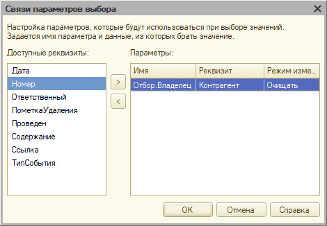

# Задание к занятию «Иерархия и подчинение»

*Примерное время выполнения: 20–60 минут*

## Цель задания

1. Научиться работать с иерархией в справочниках.
2. На практике изучить работу с владельцами в 1С.
3. Подготовить конфигурацию к последующей работе.

## Чеклист готовности к домашнему заданию

- [ ] Установить учебную платформу версии 8.3.22 или больше.
- [ ] Подготовить разработанную ранее конфигурацию "УправлениеИТФирмой"
- [ ] Просмотреть материал занятия «Иерархия и подчинение».

## Инструкция к заданию

1. Решите описанные задачи в конфигураторе.

В тексте задания приведен программный код для решения задач. Конечно, Вы можете использовать его. Но для более продуктивного обучения, старайтесь, сначала, самостоятельно написать код. Если все же, самостоятельно решить задачу не удалось, используйте код из текста задачи но обязательно пройдите его в отладке, посмотрите, что попадает в переменные, как преобразуются значения. Старайтесь максимально детально разобраться в механизме.

2. Протестируйте решение в пользовательском режиме, обязательно введите данные в базу, убедитесь, что все работает.
3. Отправьте на проверку в личном кабинете Нетологии один общий файл базы данных (.dt), содержащей решение всех задач.

## Задача 1. Иерархия в номенклатуре

### Описание задачи

Дадим пользователям возможность группировать элементы справочника Номенклатура так, как им захочется, при этом, в форме списка реализуем возможность отображения элементов только конкретной группы. Выглядеть это должно примерно так:
КАРТИНКА!!

### Процесс выполнения

1. Установите для справочника Номенклатура использование Иерархии групп и элементов. Ограничение количества уровней задавать не надо.

<details>
  <summary>Важно</summary>
Не забывайте корректно оформлять интерфейс для пользователя. В частности, после добавления иерархии в справочнике стал активен стандартный реквизит Родитель. Он будет отображаться в форме элемента именно с таким именем. Для пользователя это будет не понятно, по этому, следует задать для него синоним "Группа"
</details>

2. Создайте для справочника форму списка, определите состав колонок списка. Не выводите дерево на форму. Мы реализуем этот функционал программно, чтобы в будущем усложнить его.
3. Создайте в списке реквизитов новый реквизит "СписокГрупп" с типом ДинамическийСписок
4. В свойствах СписокГрупп, заполните ОсновнаяТаблица значением *Справочник.Номенклатура*. 

    В свойстве Настройка списка установите отбор по полю ЭтоГруппа (Равно Истина). В Свойствах элемента пользовательских настроек для Отбора укажите Режим редактирования - Недоступный.

5. Для реквизита Список (Основной реквизит формы) добавьте аналогичный отбор, но в данном случае, значение отбора должгл быть ЭтоГруппа (Равно Ложь)
6. На форме создайте группу "Колонки" с горизонтальной группировкой, а в ней 2 группы для колонок "Левая" и "Правая" с вертикальной группировкой.
7. Перенесите список в Правую колонку
8. Перенесите реквизит СписокГрупп в левую колонку. Определите состав необходимых колонок

<details>
  <summary>Дополнительно</summary>
Для более пропорционального размещения списков, Списку групп можно задать Ширину
</details>

9. В командной панели формы отключите автозаполнение, в командной панели списка элементов - включите его. Для самого списка элементов установите положение командной панели "Верх", а в составе команд отключите команду "Создать группу". Для Списка групп, в составе команд отключите команду Создать.
10. В списке групп установите отображение "Дерево", в списке элментов - Список
11. Для списка групп обработаем событие ПриАктивизацииСтроки - нам необходимо в списке элементов найти отбор по родителю, если он не найден - создать, если найден - изменить. Правое значение отбора устанавливаем ссылкой на ту группу, которая была выбрана в списке групп.

<details>
  <summary>Код</summary>
    
```bsl
&НаКлиенте
Процедура СписокГруппПриАктивизацииСтроки(Элемент)
	
	ПолеРодитель = Новый ПолеКомпоновкиДанных("Родитель");
	НайденныйЭлементОтбора = Неопределено;
	ЭлементыОтбора = Список.КомпоновщикНастроек.Настройки.Отбор.Элементы;
	Для Каждого ЭлементОтбора Из ЭлементыОтбора Цикл
		Если ЭлементОтбора.ЛевоеЗначение = ПолеРодитель Тогда
			НайденныйЭлементОтбора = ЭлементОтбора;
			Прервать;
		КонецЕсли;
	КонецЦикла;

	Если НайденныйЭлементОтбора = Неопределено Тогда
		НайденныйЭлементОтбора = ЭлементыОтбора.Добавить(Тип("ЭлементОтбораКомпоновкиДанных"));
		НайденныйЭлементОтбора.ЛевоеЗначение = ПолеРодитель;
		НайденныйЭлементОтбора.Использование = Истина;
		НайденныйЭлементОтбора.РежимОтображения = РежимОтображенияЭлементаНастройкиКомпоновкиДанных.Недоступный;
	КонецЕсли;
	
	НайденныйЭлементОтбора.ВидСравнения = ВидСравненияКомпоновкиДанных.Равно;
	НайденныйЭлементОтбора.ПравоеЗначение = Элементы.СписокГрупп.ТекущаяСтрока;
	
КонецПроцедуры
```

</details>

<details>
  <summary>Дополнительно</summary>
Обратите внимание, что в данном случае алгоритм поиска элемента отбора очень поход на аналогичный алгоритм в задании по формам списка, отличается только поле по которому осуществляется поиск. С точки зрения архитектуры решения, лучше вынести эту функциональность в общий модуль и вызывать оттуда в обеих формах, например так:

```bsl
&НаКлиенте
Процедура СписокГруппПриАктивизацииСтроки(Элемент)
	
	ПолеРодитель = Новый ПолеКомпоновкиДанных("Родитель");
	НайденныйЭлементОтбора = РаботаСФормамиКлиент.НайтиИлиСоздатьОтборВСписке(Список, ПолеРодитель);
	НайденныйЭлементОтбора.Использование = Истина;
	НайденныйЭлементОтбора.РежимОтображения = РежимОтображенияЭлементаНастройкиКомпоновкиДанных.Недоступный;
	НайденныйЭлементОтбора.ВидСравнения = ВидСравненияКомпоновкиДанных.Равно;
	НайденныйЭлементОтбора.ПравоеЗначение = Элементы.СписокГрупп.ТекущаяСтрока;
	
КонецПроцедуры
```

</details>

<details>
  <summary>Дополнительно2</summary>
При работе с событием активизации строки принято использовать *ОбработчикОжидания* - это позволит выполнить процедуру с некоторой задержкой, чтобы если пользователь зажал стрелку вниз, установка отбора отработала бы только 1 раз, а не на каждую строчку

```bsl
&НаКлиенте
Процедура СписокГруппПриАктивизацииСтроки(Элемент)
	
	ПодключитьОбработчикОжидания("УстановитьОтбор", 0.1, Истина);
	
КонецПроцедуры

&НаКлиенте
Процедура УстановитьОтбор()
	
	ПолеРодитель = Новый ПолеКомпоновкиДанных("Родитель");
	НайденныйЭлементОтбора = РаботаСФормамиКлиент.НайтиИлиСоздатьОтборВСписке(Список, ПолеРодитель);
	НайденныйЭлементОтбора.Использование = Истина;
	НайденныйЭлементОтбора.РежимОтображения = РежимОтображенияЭлементаНастройкиКомпоновкиДанных.Недоступный;
	НайденныйЭлементОтбора.ВидСравнения = ВидСравненияКомпоновкиДанных.Равно;
	НайденныйЭлементОтбора.ПравоеЗначение = Элементы.СписокГрупп.ТекущаяСтрока;	
	
КонецПроцедуры
```

</details>

## Задача 2. Подчинение контактных лиц

### Описание задачи

Очевидно, контактные лица имеют смысл только в разрезе Контрагентов. То есть, нет смысла создавать контактное лицо, не указав для него Контрагента. Таким образом, очевидно, что Контрагент должен являться Владельцем для Контактного лица.

### Процесс выполнения

1. В справочнике Контактные лица установите в качестве Владельца справочник Контрагенты.
2. Очевидно, для пользователя надо задать какое-то более понятное название для поля Владелец, например "Контрагент"
3. Зайдите в пользовательский режим и заполните владельца для всех Контактных лиц
4. В документах имеет смысл указывать только контактных лиц выбранного Контрагента, по этому следует указать связи параметров выбора. Во всех документах, где указываете Контрагента и контактное лицо (по меньшей мере документ Событие) Выберите реквизит КонтактноеЛицо и откройте его свойства.
5. В свойстве "Связи параметров выбора" укажите Контрагента, как параметр отбора. Необходимо выбрать это поле в левом списке и перенести его в правый список. 1С сама поймет как установить отбор - Отбор.Владелец, Реквизит - Контрагент, Режим изменения связанного значения - Очищать

<p align="center" width="100%">
   
</p>

6. Таким образом в документе контрагенты будут указываться строго по конкретному Контрагенту

## Задача 3*. Подчинение контактных лиц

*Это дополнительная задача, реализовывать ее не обязательно.*
*Задача предназначена для тех студентов, которым первые покажутся слишкм простыми.*
*В процессе выполнения не будут даны примеры программного кода.*

### Описание задачи

Потренируемся отбирать элементы подчиненных справочников. Реализуйте в форме контрагента кнопку "Список контактных лиц". По нажатию на кнопку должны выводиться сообщения с представлением контактного лица.

### Процесс выполнения

1. В форме контактного лица создайте команду СписокКонтактныхЛиц
2. Вынесите команду на форму. Установите Вид кнопки "Гиперссылка"
3. Пропишите программный код который переберет всех контактных лиц текущего контрагента и выведе в сообщение его имя, должность и телефон.

## Задача 4*. Форма списка контактных лиц

*Это дополнительная задача, реализовывать ее не обязательно.*
*Задача предназначена для тех студентов, которым первые покажутся слишкм простыми.*
*В процессе выполнения не будут даны примеры программного кода.*

### Описание задачи

В списке Контактных лиц добавить отбор по Контрагенту. Поведение должно быть аналогичным, как на форме Номенклатуры, но в левом списке будем указывать не Родителя, а Владельца.

### Процесс выполнения

1. Создайте форму списка справочника Контактные лица.
2. Создайте колонки формы
3. Добавьте реквизит СписокКонтрагентов - Динамический список с основной таблицей Справочник.Контрагенты
4. Разместите СписокКонтрагентов в левой колонке, а Список (контактных лиц) в правой
5. Пропишите событие для активизации строки Контрагента.

<details>
  <summary>Дополнительно</summary>
Очевидно, код тут будет очень поход на код в справочнике Номенклатура. Опять же, имеет смысл вынести его в общий модуль, передавая параметром только те значения, которые меняются.

```bsl
&НаКлиенте
Процедура СписокГруппПриАктивизацииСтроки(Элемент)
	
	ПолеРодитель = Новый ПолеКомпоновкиДанных("Родитель");
	НайденныйЭлементОтбора = РаботаСФормамиКлиент.НайтиИлиСоздатьОтборВСписке(Список, ПолеРодитель);
	НайденныйЭлементОтбора.Использование = Истина;
	НайденныйЭлементОтбора.РежимОтображения = РежимОтображенияЭлементаНастройкиКомпоновкиДанных.Недоступный;
	НайденныйЭлементОтбора.ВидСравнения = ВидСравненияКомпоновкиДанных.Равно;
	НайденныйЭлементОтбора.ПравоеЗначение = Элементы.СписокГрупп.ТекущаяСтрока;
	
КонецПроцедуры
```

</details>

## Пример

[Пример выполнения домашнего задания](examples/HW_4_6_example.md)

## Критерии оценки

Зачёт ставится, если:

1. Программа запускается, не возникает явных ошибок, исключений при выполнении программы (в том числе, если Вы начали делать дополнительную задачу, ее функционал не должен приводить к ошибкам и исключениям)
2. В справочнике Номенклатура включена иерархия
3. Форма списка справочника Номенклатура разделена на дерево групп и список элементов.
4. При выборе группы в дереве, в списке элементов должен устанавливаться отбор.
5. Справочник КонтактныеЛица подчинен справочнику Контрагенты
6. В документах, в поле Контактное лицо установлены связи параметров выбора.
7. Введены тестовые данные

Задачи 1 и 2 обязательны к выполнению (кроме текста под спойлером "Дополнительно" - эти задачи делать не обязательно. Возможно, Вы вернетесь к ним позднее, после того, как изучите дополнительный материал). Задачи 3 и 4 не обязательны.

Пожалуйста, присылайте на проверку все задачи сразу, одним файлом выгрузки информационной базы (dt)

Любые вопросы по решению задач задавайте в чате учебной группы.
