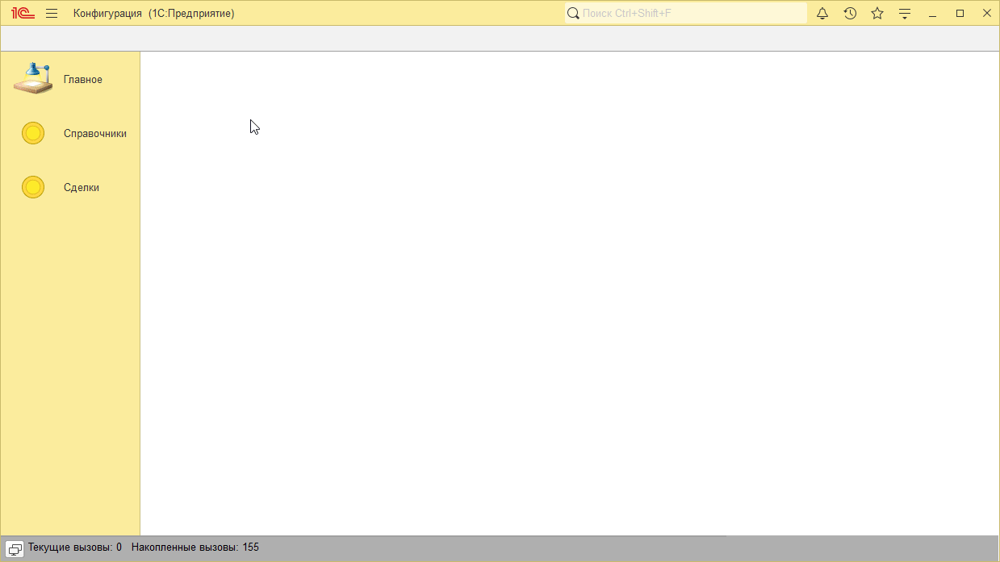
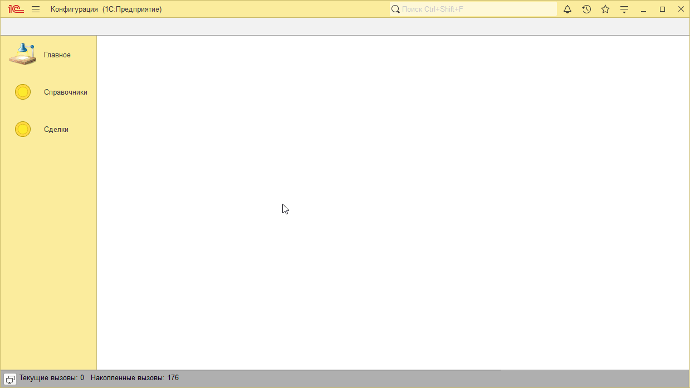

# Пример решения домашнего задания к занятию "Ссылочные типы"

## Задача 1. Создание справочников

   

## Задача 2. Создание документа "Событие"

   

## Задача 3. Открытие списка документов из контрагента

   

