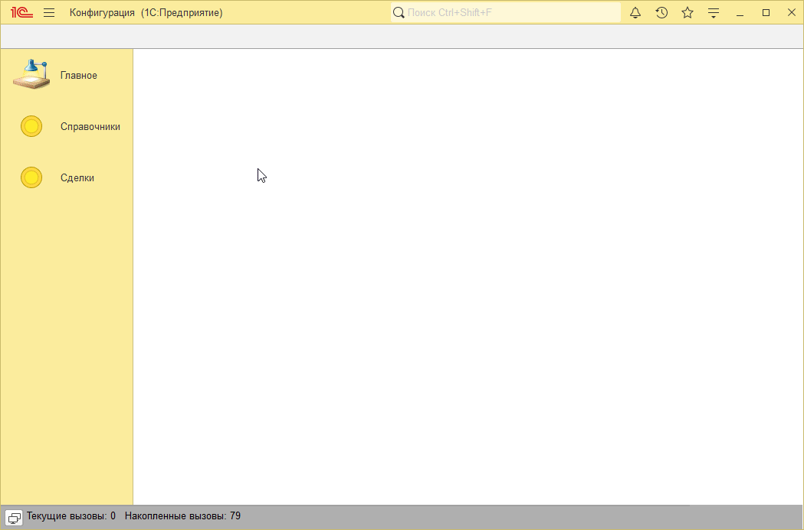
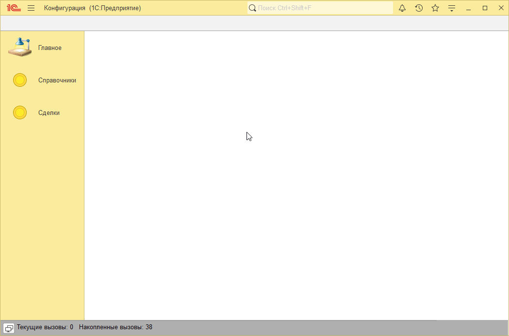

# Пример решения домашнего задания к занятию "Табличные части"

## Задача 1. Документы «Поступление товаров и услуг» и «Реализация товаров и услуг»

   

## Задача 2. Работа с табличной частью

   

## Задача 3*. Сортировка в разных направлениях

   

## Задача 4*. Расчет количества по сумме

   

