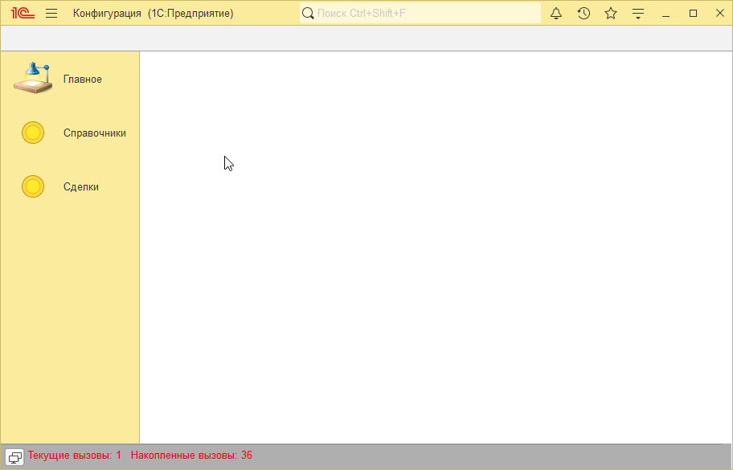
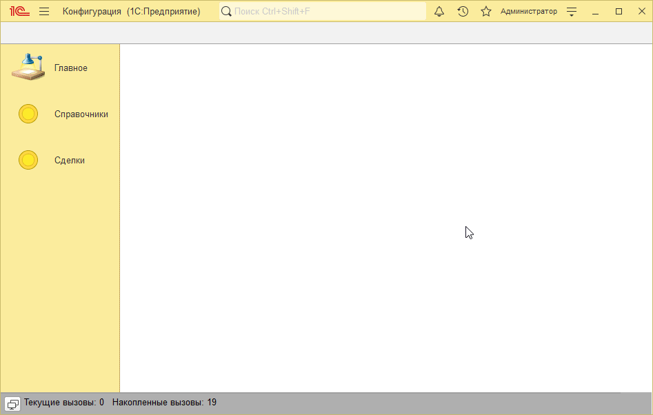

# Пример решения домашнего задания к занятию "Форма объекта"

## Задача 1. Добавить вкладки на форме документа в документы «Поступление товаров и услуг» и «Реализация товаров и услуг»

   

## Задача 2. Создание документа "Установка цен"

   

## Задача 3*. Блокирование элементов документа Установка цен

   

