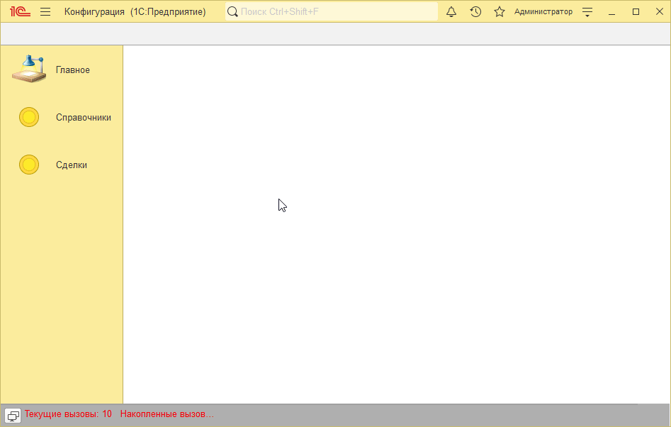
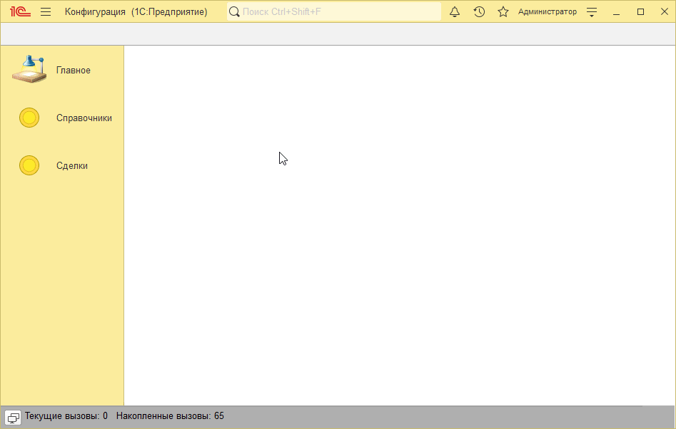
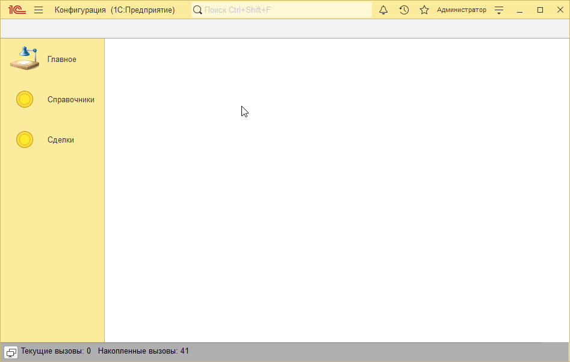

# Пример решения домашнего задания к занятию "Иерархия и подчинение"

## Задача 1. Иерархия в номенклатуре

   

## Задача 2. Подчинение контактных лиц

   

## Задача 3*. Вывод списка контактных лиц

   

## Задача 4*. Форма списка контактных лиц

   

