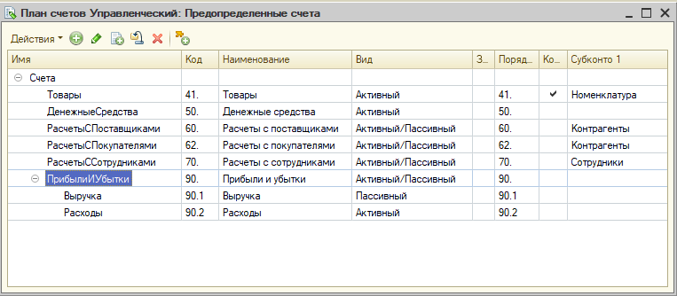
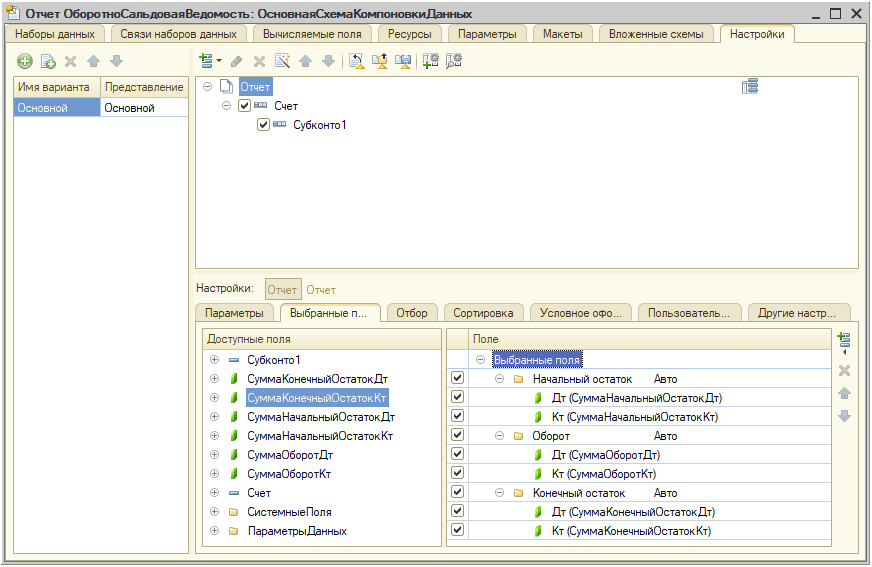

### Учет

Все добавляемые объекты включаем в новую подсистему **Учет**, выведенную в командный интерфейс.

1. Добавить план видов характеристик **ВидыСубконто**:
  * Тип значения характеристик - составной (СправочникСсылка.Контрагенты, СправочникСсылка.Номенклатура, СправочникСсылка.Сотрудники)
  * Представление объекта - "Вид субконто"
  * Три предопределенных элемента:
      * Контрагенты (СправочникСсылка.Контрагенты)
      * Номенклатура (СправочникСсылка.Номенклатура)
      * Сотрудники (СправочникСсылка.Сотрудники)

2. Добавить план счетов **Управленческий**:
  * Длина кода - 4, наименования - 50
  * Маска кода - "##.#", автопорядок по коду, ширина порядка - 4.
  * Добавить признак учета **Количественный** для учета по количеству на единственном счете **Товары**
  * В качестве видов субконто указать созданный на предыдущем шаге ПВХ **ВидыСубконто**. Максимальное количество видов субконто - 1.
  * Добавить предопределенные счета:
    * Активный 41 **Товары** (виды субконто: Номенклатура, учет по количеству)
    * Активный 50 **ДенежныеСредства**
    * Пассивный 60 **РасчетыСПоставщиками** (виды субконто: Контрагенты)
    * Активный 62 **РасчетыСПокупателями** (виды субконто: Контрагенты)
    * Активно-пассивный 70 **РасчетыССотрудниками** (виды субконто: Сотрудники)
    * Активно-пассивный 90 **ПрибылиИУбытки** с субсчетами
      * 90.1 **Доходы**
      * 90.2 **Расходы**
  * В итоге план счетов должен выглядеть так:

3. Добавить регистр бухгалтерии **Управленческий**:
  * С учетом по плану счетов **Управленческий**
  * С корреспонденцией
  * С ресурсами:
    * Сумма (ОпределяемыйТип.Сумма)
    * Количество (ОпределяемыйТип.Количество) - с признаком учета **Количественный**
  * В регистраторы добавить документы:
    * ПоступлениеТоваровИУслуг
    * РеализацияТоваровИУслуг
    * ПоступлениеДенежныхСредств
    * СписаниеДенежныхСредств

4. Доработать обработчик проведения документа **ПоступлениеТоваровИУслуг**:
  * Для строк с номенклатурой вида Товар формировать движение Дт **Товары** с заполнением субконто Номенклатура - Кт **РасчетыСПоставщиками** с заполнением субконто Контрагенты на сумму строки.
  * Для строк с номенклатурой вида Услуга формировать движение Дт **Расходы** - Кт **РасчетыСПоставщиками** с заполнением субконто Контрагенты на сумму строки.
    
5. Доработать обработчик проведения документа **РеализацияТоваровИУслуг**:
  * Формировать движение Дт **РасчетыСПокупателями** с заполнением субконто Контрагенты - Кт **Доходы** на общую сумму продажи (по всем строкам).
  * Для строк с номенклатурой вида Товар формировать движение Дт **Расходы** - Кт **Товары** с заполнением субконто Номенклатура на сумму себестоимости списанного товара. Себестоимость должна рассчитываться по данным регистра бухгалтерии, а не по данным регистра накопления **Товары**. Данные регистра бухгалтерии нужно получать запросом к виртуальной таблице **РегистрБухгалтерии.Управленческий.Остатки** на МоментВремени() проводимого документа.

6. Доработать документ **ПоступлениеДенежныхСредств**:
  * Тип реквизита **Плательщик** сделать составным и расширить его типом **СправочникСсылка.Сотрудники**.
  * При проведении формировать движения в Дт **ДенежныеСредства** и Кт:
    * Для плательщиков-контрагентов - **РасчетыСПоставщиками** с заполнением субконто **Контрагенты**.
    * Для плательщиков-сотрудников - **РасчетыССотрудниками** с заполнением субконто **Сотрудники**.
      
7. Доработать документ **СписаниеДенежныхСредств**:
  * Тип реквизита **Получатель** сделать составным и расширить его типом **СправочникСсылка.Сотрудники**.
  * При проведении формировать движения с Кт **ДенежныеСредства** и в Дт:
    * Для получателей-контрагентов - **РасчетыСПокупателями** с заполнением субконто **Контрагенты**.
    * Для получателей-сотрудников - **РасчетыССотрудниками** с заполнением субконто **Сотрудники**.
      
8. Добавить отчет **ОборотноСальдоваяВедомость** ("Оборотно-сальдовая ведомость"):
  * Создать основную схему компоновки данных, а в ней - набор данных-запрос
  * В запрос конструктором добавить виртуальную таблицу **РегистрБухгалтерии.Управленческий.ОстаткиИОбороты** с параметрами &НачалоПериода и &КонецПериода
  * В качестве полей выбрать:
    * Будущие группировки Счет и Субконто1
    * Будущие ресурсы:
      * СуммаНачальныйОстатокДт и СуммаНачальныйОстатокДт
      * СуммаОборотДт и СуммаОборотКт
      * СуммаКонечныйОстатокДт и СуммаКонечныйОстатокКт
  * На закладке "Ресурсы* добавить три пары ресурсов с функцией по умолчанию **Сумма** и прочими настройками по умолчанию
  * На закладке "Настройки":
    * Добавить группирровку **Счет** (с иерархией), а под ней - **Субконто1** (без иерархии)
    * Добавить ресурсы, сгруппировав их в группы "Начальный остаток", "Оборот", "Конечный остаток", и дав краткие заголовки "Дт" и "Кт" вместо избыточных "СуммаНачальныйОстатокДт" и т.д.:

    * Параметры **НачалоПериода** и **КонецПериода** включите в пользовательские настройки с быстрым доступом.
  * Сформировав движения документами по всем счетам, проверьте отчет. Он должен выглядеть примерно так:
  
