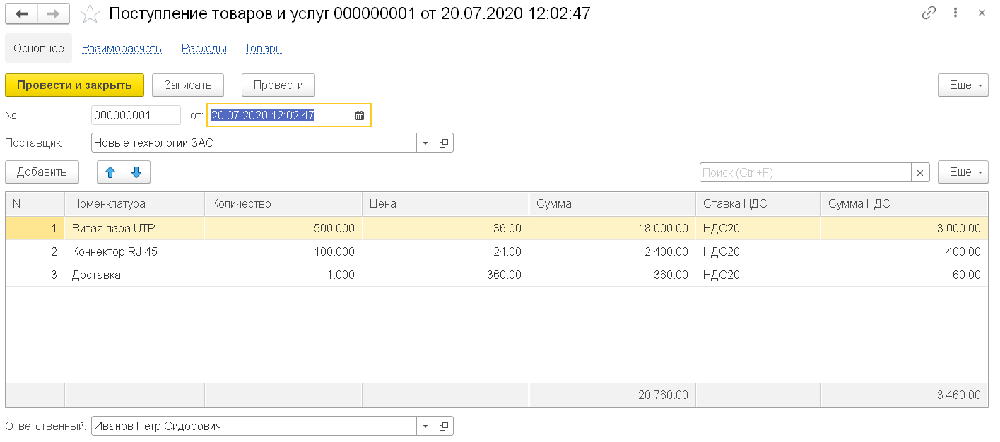
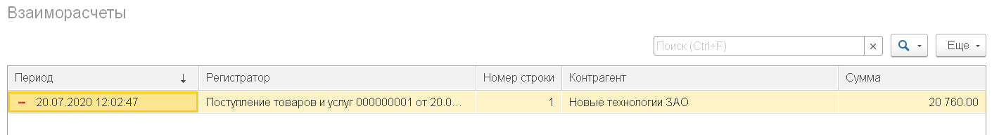
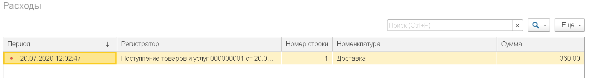
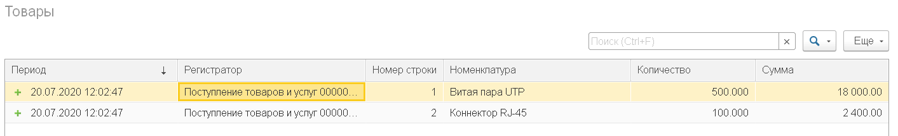
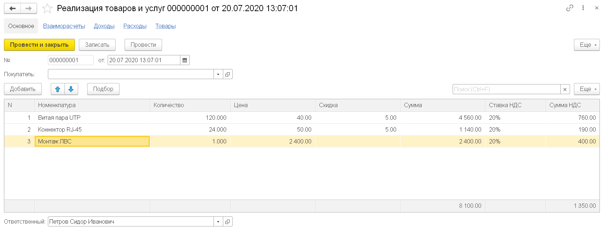
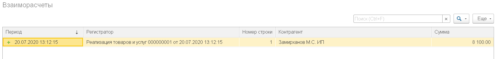
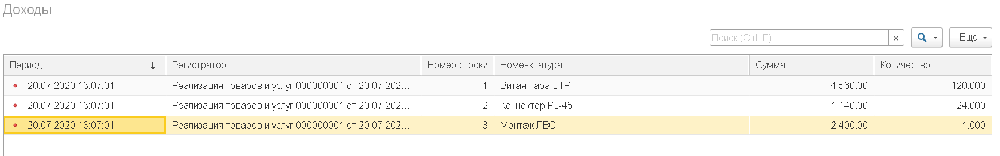
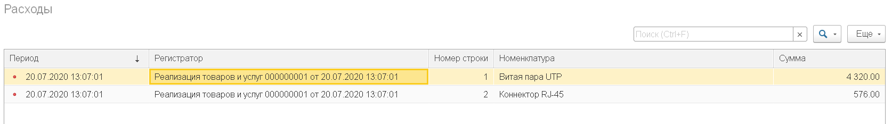
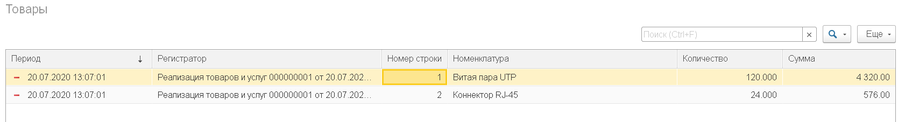

### Сделки

Все добавляемые объекты включаем в новую подсистему **«Сделки»**.

1. Добавить регистр накопления **«Товары»** вида «Остатки»
  * добавить измерение «Номенклатура» (СправочникСсылка.Номенклатура) и ресурсы «Сумма» (ОпределяемыйТип.Сумма) и «Количество» (ОпределяемыйТип.Количество).

2. Добавить регистр накопления **«ВзаиморасчетыСКонтрагентами»** вида «Остатки»:
  * добавить измерение «Контрагент» (СправочникСсылка.Контрагенты) и ресурс «Сумма» (ОпределяемыйТип.Сумма).

3. Добавить регистр накопления **«Доходы»** вида «Обороты»:
  * д«обавить измерение «Номенклатура» (СправочникСсылка.Номенклатура) и ресурсы «Сумма» (ОпределяемыйТип.Сумма) и «Количество» (ОпределяемыйТип.Количество).

4. Добавить регистр накопления **«Расходы»** вида «Обороты»:
  * добавить измерение «Номенклатура» (СправочникСсылка.Номенклатура) и ресурс «Сумма» (ОпределяемыйТип.Сумма).
  
5. Добавить общий модуль «НДСКлиентСервер»:
 * с флагами «Клиент» и «Сервер»;
 * создать в нём функцию «СуммаНДСПоСтавке» (Сумма, СтавкаНДС), возвращающую сумму НДС, рассчитанную от суммы по ставке согласно [требованиям](diploma-b-reqs.md). Чтобы обеспечить работоспособность на клиенте, для получения значений ставок НДС используйте функцию «ПредопределенноеЗначение()».
  
6. Добавить документ **«ПоступлениеТоваровИУслуг»**:
  * добавить реквизиты «Поставщик»» (СправочникСсылка.Контрагенты) и «Сумма» (ОпределяемыйТип.Сумма);
  * добавить ТЧ «ТоварыИУслуги» с реквизитами:
    * «Номенклатура» (СправочникСсылка.Номенклатура);
    * «Количество» (ОпределяемыйТип.Количество);
    * «СтавкаНДС» (ПеречислениеСсылка.СтавкиНДС);
    * «Цена», «Сумма», «СуммаНДС» (ОпределяемыйТип.Сумма);
  * в «Движениях» выбрать регистры накопления «Товары», «Расходы» и «ВзаиморасчетыСКонтрагентами»;
  * создать форму документа, в которой:
    * разумным образом разместить элементы управления для реквизитов и табличных частей;
     * в таблице товаров и услуг включить отображение подвала и вывести в него итог по колонкам «Сумма» и «Сумма НДС», поставив флаг «Отображать в подвале» и задав путь к данным подвала;
    * создать клиентские процедуры:
      * ПриИзмененииКоличества(ИзмененнаяСтрока), ПриИзмененииЦены(ИзмененнаяСтрока), в которых:
        * рассчитывать сумму по цене и количеству и вызывать ПриИзмененииСуммы();
      * ПриИзмененииСуммы(ИзмененнаяСтрока), ПриИзмененииСтавкиНДС(ИзмененнаяСтрока), в которых:
        * рассчитывать сумму НДС по сумме и ставке вызовом НДСКлиентСервер.СуммаНДСПоСтавке();
    * переопределить обработчики событий ПриИзменении полей ввода для количества, цены, суммы и ставки НДС и вызывать из них процедуры ПриИзменении<...>, передавая в качестве параметра «ТекущиеДанные» таблицы;
  * форма может выглядеть, например, так:

  * в модуле объекта:
    * создать обработчик события «ОбработкаПроведения» и формировать движения, выбрав предварительно запросом табличную часть с типами номенклатуры:
      * по регистру «ВзаиморасчетыСКонтрагентами» — одно движение вида «Расход» с указанием контрагента-поставщика и общей суммы;
      * по регистру «Товары» — движения вида «Приход» по каждой строке с номенклатурой типа «Товары» с указанием номенклатуры, количества и суммы;
      * по регистру ««Расходы» — движения по каждой строке с номенклатурой типа «Услуги» с указанием номенклатуры и суммы;
    * создать обработчик события «ПередЗаписью» и сохранять в реквизит шапки «Сумма» итог по одноимённому реквизиту табличной части для отображения в списках;
 * проверить документ, убедившись в том, что:
  * при изменении количества и цены пересчитывается сумма и сумма НДС, а при изменении суммы и ставки НДС — сумма НДС;
  * формируются движения по трём регистрам накопления, и сумма движения по «Взаиморасчетам» равна итогу по колонке «Сумма» и сумме движений по «Товарам» и «Расходам». Пример движений для документа со снимка выше:

7. Добавить документ **РеализацияТоваровИУслуг** (или скопировать и переименовать **ПоступлениеТоваровИУслуг**):
  * Добавить реквизиты Покупатель (СправочникСсылка.Контрагенты) и Сумма (ОпределяемыйТип.Сумма)
  * Добавить ТЧ ТоварыИУслуги с реквизитами:
    * Номенклатура (СправочникСсылка.Номенклатура)
    * Количество (ОпределяемыйТип.Количество)
    * СтавкаНДС (ПеречислениеСсылка.СтавкиНДС)
    * Скидка (Число)
    * Цена, Сумма, СуммаНДС (ОпределяемыйТип.Сумма)
  * В "Движениях" выбрать регистры накопления Товары, Доходы, Расходы и ВзаиморасчетыСКонтрагентами
  * Создать форму документа, в которой:
    * Разумным образом разместить элементы управления для реквизитов и табличных частей
     * В таблице товаров и услуг включить отображение подвала и вывести в него итог по колонкам "Сумма" и "Сумма НДС".
    * Создать клиентскую функцию СуммаПоСтроке(Строка), которая возвращает сумму с учетом количества, цены и скидки 
    * Создать клиентские процедуры:
      * ПриИзмененииНоменклатуры(ИзмененнаяСтрока), в которой:
        * Заполнять цену и скидку аналогично документам **УстановкаЦен** и **УстановкаСкидок**, а также заполнять ставку НДС и вызывать процедуры ПриИзмененииЦены, ПриИзмененииСкидки и ПриИзмененииСтавкиНДС
      * ПриИзмененииКоличества(ИзмененнаяСтрока), ПриИзмененииЦены(ИзмененнаяСтрока), ПриИзмененииСкидки(ИзмененнаяСтрока), в которых:
        * Рассчитывать сумму вызовом СуммаПоСтроке() и вызывать ПриИзмененииСуммы()
      * ПриИзмененииСуммы(ИзмененнаяСтрока), ПриИзмененииСтавкиНДС(ИзмененнаяСтрока), в которых:
        * Рассчитывать сумму НДС по сумме и ставке вызовом НДСКлиентСервер.СуммаНДСПоСтавке()
    * Переопределить обработчики событий ПриИзменении полей ввода номенклатуры, количества, цены, скидки, суммы и ставки НДС, и вызывать из них процедуры ПриИзменении<...>, передавая в качестве параметра ТекущиеДанные таблицы.
    * Реализовать подбор аналогично документу **УстановкаЦен**, передавая в качестве владельца открываемой формы таблицу ТоварыИУслуги, а в обработчике события ОбработкаВыбора вызывая процедуру ПриИзмененииНоменклатуры, чтобы обеспечить получение цен и скидок и автоматический пересчет сумм.
  * Форма может выглядеть, например, так:

  * В модуле объекта:
    * Создать обработчик события ОбработкаПроведения и формировать движения, выбрав предварительно запросом данные табличной части документа с типами номенклатуры и соединив с виртуальной таблицей Остатки регистра Товары по номенклатуре:
      * По регистру ВзаиморасчетыСКонтрагентами - одно движение вида "Приход" с указанием контрагента-покупателя и общей суммы
      * По регистру Товары - движения вида "Расход" по каждой строке с номенклатурой типа Товары с указанием номенклатуры, количества и суммы. Сумму рассчитывать, определив среднюю стоимость единицы делением суммы остатка на количество остатка и умножив среднюю стоимость на реализуемое количество. При нехватке остатков отказываться от проведения, выводя пользователю разумное сообщение.
      * По регистру Расходы - движения по каждой строке с номенклатурой типа Товары с указанием номенклатуры и суммы, равной сумме расхода по регистру Товары.
      * По регистру Доходы - движения по каждой строке с указанием номенклатуры, количества и суммы
    * Создать обработчик события ПередЗаписью и сохранять в реквизит шапки Сумма итог по одноименному реквизиту табличной части для отображения в списках
 * Проверить документ, убедившись в том, что:
  * При изменении количества, цены и скидки пересчитывается сумма и сумма НДС, а при изменении суммы и ставки НДС - сумма НДС
  * Формируются движения по четырем регистрам накопления, и сумма движения по Взаиморасчетам равна итогу по колонке Сумма и сумме движений по Доходам, а суммы движений по Расходам и Товарам совпадают. Пример движений для документа со снимка выше:

8. Добавить журнал документов **Сделки**:
  * В качестве регистрируемых выбрать документы **ПоступлениеТоваровИУслуг** и **РеализацияТоваровИУслуг**
  * Добавить графы Контрагент  (Поставщик из Поступления и Покупатель из Реализации), Ответственный и Сумма
