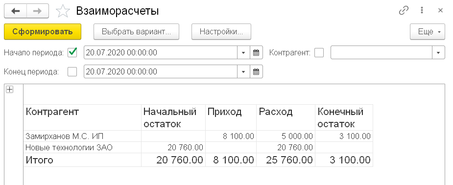
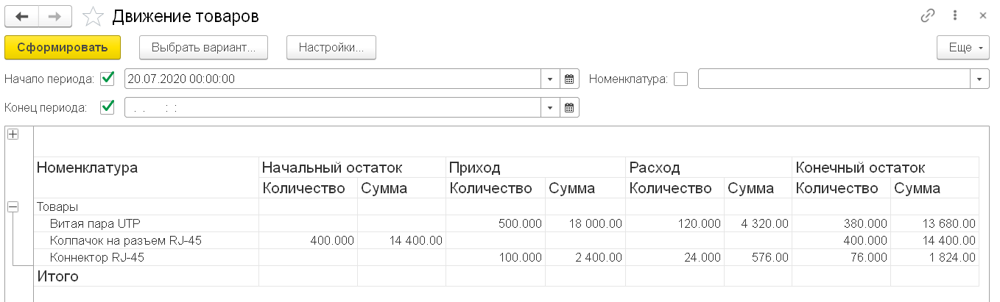
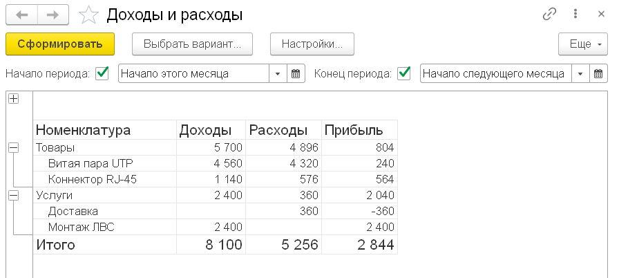

### Отчеты

1. Добавляем отчет **Взаиморасчеты с контрагентами**:
  * Включаем в подсистему **Сделки**
  * Создаем основную схему компоновки данных
  * Добавляем набор данных-запрос, в котором выбираем контрагента, сумму (начальный остаток, приход, расход и конечный остаток) из виртуальной таблицы ОстаткиИОбороты регистра Взаиморасчеты без параметров
  * Даем полям сумм нормальные заголовки ("Начальный остаток" вместо "Сумма начальный остаток" и т.д.)
  * На закладке "Ресурсы" добавляем все суммы (начальный остаток, приход, расход и конечный остаток) с настройками по умолчанию
  * В настройках:
    * Добавляем группировку по контрагенту.
    * На закладке "Выбранные поля" выбираем поле Контрагент и все суммы
    * На закладке "Отбор" добавляем поле Контрагент и включаем быстрый доступ
  * Проверяем: отчет должен выглядеть примерно так:

1. Добавляем отчет **Движение товаров**:
  * Включаем в подсистему **Сделки**
  * Создаем основную схему компоновки данных
  * Добавляем набор данных-запрос, в котором выбираем номенклатуру, сумму и количество (начальный остаток, приход, расход и конечный остаток) из виртуальной таблицы ОстаткиИОбороты регистра Товары без параметров
  * На закладке "Ресурсы" добавляем все суммы и количества (начальный остаток, приход, расход и конечный остаток). В колонке "Рассчитывать по..." для количеств оставляем только расчет по номенклатуре без иерархии, чтобы не складывать разнородные количества.
  * В настройках:
    * Добавляем группировку по номенклатуре с иерархией.
    * На закладке "Параметры" включаем использование автоматически добавленных параметров Начало периода и Конец периода; включаем их в пользовательские настройки с быстрым доступом
    * На закладке "Выбранные поля" выбираем поле Номенклатура, все суммы и количества. Суммы и количества объединяем в группы "Начальный остаток", "Приход", "Расход", "Конечный остаток". Суммам и количествам, выбрав в контекстном меню команду "Заголовок", даем краткие заголовки, достаточные в контексте группы ("Количество", "Сумма").
    * На закладке "Отбор" добавляем поле Номенклатура и включаем быстрый доступ
  * Проверяем: отчет должен выглядеть примерно так:

3. Добавляем отчет **ДоходыИРасходы**:
  * Включаем в подсистему **Сделки**
  * Создаем основную схему компоновки данных
  * Добавляем набор данных-запрос, в котором конструкцией ОБЪЕДИНИТЬ ВСЕ объединяем два подзапроса:
    * В первом получаем номенклатуру, оборот по сумме (с псевдонимом Доходы) и 0 (с псевдонимом Расходы) из виртуальной таблицы Обороты регистра Доходы
    * Во втором получаем номенклатуру, 0 (с псевдонимом Доходы) и оборот по сумме (с псевдонимом Расходы) из виртуальной таблицы Обороты регистра Расходы:
    
  * Добавляем вычисляемое поле Прибыль с выражением "Доходы - Расходы"
  * На закладке "Ресурсы" добавляем все Доходы, Расходы и Прибыль с настройками по умолчанию.
  * В настройках:
    * Добавляем группировку по номенклатуре (с иерархией).
    * На закладке "Параметры" включаем использование автоматически добавленных параметров Начало периода и Конец периода; включаем их в пользовательские настройки с быстрым доступом
    * Выбираем поля Номенклатура, Доходы, Расходы, Прибыль
  * Проверяем: отчет должен выглядеть примерно так:
   
