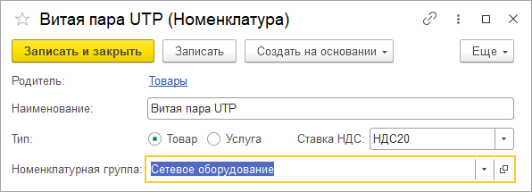
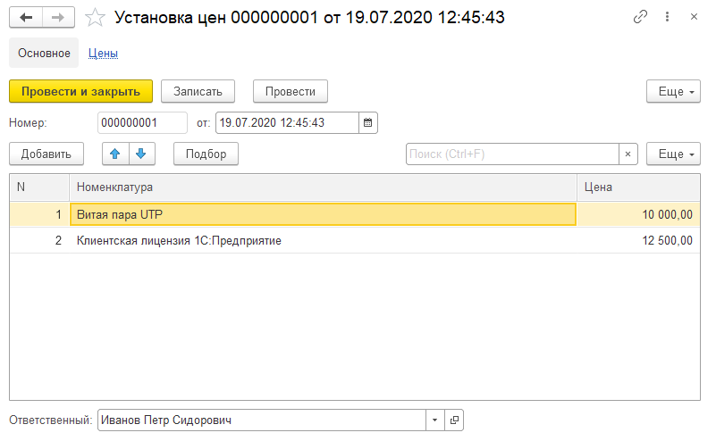
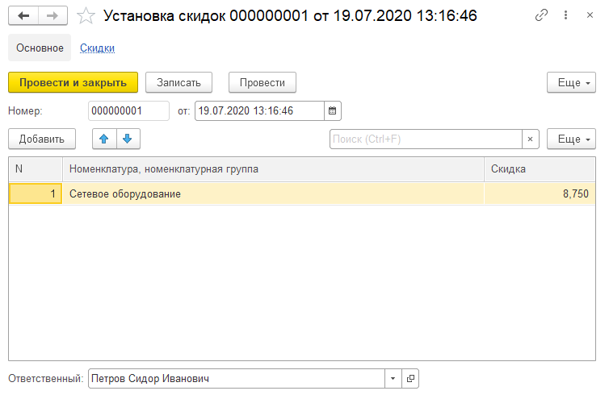

# Диплом блока B "Сделки и деньги"

## Описание задачи
Развить созданную в блоке Б конфигурацию "Управление ИТ-фирмой", обеспечив возможность учета хозяйственных операций по приобретению и реализации товаров и услуг и движению денежных средств с базовым механизмом ценообразования и набором простых отчетов.

## Требования к результату

Конфигурация с именем "УправлениеИТФирмой" из диплома блока А, дополненная:

В существующей подсистеме Настройки:

* Перечислением **ТипыНоменклатуры** (Товар, Услуга)

* Перечислением **СтавкиНДС** (БезНДС, НДС10, НДС20)

* Справочником **НоменклатурныеГруппы**
   * Без иерархии, с наименованием разумной длины

* Справочником **Номенклатура**, который:
   * Имеет наименование разумной длины и неограниченную иерархию групп и элементов
   * Содержит реквизиты Тип, СтавкаНДС и НоменклатурнаяГруппа, используемые для элементов и обязательные к заполнению

* Документом **УстановкаЦен**, который:
   * Содержит реквизит шапки Ответственный и табличную часть Цены с реквизитами Номенклатура и Цена
   * Имеет форму, в которой реализованы:
      * Выбор и подбор номенклатуры с автоматическим назначением цен согласно срезу последних регистра сведений Цены
      * Команды УстановитьФиксированнуюЦену и ИзменитьЦенуНаПроцент с кнопками в командной панели, после ввода цены или процента изменяющие цены во всех строках
   * Формирует движения по регистру сведений **Цены**
   
* Регистром сведений **Цены**, который:
   * Содержит измерение Номенклатура и ресурс Цена
   * Является периодическим с подчинением регистратору (документу **УстановкаЦен**)

* Документом **УстановкаСкидок**, который:
   * Содержит реквизит шапки Ответственный и табличную часть Скидки с реквизитами НоменклатураНоменклатурнаяГруппа и Скидка
   * Имеет форму, в которой реализованы:
      * Выбор номенклатуры и номенклатурных групп с автоматическим назначением скидок согласно срезу последних регистра сведений Скидки
      * Команда УстановитьФиксированнуюСкидку с кнопкой в командной панели, после ввода скидки устанавливающая ее во всех строках
   * Формирует движения по регистру сведений **Скидки**
   
* Регистром сведений **Скидки**, который:
   * Содержит измерение НоменклатураНоменклатурнаяГруппа и ресурс Скидка
   * Является периодическим с подчинением регистратору (документу **УстановкаСкидок**)
   
* Журналом документов **ЦеныИСкидки**, который:
   * Содержит документы **УстановкаЦен** и **УстановкаСкидок** и графу Ответственный

Подсистемой **Сделки**, а в ней:

* Документом **ПоступлениеТоваровИУслуг**, который:
   * Содержит реквизиты шапки Поставщик, Ответственный, Сумма и табличную часть ТоварыИУслуги с реквизитами Номенклатура, Количество, Цена, Сумма, СтавкаНДС, СуммаНДС
   * Имеет форму, в которой реализован выбор и подбор номенклатуры с автоматическим пересчетом числовых колонок по правилам:
      * При изменении реквизитов Количество и Цена пересчитывается Сумма и СуммаНДС (см. ниже "Правила расчета НДС")
      * При изменении реквизита Сумма пересчитывается Цена и СуммаНДС
      * При изменении реквизита СтавкаНДС пересчитывается СуммаНДС
   * Перед записью заполняет реквизит шапки Сумма итогом по одноименной колонке табличной части
   * Формирует движения:
      * Расход по регистру накопления **ВзаиморасчетыСКонтрагентами** с указанием поставщика в сумме общего итога по реквизиту ТЧ Сумма
      * Приход по регистру накопления **Товары **в разрезе номенклатуры типа Товар согласно реквизитам ТЧ Количество и Сумма
      * Движения по регистру накопления **Расходы** в разрезе номенклатуры типа Услуга согласно реквизиту ТЧ Сумма

* Документом **РеализацияТоваровИУслуг**, который:
   * Содержит реквизит шапки Покупатель, Ответственный, Сумма и табличную часть ТоварыИУслуги с реквизитами Номенклатура, Количество, Скидка, Цена, Сумма, СтавкаНДС, СуммаНДС
   * Имеет форму, в которой реализован выбор и подбор номенклатуры с автоматическим назначением цены и скидки, а также пересчетом числовых колонок по правилам:
      * При изменении реквизитов Количество и Цена пересчитывается Сумма (с учетом скидки) и СуммаНДС (см. ниже "Правила расчета НДС")
      * При изменении реквизита Скидка пересчитывается Сумма и СуммаНДС (см. ниже "Применение скидок")
      * При изменении реквизита Сумма пересчитывается Скидка (цена остается прежней) и СуммаНДС
      * При изменении реквизита СтавкаНДС пересчитывается СуммаНДС
   * Перед записью заполняет реквизит шапки Сумма итогом по одноименной колонке табличной части
   * Формирует движения:
      * Приход по регистру накопления **ВзаиморасчетыСКонтрагентами** с указанием покупателя в сумме общего итога по реквизиту ТЧ Сумма
      * Расход по регистру накопления **Товары** в разрезе номенклатуры типа Товар согласно реквизиту ТЧ Количество и сумме, определенной согласно средней стоимости остатков этого товара. В отсутствие достаточного остатка проведение не выполняется.
      * Движения по регистру накопления **Расходы** в разрезе номенклатуры типа Товар в сумме себестоимости продаж (сумме расхода по регистру Товары)
      * Движения по регистру накопления **Доходы** в разрезе номенклатуры всех типов согласно реквизиту ТЧ Сумма
      
* Журналом документов **Сделки**, который:
   * Содержит документы **ПоступлениеТоваровИУслуг** и **РеализацияТоваровИУслуг** с графами Контрагент, Ответственный и Сумма

Подсистемой **Деньги**, а в ней:

* Документом **ПоступлениеДенежныхСредств**, который:
  * Содержит реквизиты Плательщик и Сумма
  * Формирует движение: расход по регистру накопления **ВзаиморасчетыСКонтрагентами** с указанием плательщика и суммы

* Документом **СписаниеДенежныхСредств**, который:
  * Содержит реквизиты Получатель и Сумма
  * Формирует движение: приход по регистру накопления **ВзаиморасчетыСКонтрагентами** с указанием получателя и суммы
  
* Журналом документов **Деньги**, который:
   * Содержит документы **ПоступлениеДенежныхСредств** и **СписаниеДенежныхСредств** с графами Контрагент, Ответственный и Сумма

* Регистром накопления **ВзаиморасчетыСКонтрагентами**, который:
  * Имеет вид Остатки
  * Содержит измерение Контрагент и ресурс Долг
  * Подчинен регистраторам **ПоступлениеТоваровИУслуг**, **РеализацияТоваровИУслуг**, **ПоступлениеДенежныхСредств**, **РасходованиеДенежныхСредств**
  * Положительные остатки по нему означают дебиторскую задолженность (нам должны), отрицательные - кредиторскую (мы должны)
      
* Регистром накопления **Товары**, который:
  * Имеет вид Остатки
  * Содержит измерение Номенклатура и ресурсы Количество, Сумма
  * Подчинен регистраторам **ПоступлениеТоваровИУслуг** и **РеализацияТоваровИУслуг**
  * Хранит текущие остатки товаров и их себестоимость с учетом НДС
  
* Регистром накопления **Доходы**, который:
  * Имеет вид Обороты
  * Содержит измерение Номенклатура и ресурсы Количество, Сумма
  * Подчинен регистратору **РеализацияТоваровИУслуг**
  * Хранит доходы (выручку) от реализации товаров и услуг с учетом НДС
  
* Регистром накопления **Расходы**, который:
  * Имеет вид Обороты
  * Содержит измерение Номенклатура и ресурсы Количество, Сумма
  * Подчинен регистраторам **ПоступлениеТоваровИУслуг**, **РеализацияТоваровИУслуг**
  * Хранит расходы по приобретенным услугам и себестоимость реализованных товаров с учетом НДС
  
* Отчетом **ДоходыИРасходы**, который:
  * Выводит, соединяя, данные регистров **Доходы** и **Расходы** в три колонки ("Доходы", "Расходы", "Прибыль")
  * Содержит группировку по номенклатуре с учетом иерархии и общие итоги
  
* Отчетом **ДвижениеТоваров**, который:
  * Выводит данные регистра **Товары**: остатки и обороты по количеству и сумме
  * Содержит группировку по номенклатуре с учетом иерархии и общие итоги
  * Не суммирует количества в общем итоге и по иерархии номенклатуры
  
* Отчетом **ВзаиморасчетыСКонтрагентами**, который:
  * Выводит данные регистра **Взаиморачеты**: остатки и обороты
  * Содержит группировку по контрагентам и общие итоги
      
### Применение скидок

Скидки определяются по срезу последних регистра сведений Скидки. Если скидка установлена и на конкретный элемент справочника **Номенклатура**, и на номенклатурную группу, приоритет имеет скидка для конкретного элемента.

Цена определяется по данным регистра сведений Цены и не пересчитывается при изменении скидки. Сумма определяется по цене с учетом скидки как:
   Сумма = Количество * Цена * (100 - Скидка) / 100
При изменении суммы изменяется скидка, но не цена, по обратной формуле:
   Скидка = 100 * (1 - Сумма / Количество / Цена)

### Правила расчета НДС

НДС рассчитывается по ставкам, определяемым по значению перечисления **СтавкиНДС** (БезНДС - 0%, НДС10 - 10%, НДС20 - 20%). Сумма НДС определяется умножением суммы на ставку (т.е. НДС рассчитывается по схеме "в том числе", например, для ставки 20% и суммы 120 р сумма НДС будет равна 120 * 0.2 / (1 + 0.2) = 20.

## Порядок выполнения

1. Добавить перечисление **ТипыНоменклатуры**, включить в подсистему **Настройка**, добавить значения Товар и Услуга.
  
2. Добавить перечисление **СтавкиНДС**, включить в подсистему **Настройка**, добавить значения БезНДС, НДС10, НДС20.

3. Добавить справочник **НоменклатурныеГруппы**:
  * Синоним - "Номенклатурные группы", представление объекта - "Номенклатурная группа"
  * Включить в подсистему **Настройка**
  * Убрать код, дать разумную длину наименованию

4. Добавить справочник **Номенклатура**:
  * Включить в подсистему **Настройка**
  * Убрать код, дать разумную длину наименованию
  * Включить иерархию групп и элементов
  * Добавить реквизиты, включив в "Проверке заполнения" вариант "Выдавать ошибку", и поставив флаг "Заполнять из данных заполнения":
    * Тип - ПеречислениеСсылка.ТипыНоменклатуры
    * НоменклатурнаяГруппа - СправочникСсылка.НоменклатурныеГруппы
    * СтавкаНДС - ПеречислениеСсылка.СтавкиНДС
  * В модуле объекта переопределить событие ОбработкаЗаполнения, заполнив тип и ставку НДС значениями по умолчанию (Товар, НДС20)
  * Создать форму элемента, расположив элементы разумным образом, например, такую:
  

5. Добавить регистр сведений **Цены**
  * Включить в подсистему **Настройка**
  * Установить периодичность "По позиции регистратора" и режим записи "Подчинение регистратору"
  * Добавить измерение Номенклатура (СправочникСсылка.Номенклатура) с флагами "Ведущее" и "Основной отбор" и ресурс Цена (ОпределяемыйТип.Сумма)
  * Добавить общий модуль ЦеныСервер с флажками "Сервер" и "Внешнее соединение", и создать в нем экспортную функцию ЦенаНаДату(Номенклатура, Дата), которая получит запросом срез последних на указанную дату с отбором по номенклатуре и вернет цену.
  * Добавить общий модуль ЦеныВызовСервера с флажками "Сервер", "Внешнее соединение" и "Вызов сервера", и создать в нем функцию ЦенаНаДату для вызова из клиентского кода форм, которая вызовет одноименную функцию из модуля ЦеныСервер.
  
6. Добавить документ **УстановкаЦен**
  * Включить в подсистему **Настройка**
  * Добавить реквизит Ответственный (СправочникСсылка.Сотрудники), поставив флаг "Заполнять из данных заполнения"
  * Добавить ТЧ Цены с реквизитами Номенклатура (СправочникСсылка.Номенклатура) и Цена (ОпределяемыйТип.Сумма)
  * В "Движениях" выбрать регистр сведений "Цены"
  * В модуле объекта:
    * Переопределить событие ОбработкаЗаполнения, заполнив реквизит Ответственный сотрудником текущего пользователя
    * Переопределить событие ОбработкаПроведения, формируя движения по регистру сведений Цены датой документа
  * Создать форму документа, в которой:
    * Разумным образом разместить элементы управления для реквизитов и табличных частей
    * Включить видимость команды перехода к движениям по регистру Цены на закладке "Командный интерфейс"
    * Создать клиентскую процедуру ПриИзмененииНоменклатуры с параметром ИзмененнаяСтрока (ДанныеФормыЭлементКоллекции), в которой, если Номенклатура заполнена, вызвать ЦеныВызовСервера.ЦенаНаДату и заполнить цену.
    * Переопределить событие ПриИзменении поля ввода номенклатуры и вызвать в нем процедуру ПриИзмененииНоменклатуры с передачей текущих данных таблицы цен.
    * Добавить команду Подбор, разместив ее в командной панели таблицы цен. В обработчике команды открыть форму выбора справочника Номенклатура с параметром ЗакрыватьПриВыборе = Ложь, указав в качестве владельца таблицу цен.
    * Переопределить событие ОбработкаВыбора таблицы цен. В обработчике отказаться от стандартной обработки и, если в таблице еще нет выбранного значения - добавить строку и вызвать процедуру ПриИзмененииНоменклатуры, передав добавленную строку.
    * Форма может выглядеть, например, так:

  * Проверить документ, убедившись в том, что:
    * Введенные цены после проведения появляются в регистре.
    * Выбор и подбор номенклатуры в последующих документах автоматически подставляют цены из предыдущих документов.

7. Добавить регистр сведений **Скидки** (или скопировать и переименовать **Цены**)
  * Включить в подсистему **Настройка**
  * Установить периодичность "По позиции регистратора" и режим записи "Подчинение регистратору"
  * Добавить измерение НоменклатураНоменклатурнаяГруппа (СправочникСсылка.Номенклатура, СправочникСсылка.НоменклатурныеГруппы) с флагами "Ведущее" и "Основной отбор" и ресурс Скидка (Число)
  * В общий модуль ЦеныСервер добавить экспортную функцию СкидкаНаДату(Номенклатура, Дата), которая получит запросом срез последних на указанную дату с отбором по номенклатуре и номенклатурной группе и вернет скидку, установленную для номенклатурной группы, если нет скидки для конкретной номенклатуры. В общий модуль ЦеныВызовСервера добавить одноименную функцию-обертку.
  
6. Добавить документ **УстановкаСкидок** (или скопировать и переименовать **УстановкаСкидок**)
  * Включить в подсистему **Настройка**
  * Добавить реквизит Ответственный (СправочникСсылка.Сотрудники), поставив флаг "Заполнять из данных заполнения"
  * Добавить ТЧ Скидки с реквизитами НоменклатураНоменклатурнаяГруппа (СправочникСсылка.Номенклатура, СправочникСсылка.НоменклатурныеГруппы) и Скидка (Число)
  * В "Движениях" выбрать регистр сведений "Скидки"
  * В модуле объекта:
    * Переопределить событие ОбработкаЗаполнения, заполнив реквизит Ответственный сотрудником текущего пользователя
    * Переопределить событие ОбработкаПроведения, формируя движения по регистру сведений Скидки датой документа
  * Создать форму документа, в которой:
    * Разумным образом разместить элементы управления для реквизитов и табличных частей
    * Включить видимость команды перехода к движениям по регистру Скидки на закладке "Командный интерфейс"
    * Создать клиентскую процедуру ПриИзмененииНоменклатурыНоменклатурнойГруппы с параметром ИзмененнаяСтрока (ДанныеФормыЭлементКоллекции), в которой, если НоменклатураНоменклатурнаяГруппа заполнена, вызвать ЦеныВызовСервера.СкидкаНаДату и заполнить скидку.
    * Переопределить событие ПриИзменении поля ввода номенклатуры / номенклатурной группы и вызвать в нем процедуру ПриИзмененииНоменклатурыНоменклатурнойГруппы с передачей текущих данных таблицы скидок.
    * Форма может выглядеть, например, так:

  * Проверить документ, убедившись в том, что:
    * Введенные скидки после проведения появляются в регистре.
    * Выбор в последующих документах автоматически подставляет скидки из предыдущих.
