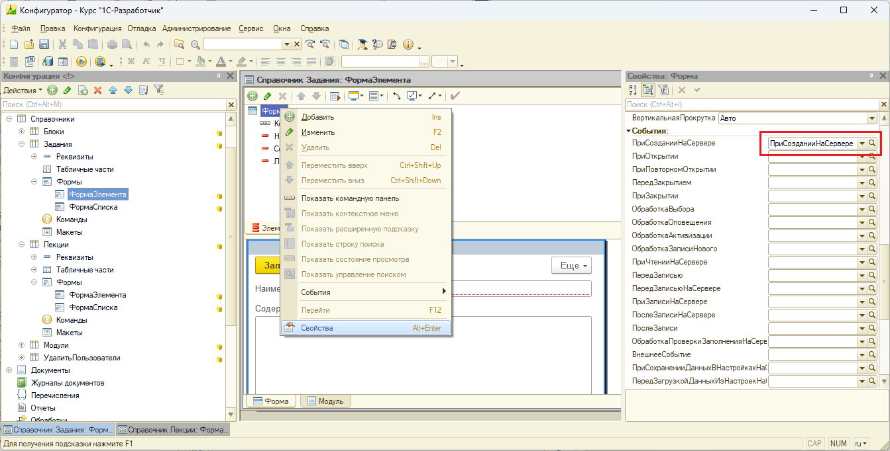

# Задание к занятию "Среда разработки и конфигурация"

## Задача 1 "Основные свойства конфигурации"

### Описание задачи

Нужно создать с нуля пустую конфигурацию, заполнить ее имя и основные свойства.

### Требования к результату

Результат - файл .cf конфигурации с заполненным именем и несколькими основными свойствами.

### Процесс выполнения

1. Создайте пустую конфигурацию и назовите ее **УправлениеИТФирмой**.
2. В дальнейшем эта конфигурация будет вашим дипломным проектом. Задайте осмысленным образом ее основные свойства: синоним, комментарий, краткое и подробное описание, а также информацию о правах.
3. Загрузите подходящий логотип и заставку.
4. Обновите конфигурацию базы данных.
5. Запустите конфигурацию в режиме Предприятия. Убедитесь, что информация и картинки на заставке и в "Сведениях о программе" выглядят нормально и соответствуют введенному вами.
6. Сохраните конфигурацию в .cf и предъявите как результат выполнения задания.

## Задача 2 "Сравнение и объединение конфигураций"

### Описание задачи

Нужно объединить конфигурацию демобазы с конфигурацией из файла, взяв из файла новый справочник **Студенты**, удалив неиспользуемый справочник **УдалитьПользователи** и сохранив неизменным справочник **Лекции**.

### Требования к результату

Результат - файл .cf конфигурации, содержащий:
- справочник **Студенты**.
- табличную часть **ВыполнениеСтудентами** справочника **Задания**.
В форме элемента справочника **Лекции** должна остаться закладка **Задания**.
Справочник **УдалитьПользователи** должен отсутствовать.

### Процесс выполнения

1. Создайте пустую ИБ и загрузите в нее демо-базу "Курс 1С-разработчик" (https://github.com/netology-code/1c-homeworks/blob/master/1c-developer-demo.dt).
2. В режиме сравнения объедините ее с конфигурацией (https://github.com/netology-code/1c-homeworks/blob/master/1c-developer-students.cf). При этом:
- Возьмите из объединяемой конфигурации новый справочник **Студенты** и все  изменения в справочнике **Задания**.
- В настройках объединения включите режим "Разрешить удаление объектов основной конфигурации" и удалите отсутствующий в загружаемой конфигурации справочник **УдалитьПользователи**.
- Справочник **Лекции**, напротив, оставьте неизменным: в объединяемой конфигурации там нет важной закладки "Задания", которая есть в основной.

    
Подсказка

 - 
  
  

3. Закончите объединение и запустите ИБ в режиме "Предприятие", обновив конфигурацию БД. Удостоверьтесь в том, что в интерфейсе появился новый справочник "Студенты", а в формах заданий появилась закладка "Выполнение".
4. Сохраните конфигурацию в файл .cf и предъявите как результат выполнения задания.

## Задача 3 "Проверка конфигурации"

### Описание задачи

Требуется проверить демо-конфигурацию на предмет двух специально привнесенных ошибок и исправить их согласно тексту комментариев рядом с ошибками.

### Требования к результату

Результат - файл .cf конфигурации, не выдающий ошибок проверки.

### Процесс выполнения

1. Создайте пустую ИБ и загрузите в нее демо-базу "Курс 1С-разработчик" (https://github.com/netology-code/1c-homeworks/blob/master/1c-developer-demo.dt).
2. Запустите проверку конфигурации в самом придирчивом режиме, установив все флажки, кроме флажков мобильного приложения.

    
Подсказка

  
- 

3. Исправьте выявленные ошибки согласно комментариям в коде, пока проверка не перестанет выводить ошибки.

    
Подсказка

- Перейти к ошибке можно через двойной щелчок левой кнопки мыши, по строке ошибки в Служебных сообщениях. 
- Есть процедуры, которые прописаны в свойствах формы. Если эту процедуру удалить целиком, то надо не забыть очистить обращение к ней в Событиях. Очистить можно просто выделив название и нажать кнопку Del.

- 
  
  

  
4. Сохраните исправленную конфигурацию в .cf и предъявите как результат.

### Рекомендации

В этой задаче для исправления ошибки **"Отсутствует обработчик:..."** необходимо в свойствах элемента формы, на который ругается проверка, очистить имя обработчика:

## Задача 4 "Обновление конфигурации"

### Описание задачи

Нужно обновить конфигурацию демобазы до версии 1.0.0.2 файлом обновления.

### Требования к результату

Результат - файл конфигурации демобазы (.cf), обновленный до версии 1.0.0.2, в котором есть заставка и удален справочник УдалитьПользователи.

### Процесс выполнения

1. Создайте пустую ИБ и загрузите в нее демо-базу "Курс 1С-разработчик" (https://github.com/netology-code/1c-homeworks/blob/master/1c-developer-demo.dt).
2. Обновите ее конфигурацией (https://github.com/netology-code/1c-homeworks/blob/master/1c-developer-1.0.0.2.cfu).
3. Запустите конфигурацию, обновив конфигурацию ИБ, и удостоверьтесь, что:
- версия конфигурации изменилась (например, в окне "О программе");
- появилась заставка;
- справочник "(не исп) Пользователи" исчез.
4. Обновленную конфигурацию сохраните как результат выполнения задания.

# Критерии оценки

## Зачет
1. Форма предоставленных файлов соответсвует требованиям задач, предоставлено 4 файла (один по итогу выполнения каждой задачи)
2. В конфигурации **УправлениеИТФирмой** заполнены все необходимые свойства корня, в конфигурации нет прочих объектов
3. В конфигурации **Курс 1С-разработчик** в результате выполнения задачи 2 перенесены только описанные в задании изменения
3. В конфигурации **Курс 1С-разработчик** в результате выполнения задачи 3 исправлены ошибки, выявляемые Проверкой конфигурации
4. В конфигурации **Курс 1С-разработчик** в результате выполнения задачи 4 корректно выполнено обновление конфигурации

## На доработку
1. Предоставлены результаты решения не всех задач
2. Решения не соответствуют описанным требованиям
