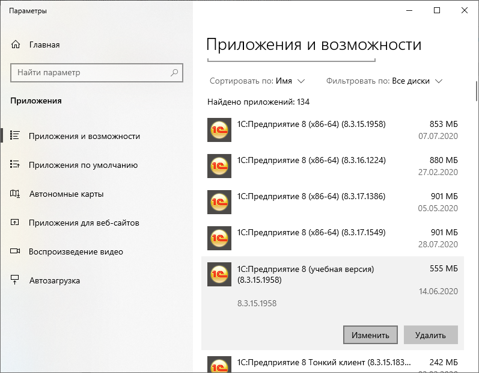
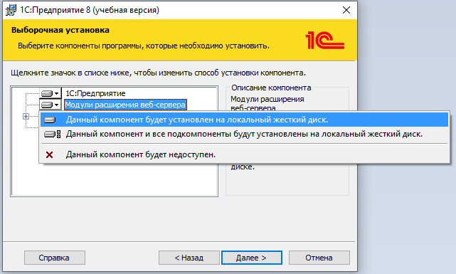
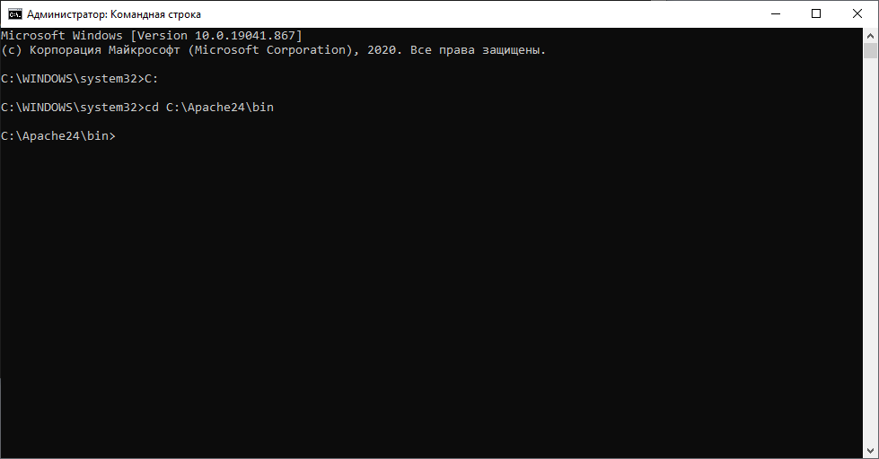

# Задание к занятию "Виды клиентов и режимы работы программы"

## Задача 1 "Публикация информационной базы на веб-сервере"

### Описание задачи
Нужно опубликовать учебную информационную базу на веб-сервере, установив его, если необходимо.

### Требования к результату
Результат - снимок экрана, в котором должно быть окно браузера, а в нем - одна из учебных информационных баз с открытым окном "О программе".

### Процесс выполнения

Процесс выполнения описан для операционных систем Windows. Если вы работаете под управлением операционной системы Linux, то установить веб-сервер и выполнить публикацию необходимо по инструкции от вендора: https://its.1c.ru/db/metod8dev#content:5979:hdoc.

#### Установка веб-сервера

1. Определите разрядность установленной платформы 1С:Предприятие. Если у вас учебная версия, значит установлена 32-разрядная платформа. В противном случае посмотрите каталог установки платформы. Если путь содержит каталог "/Program Files (x86)/", то установлена 32-разрядная, если содержит "Program Files", то 64-разрядная.
2. Убедитесь, что для платформы установлен модуль расширения веб-сервера. Для этого откройте окно "Установка и удаление программ", выберите пункт 1С:Предприятие 8 (учебная версия) и нажмите на кнопку изменить:

Выберите действие изменить:

Установите настройку для модуля расширения веб-сервера в значение Данный компонент будет установлен на локальный жесткий диск и нажмите Далее:

3. Скачайте дистрибутив веб-сервера Apache с сайта https://www.apachehaus.com/cgi-bin/download.plx. При этом если платформа 64-битная, то нужно скачить сервер с приставкой "x64", если 32-битная, то без нее.
4. Разархивируйте папку в Apache24 в каталог C:\Apache24.
5. Запустите командную строку от имени администратора: В строке найти меню пуск ввести "Командная строка", нажать на нее правой кнопкой мыши и выбрать пункт Запустить от имени администратора
6. В командной строке перейтите в директорию установки апача, для этого последовательно введите команды: "C:", "cd C:\Apache24\bin"

7. Установить веб-сервер как службу, для этого введите в командной строке команду "httpd.exe -k install"
8. Запустите веб-сервер, для этого введите в командной строке команду "httpd.exe -k start"

9. Проверьте работу веб-сервера. Откройне браузер и перейдите по ссылке http://localhost. Если страница выглядит как на картинке ниже, значит веб-сервер установлен правильно и можно переходить к публикации информационной базы.

#### Публикация информационной базы

1. Убедитесь, что база "УправлениеИТФирмой" не содержит в пути символов кириллицы (только латиница). Если это не так, то перенесите ее в каталог, путь которого состоит только из латинских символов. Желательно поближе к корню диска.
2. Запустите информационную базу "УправлениеИТФирмой" в конфигураторе от имени Администратора.
3. Откройте окно публикации на веб-сервере (Администрирование / Публикация на веб-сервере). Укажите Имя: "IT-company-management", Каталог: "C:\Apache24\htdocs\IT-company-management\", остальные настройки оставьте по умолчанию и нажмите Опубликовать.
4. После публикации платформа предложит перезапустить веб-сервер, сделайте это.
5. Пройдите по ссылке http://localhost/IT-company-management и убедитесь, что опубликованная база успешно открывается.
6. В качестве результата пришлите снимок экрана с окном браузера, в которой работает эта информационная база. В окне браузера должно быть открыто окно "О программе".

### Типичные ошибки
1. Разрядность веб-сервера должна совпадать с разрядностью версии платформы. Например, если вы используете 32-разрядную учебную версию, Apache тоже должен быть 32-разрядным.
2. Веб-сервер может не запускаться (служба запускается и сразу останавливается), если используемый им порт 80 занят другой программой. Для того, чтобы изменить порт веб-сервера можно открыть файл "C:\Apache24\conf\httpd.conf", найти строку "Listen 80" и поменять в ней порт 80 на 81 или 8000, после этого в ссылке после доменного имени нужно будет добавлять имя порта http://localhost:81 или http://localhost:8000.
