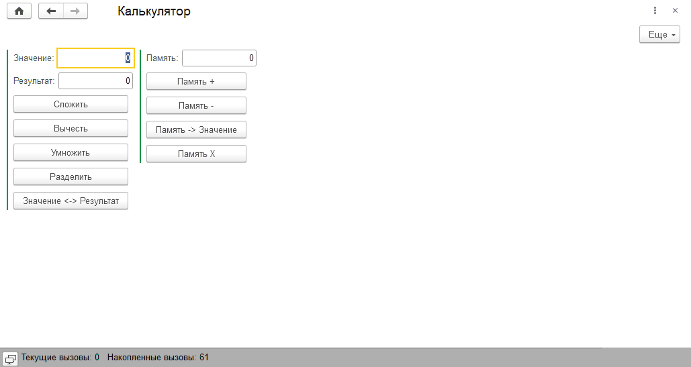

# Задание к занятию "Переменные и параметры сеанса"
_Примерное время выполнения: 60 минут_

Все задачи обязательны к выполнению. Пожалуйста, присылайте на проверку все задачи сразу.

Любые вопросы по решению задач задавайте в чате учебной группы.

## Цель задания

1. Закрепить на практике работу с переменными
2. Научиться сохранять время старта сеанса

Решение задания научит вас работать с параметрами сеанса, присваивать переменным значения и менять эти значения местами. Эти навыки пригодятся для выполнения домашнего задания в дальнейшем.

## Чеклист готовности к домашнему заданию

- [ ] Установлена учебная платформа версии 8.3.20 или больше.
- [ ] Развернута информационная база с конфигурацией **УправлениеИТФирмой**, полученная по итогу выполнения [домашнего задания к занятию Модули](/homework-2-1.md)
- [ ] Подготовлена обработка **Калькулятор**, полученная по итогу выполнения [домашнего задания к занятию Внешние отчеты, обработки и расширения](/homework-1-6.md)

## Инструкция к заданию

1. Решите описанные задачи в конфигураторе.
2. Протестируйте решение в пользовательском режиме.
3. Отправьте на проверку в личном кабинете Нетологии один общий файл выгрузки информационной базы (.dt) с конфигурацией, содержащей решения по всем задачам. Файл прикрепите в раздел "решение" в практическом задании.

## Задача 1 "Развитие Калькулятора"

### Описание задачи

Вы хотите добавить в обработку **Калькулятор** стандартные для настольных калькуляторов функции работы с памятью:
- команду, меняющую местами значения реквизитов Значение и Результат.
- команды добавления значения к памяти, вычитания из памяти, очистки и вывода памяти в значение.

### Требования к результату
В обработку "Калькулятор" добавлены:
* реквизит и поле формы **Память**;
* кнопки:
  * меняющие местами **Значение** и **Результат**.
  * добавляющие и вычитающие **Значение** из **Памяти**.
  * очищающие **Память** и выводящие **Память** в **Значение**.

### Процесс выполнения

1. Добавляем в обработку реквизит **Память** (Число разумной точности) и переносим его на форму как поле ввода или поле надписи.
2. Добавляем команды:
    * **ОбменятьЗначениеРезультат** ("Значение <-> Результат");
    * **ДобавитьЗначениеКПамяти** ("Память+");
    * **ВычестьЗначениеИзПамяти** ("Память-");
    * **ОчиститьПамять** ("Память Х");
    * **ПамятьВЗначение** ("Память -> Значение");
3. Команды перетаскиваем на форму кнопками и создаем обработчики, вызвав команду "<Действие команды>" из контекстного меню кнопки.
4. В обработчиках команд реализуем программный код для работы с памятью. Используйте операторы присваивания и арифметические операции сложение и вычитание. Для обмена значениями понадобится временная переменная, которую можно объявить заранее.

      
Пример работы калькулятора

   

## Задача 2 "Параметры сеанса"

### Описание задачи
Вам требуется создать параметр сеанса **ВремяНачалаСеанса**, который хранил бы на сервере сведения о времени начала сеанса. Реализуйте обработку для получения информации о дительности текущего сеанса в секундах.

### Требования к результату
Выгружена информационную базу с конфигурацией, в которой созданы:
- Параметр сеанса **ВремяНачалаСеанса** типа Дата и время, который после запуска клиентского сеанса хранил время, в которое был запущен сеанс;
- Обработка **ПроверкаДлительностиСеанса** с командой **Длительность сеанса** в основной форме.

### Процесс выполнения

1. Добавляем параметр сеанса **ВремяНачалаСеанса** типа **Дата** с составом даты **Дата и время**.
2. В модуле сеанса создаем обработчик **УстановкаПараметровСеанса**, в коде которого записываем в параметр сеанса текущее время, полученное с помощью метода `ТекущаяДатаСеанса()`.
3. Создаем общий модуль **СеансыВызовСервера** с флажками **Сервер** и **Вызов сервера**
4. Реализуем в модуле **СеансыВызовСервера** экспортную функцию **ВремяНачалаСеанса**, которая будет возвращать значение параметра сеанса **ВремяНачалаСеанса**
5. Создаем обработку **ПроверкаДлительностиСеанса**, основную форму обработки, на форму добавляем команду **Длительность сеанса** и назначаем обработчик
6. В обработчике команды **Длительность сеанса** получаем значение параметра сеанса и выводим пользователю информацию о длительности сеанса:
    - Чтобы получить длительность сеанса в секундах необходимо из `ТекущаяДата()` вычести время начала сеанса, полученное из функции.
    - Для вывода длительности пользователю можно использовать метод `Сообщить()`

## Критерии оценки

Задание считается выполненным при соблюдении следующих условий:
1. Решение включает выгрузку в формате dt с конфигурацией **УправлениеИТФирмой** и внешнюю обработку **Калькулятор**;
2. В обработке **Калькулятор** есть функции сохранения числа в память, прибаление к памяти, вычитание из памяти, очистка памяти и чтение памяти;
3. В конфигурации **УправлениеИТФирмой** есть обработка **ПроверкаДлительностиСеанса**, которая при нажатии на команду **Длительность санса** выводит информацию сколько секунд прошло с момента запуска приложения.

## Подсказка:

Чтобы вам было проще понять, что в итоге должно получиться, мы подготовили подсказки: анимационные изображения в формате gif или картинки. Чтобы их увидеть, кликните по [ссылке](Examples/homework-2-2-example.md)