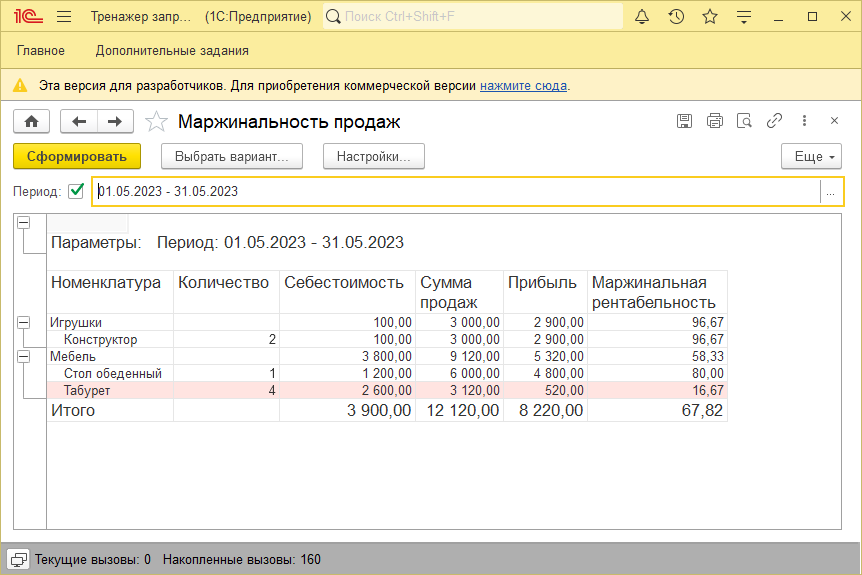

# Задание к занятию "Основы СКД"

Все задачи обязательны к выполнению. 
Любые вопросы по решению задач задавайте в чате учебной группы.

## Цель задания

1. Научиться формировать отчеты с использованием СКД

## Чек-лист готовности к домашнему заданию

- [ ] Установить платформу 1С: Предприятие версии 8.3.22 или больше.

## Инструкция к заданию

1. Изучите структуру конфигурации в конфигураторе. Какие есть справочники, документы, регистры. Как они друг с другом связаны.
2. Реализуйте отчет

## Задача 1 "Отчет Маржинальность продаж товаров за период"

### Описание задачи
Необходимо реализовать возможность хранения и расчета себестоимости для остатков товаров

### Требования к результату
В регистре сведений Остатки товаров добавлен ресурс Сумма. В документах Покупка и Продажа реализован алгоритм заполнения этого ресурса при проведении.

### Процесс выполнения
1. Используйте базу, полученную по итогам предыдущего задания. Убедитесь, что в регистре Остатки товаров и Продажи есть движения, и что в регистре Остатки товаров корректно рассчитана себестоимость. При необходимости перепроведите документы.
2. Создайте новый отчет и включите его в подсистему Дополнительные задания.
3. Создайте основную схему компоновки данных отчета.
4. Реализуйте запрос, который будет получать информацию о себестоимости продаж товаров и количестве проданного из виртуальной таблицы Обороты регистра накопления Остатки товаров и информацию о сумме продаж из виртуальной таблицы Обороты регистра накопления Продажи
5. Добавьте вычисляемые поля Прибыль и Маржинальная рентабельности. Прибыль расcчитывается как "СуммаПродаж - Себестоимость". Маржинальная рентабельность рассчитывается как "Прибыль / СуммаПродаж * 100" и учитывается в процентах. В формуле реализуйте проверку на 0 в делителе.

    
Подсказка

*Маржинальность — это показатель рентабельности реализуемой продукции, который определяется числовым выражением - маржой. Маржинальность услуги, товара или иного проекта — это разница между стоимостью готовой продукции и себестоимостью, то есть затратами на их производство.* 

 

6. Настройте ресурсы:
    - Прибыль, Себестоимость, Сумму продаж и Количество можно просто суммировать
    - Маржинальную рентабельность необходимо рассчитывать по формуле "Сумма(Прибыль) / Сумма(СуммаПродаж) * 100"
7. Добавьте параметр Период с типом Стандартный период. Настройте расчет параметров НачалоПериода и КонецПериода по выражению от Периода и ограничьте их использование.
8. На закладке настройки:
    - Добавьте группировку по Номенклатуре с учетом Иерархии
    - Добавьте в состав пользовательских настроек параметр Период
    - Добавьте в выбранные поля Количество, Себестоимость, СуммуПродаж, Прибыль и Маржинальную рентабельность.
    - С помощью условного оформления выделите красным фоном строки отчета, где маржинальная рентабельность менее 20%, а также ограничьте количество символов после запятой в колонке Маржинальная рентабельность двумя.

### Пример внешнего вида отчета

## Критерии оценки

Домашнее задание проверяется экспертом.

Успешным выполнением считается корректно реализованный отчет "Маржинальность продаж товаров за период"
