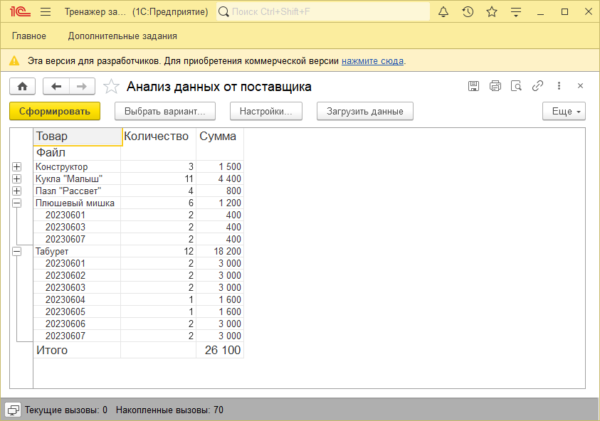

# Задание к занятию "Работа с СКД"

Данное задание со звездочкой и не является обязательным. Вы можете его выполнить, чтобы лучше разобраться в работе с СКД. 
Любые вопросы по решению задач задавайте в чате учебной группы.

## Цель задания

1. Научиться формировать отчеты с использованием СКД

## Чеклист готовности к домашнему заданию

- [ ] Установить платформу 1С:Предприятие версии 8.3.22 или больше.

## Задача 1 (со звёздочкой) Анализ выгрузки

### Описание задачи
Партнер передает информацию о продажах наших товаров за период в виде архива. Необходимо реализовать отчет для анализа данных архива, предоставленных партнером.

### Требования к результату
Внешний отчет, который позволяет выбрать архив, получает из него данные и формирует отчет.

### Процесс выполнения
1. Скачайте и изучите [Пример архива](reference-data/export.zip), который отправляет поставщик
2. Создайте внешний отчет, добавьте реквизит отчета АдресДанных, тип - строка.
3. Создайте форму внешнего отчета, добавьте на форму команду Загрузить данные. При выполнении команды необходимо предлагать пользователю выбрать zip-файл, когда файл выбрать - сохранять его во временном хранилище. Адрес временного хранилища необходимо сохранить в реквизите отчета АдресДанных.
4. Назначьте обработчик события ПриКомпоновкеРезультата в модуле объекта отчета и реализуйте алгоритм:
   - Отключите стандартную обработку
   - Проверьте заполнения АдресаДанных - если он пустой необходимо показать ошибку "Для формирования отчета необходимо выбрать файл архива"
   - Получите архив из временного хранилища
   - Получите имя временного файла и создайте новый каталог с этим именем с помощью методов ПолучитьИмяВременногоФайла() и СоздатьКаталог()
   - Распакуйте архив в новый каталог с помощью объекта ЧтениеZipФайла
   - Создайте таблицу значений для хранения данных файлов, добавьте колонки исходя из содержимого файлов и целевого внешнего вида отчета
   - Найдите все файлы в каталоге с помощью метода НайтиФайлы()
   - Прочитайте данные каждого файла с помощью Табличного документа и добавьте эти данные в таблицу значений
   - Удалите временные файлы
   - Сформируйте отчет программно вызывая объекты СКД с передачей сформированной таблицы значений как внешнего набора данных
5. Создайте Основную схему компоновки данных
   - Добавьте в качества источника НаборДанных: Объект
   - Заполните колонки набора данных исходя из целевого внешнего вида отчета
   - Заполните ресурсы исходя из целевого внешнего вида отчета
   - Заполните настройки отчета исходя из целевого внешнего вида
6. Проотестируйте работу отчета
   - Откройте отчет в любой информационной базе
   - Выберите в качестве файла [Пример архива](reference-data/export.zip)
   - Сформируйте отчет и сравните с примеров внешнего вида отчета

### Пример внешнего вида отчета

## Критерии оценки

Домашнее задание проверяется экспертом.

Успешным выполнением считается корректно реализованный отчет "Анализ выгрузки"
