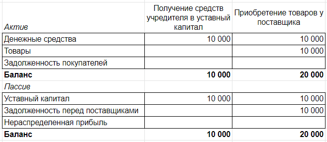

# Основные понятия учета

## Задание 1

### Описание задачи

Собрать простейший баланс торгового предприятия после продажи приобретенных товаров.

### Требование к результату

Баланс предприятия в произвольной форме (текст, таблица) с суммами по статьям:

**Актив**
Денежные средства <...>
Товары  <...>
Задолженность покупателей <...>

**Пассив**
Уставный капитал  <...>
Задолженность перед поставщиками  <...>
Нераспределенная прибыль  <...>

Баланс должен отражать ситуацию, когда предприятие:
1. Получило от учредителя 10 000 рублей в уставный капитал.
2. Приобрело на всю сумму товары, полностью рассчитавшись с поставщиком.
3. Продало все товары за 12 000, полностью рассчитавшись с покупателем.
4. Прибыль еще не распределило и дивиденды не выплатило.

### Процесс выполнения

1. Создайте в Google Sheets, Excel или OpenOffice Calc таблицу со строками актива ("Денежные средства", "Товары", "Задолженность покупателей") и пассива ("Уставный капитал", "Задолженность перед поставщиками", "Нераспределенная прибыль"). Каждая колонка будет соответствовать одной хозяйственной операции и содержать итоговые остатки по счетам после отражения ее в учете:

Итоговый баланс будет просто данными в последней колонке.

2. Добавляя по колонке на операцию, отразите в ней результаты пяти хозяйственных операций:

  * Получение от учредителя 10 000 рублей, которые составят уставный капитал (см. фото выше).
  * Приобретение у поставщика товаров стоимостью 10 000 рублей с увеличением задолженности перед поставщиками на эту сумму (см. фото выше).
  * Полную оплату долга поставщику с уменьшением остатка денежных средств.
  * Продажу покупателю товаров на сумму 12 000 рублей с их полным списанием и прибылью в размере 2 000 рублей
  * Получение оплаты от покупателя, закрывающее задолженность и увеличивающее остаток денежных средств.
  
3. Соберите баланс как данные последней колонки.
